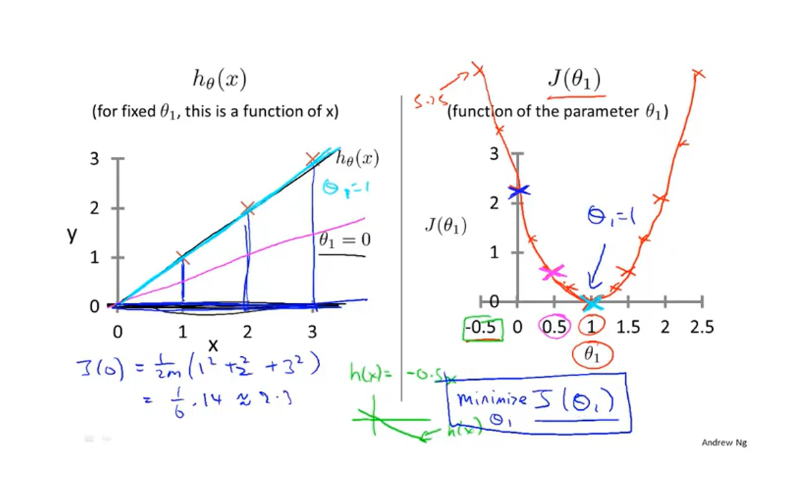
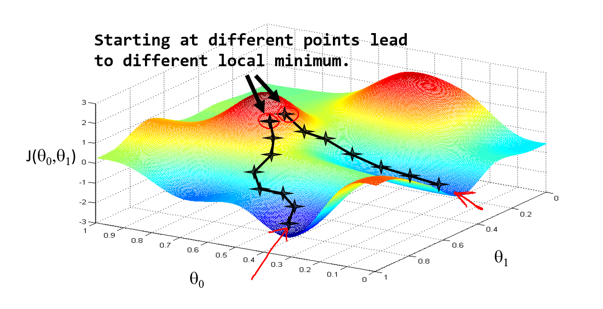
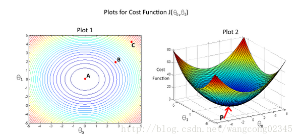

## 1. 模型描述

!!! info ""

    参考视频:
    2 - 1 - Model Representation (8 min).mkv

我们这里有一个俄勒冈州波特兰市的**住房价格数据集**，数据集包含：房屋**尺寸**，房屋**出售价格**......然后，你有一个朋友。他有一套1250平的房子，他需要你告诉他这房子能卖多少钱。我们该怎么做？


部分数据集如下表所示：

| Size   in $feet^2 (x)$ | Price ($) in $1000's (y)$ |
| ---------------------- | ------------------------- |
| 2104                   | 460                       |
| 1416                   | 232                       |
| 1534                   | 315                       |
| 852                    | 178                       |
| …                      | …                         |

上述数据集，我们通常称为**训练集**（**training set**）。

为了**方便描述**和后面**公式推导**将这个问题进行如下**标记（Notion）**：


|                      |                                                        |
| -------------------- | ------------------------------------------------------ |
| $m$                  | **样本数量（number of training examples ）**               |
| $x$                  | **输入变量/特征（input of variable/features）**            |
| $y$                  | **目标变量/输出变量（output variable / target variable）** |
| $(x, y)$             | **一个样本（one training example）**                       |
| $(x^{(i)}, y^{(i)})$ | **第$i$个样本**                                            |


好了，下面先来**明确一下**我们**已知条件**和**要做的事**：

我们已知了训练集（m组数据：$(x^{(1)}, y^{(1)}), (x^{(2)}, y^{(2)}), ...(x^{(m)}, y^{(m)}), 其中(x^{(i)}, y^{(i)})$代表了第 i 组的（房屋尺寸，房屋价格）），根据这个训练集，我们要训练出我们的模型（函数），通常表示为h，即**hypothesis(假设)**。而这个函数h的输入是房屋尺寸，输出就是房屋价格。因此，h 是一个从x 到 y 的函数映射。


那么，对于我们这个问题，我们应该如何描述$h$？

一种可能的表达方式为：
$$
h_\theta \left( x \right)=\theta_{0} + \theta_{1}x\tag{1.2.1}
$$
因为只含有一个特征/输入变量，因此这样的问题叫作单变量线性回归问题。

!!! note

    线性回归中{++线性++}的含义： 因变量{++y++}对于{++未知的回归系数++}（$\theta_0$，$\theta_1$，.... $\theta_n$） 是{++线性++}的。


## 2. 代价函数

!!! info ""

    参考视频:
    2 - 2 - Cost Function (8 min).mkv

Training Set

| Size   in $feet^2 (x)$ | Price ($) in $1000's (y)$ |
| ---------------------- | ------------------------- |
| 2104                   | 460                       |
| 1416                   | 232                       |
| 1534                   | 315                       |
| 852                    | 178                       |
| …                      | …                         |

Hypothesis:    $h_\theta \left( x \right)=\theta_{0}+\theta_{1}x$

Parameters: $\theta_{0}$ ， $\theta_{1}$

通过上一节，我们知道了，我们要完成朋友的**需求（根据他房子的大小预测房价**），要知道假设函数    $h$，我们对    $h$     做出这样一种假设：$h_\theta \left( x \right)=\theta_{0}+\theta_{1}x$。通过观察这个函数，我们可以把这个问题转化为求$\theta_{0}$ 和 $\theta_{1}$，从而当你朋友把房子大小告诉你，你将其代入公式即可得到预测的房价。那么，我们如何选择呢$\theta_{0}$ 和 $\theta_{1}$？

首先，我们先直观理解$h_\theta \left( x \right)$ ---下图是$\theta_{0}$ 和 $\theta_{1}$取不同值时，$h$的整体图像。


!!! note

    上面图像为了方便省略了$\theta$下标，即 $h_\theta(x) = h(x)$，后面也可能会这样做。

**结合图像描述我们的任务**

- 把训练集数据绘制在下图中（并非上面的房价训练集，仅举例示意）


- 我们要做的就是绘制一条直线（下图蓝色的线）尽量地与上面那些点有和好的拟合，这条直线就是$h_\theta(x)$。如何确定这条直线也就是确定$\theta_0$和$\theta_1$。


- 我们的idea：

  Choose $\theta_0, \theta_1$

  so that $h_\theta(x)$  is close to  $y$  for our training examples  $(x, y)$

将我们的任务以公式化标记，即：

$$
\mathop{minimize} \limits_{\theta_0,\ \theta_1}\   \frac {1} {2m}\cdot\sum\limits_{i=1}^{m}\Big(h_\theta(x^{(i)})-y^{(i)}\Big)^2\tag{2.1.1}
$$

线性回归实际上就是解决一个关于$\theta_0, \theta_1$的最小化问题(minimize)。我们希望我们的直线与那些点有很好的拟合，那我们把每一个点预测得到的值$\Big($将x代入假设函数可得到，即$h_\theta(x)\Big)$与真实值y求一个差的平方。再把这些平方累加。即:

$$
\sum\limits_{i=1}^{m}\Big(h_\theta(x^{(i)})-y^{(i)}\Big)^2\tag{2.1.2}
$$

我们只要让这个平方和最小即可。

注意, 

关于式(2.1.1)前面$\frac{1}{2m}$

- $\frac{1}{m}$是因为求和项有m个，这里除以m，是求平均值。
- $\frac{1}{2}$为了后面求导消去
- 其实这个$\frac{1}{2m}$对我们求最小值没有任何影响，只是为了计算方便这么写。

关于式(2.1.2)的几何意义

- 所有数据点与拟合直线在y轴方向的截距的平方和

在本例子中，

- $h_\theta \left( x \right)=\theta_{0} + \theta_{1}x$

通常，为了方便起见，我们定义一个函数，也就是代价函数(cost function)，如下：

$$
J(\theta_0,\theta_1)=\frac {1} {2m}\sum\limits_{i=1}^{m}(h_\theta(x^{(i)})-y^{(i)})^2\tag{2.1.3}
$$

我们的最终目标就转化为：

$$
\mathop{minimize} \limits_{\theta_0,\ \theta_1}J(\theta_0,\theta_1)
$$

这里我们定义的式(2.1.3)损失函数, 也被称为平方误差函数(squared error function)。然而，损失函数不止这一种形式，但是在回归问题中，平方误差函数都是比较合理和比较常用的选择。

## 3 代价函数直观理解1

!!! info ""

    参考视频:
    2 - 3 - Cost Function - Intuition I (11 min).mkv

在上一个小节，我们得到了代价函数的定义。在这一小节中，我们通过一个例子来获取一些直观的感受，看看代价函数到底是在干什么。

Hypothesis: $h_\theta(x)=\theta_0+\theta_1x$

Parameters: $\theta_0,\ \theta_1$

Cost Function: $J(\theta_0,\theta_1)=\frac {1} {2m}\sum\limits_{i=1}^{m}(h_\theta(x^{(i)})-y^{(i)})^2$

Goal: $\mathop{minimize} \limits_{\theta_0,\ \theta_1}J(\theta_0,\theta_1)$

为了让代价函数 $J$ 有更好的，可视化效果，我们简化假设函数为$h_\theta(x)=\theta_1x$，即假设$\theta_0=0$。简化后：

$h_\theta(x)=\theta_1x$

$J(\theta_1)=\frac {1} {2m}\sum\limits_{i=1}^{m}(h_\theta(x^{(i)})-y^{(i)})^2$

Goal: $\mathop{minimize} \limits_{\theta_1}J(\theta_1)$

在确定好不同的 $\theta_1$ ,之后画出假设函数 $h$ 和代价函数 $J$。本例中，假定训练集为$(1,1), (2,2), (3,3)$。

- 当 $\theta_1=1$ 时，


注意到，因为$\theta_1=1$，此时 $h_\theta=y$ ,所以 $J=0$ 。并在右边图上画出第一个点(1,0)。

- 当 $\theta_1=0.5$ 时，


$(x,y)$依次取(1, 0.5), (2, 1), (3, 1.5) 计算 $J \approx 0.58$ 。并在右边图上画出第二个点(0.5,0.58)。

- 当 $\theta_1=0$ 时，


同理，当 $\theta_1$ 取不同值时，我们可以计算出 $J$ ，并在右侧画出 $J$ 的大致图像。


总结：
我们通过取不同的 $\theta_1$ ，绘制出了 $J$ 。



So for each value of $\theta_1$ , we wound up with a diffent value of $J(\theta_1)$ . And we colud then use this to trace out this plot on the right. 
Now you remember the optimization objective for our learning algorithm is we want to choose the value of $\theta_1$ that minimize $J(\theta_1)$. This was our objective function for the linear regression. 

现在，我们观察右侧那条曲线，会发现，当 $\theta_1=1$ 时，$J(\theta_1)$最小。再观察左边的拟合情况会发现，这确实是最好的情况。对于这个特殊的训练集，我们确实完美地拟合了它。

And that's why minimizing $J(\theta_1)$ corresponds to finding a straight line that fits the data well. 

## 4. 代价函数的直观理解II

!!! info ""

    参考视频:
    2 - 4 - Cost Function - Intuition II (9 min).mkv


代价函数的样子，则可以看出在三维空间中存在一个使得$J(\theta_{0}, \theta_{1})$最小的点。


通过这些图形，我希望你能更好地理解这些代价函数 $J$ 所表达的值是什么样的，它们对应的假设函数是什么样的，以及什么样的假设对应的点，更接近于代价函数 $J$ 的最小值。

当然，我们真正需要的是一种有效的算法，能够自动地找出这些使代价函数 $J$ 取最小值的参数 $\theta_{0}$ 和 $\theta_{1}$ 来。

我们也不希望编个程序把这些点画出来，然后人工的方法来读出这些点的数值，这很明显不是一个好办法。我们会遇到更复杂、更高维度、更多参数的情况，而这些情况是很难画出图的，因此更无法将其可视化，因此我们真正需要的是编写程序来找出这些最小化代价函数的 $\theta_{0}$ 和 $\theta_{1}$ 的值，在下一节视频中，我们将介绍一种算法，能够自动地找出能使代价函数 $J$ 最小化的参数 $\theta_{0}$ 和 $\theta_{1}$ 的值。

## 5. 梯度下降

!!! info ""

    参考视频:
    2 - 5 - Gradient Descent (11 min).mkv

梯度下降是一个用来求函数最小值的算法，我们将使用梯度下降算法来求出代价函数$J(\theta_{0}, \theta_{1})$ 的最小值。

梯度下降背后的思想是：开始时我们随机选择一个参数的组合$\left( {\theta_{0}},{\theta_{1}},......,{\theta_{n}} \right)$，计算代价函数，然后我们寻找下一个能让代价函数值下降最多的参数组合。我们持续这么做直到找到一个局部最小值（**local minimum**），因为我们并没有尝试完所有的参数组合，所以不能确定我们得到的局部最小值是否便是全局最小值（**global minimum**），选择不同的初始参数组合，可能会找到不同的局部最小值。



想象一下你正站立在山的这一点上，站立在你想象的公园这座红色山上，在梯度下降算法中，我们要做的就是旋转360度，看看我们的周围，并问自己要在某个方向上，用小碎步尽快下山。这些小碎步需要朝什么方向？如果我们站在山坡上的这一点，你看一下周围，你会发现最佳的下山方向，你再看看周围，然后再一次想想，我应该从什么方向迈着小碎步下山？然后你按照自己的判断又迈出一步，重复上面的步骤，从这个新的点，你环顾四周，并决定从什么方向将会最快下山，然后又迈进了一小步，并依此类推，直到你接近局部最低点的位置。

批量梯度下降（**batch gradient descent**）算法的公式为：

repeat until convergence {
$$
\theta_j := \theta_j - \alpha\frac{\partial}{\partial\theta_j}J(\theta_0, \theta_1)
$$
}

其中 $\alpha$ 是学习率（**learning rate**），它决定了我们沿着能让代价函数下降程度最大的方向向下迈出的步子有多大，在批量梯度下降中，我们每一次都同时让所有的参数减去学习速率乘以代价函数的导数。

在梯度下降算法中，还有一个更微妙的问题，梯度下降中，我们要更新${\theta_{0}}$和${\theta_{1}}$ ，当 $j=0$ 和$j=1$时，会产生更新，所以你将更新$J\left( {\theta_{0}} \right)$和$J\left( {\theta_{1}} \right)$。实现梯度下降算法的微妙之处是，在这个表达式中，如果你要更新这个等式，你需要同时更新${\theta_{0}}$和${\theta_{1}}$，我的意思是在这个等式中，我们要这样更新：${\theta_{0}} := {\theta_{0}}$ ，并更新${\theta_{1}}:= {\theta_{1}}$。

实现方法是：你应该计算公式右边的部分，通过那一部分计算出${\theta_{0}}$和${\theta_{1}}$的值，然后同时更新${\theta_{0}}$和${\theta_{1}}$。

让我进一步阐述这个过程：


在梯度下降算法中，这是正确实现同时更新的方法。我不打算解释为什么你需要同时更新，同时更新是梯度下降中的一种常用方法。我们之后会讲到，同步更新是更自然的实现方法。当人们谈到梯度下降时，他们的意思就是同步更新。注意上面图左下方和右下方的区别。

**注意：**

- 梯度下降法，是需要同时更新${\theta_{0}}$, ${\theta_{1}}$,...,  ${\theta_{n}}$的。本例中，只有${\theta_{0}}$和${\theta_{1}}$。

- 上面图中用了 `:=`更新 $\theta$ , 这里  `:=` 等同于计算机语言中的赋值操作。

在接下来的视频中，我们要进入这个微分项的细节之中。我已经写了出来但没有真正定义，如果你已经修过微积分课程，如果你熟悉偏导数和导数，这其实就是这个微分项：

$\alpha \frac{\partial }{\partial {{\theta }_{0}}}J({{\theta }_{0}},{{\theta }_{1}})$，$\alpha \frac{\partial }{\partial {{\theta }_{1}}}J({{\theta }_{0}},{{\theta }_{1}})$。

## 6. 梯度下降的直观理解

!!! info ""

    参考视频:
    2 - 6 - Gradient Descent Intuition (12 min).mkv

在之前的视频中，我们给出了一个数学上关于梯度下降的定义，本次视频我们更深入研究一下，更直观地感受一下这个算法是做什么的，以及梯度下降算法的更新过程有什么意义。梯度下降算法如下：

${\theta_{j}}:={\theta_{j}}-\alpha \frac{\partial }{\partial {\theta_{j}}}J\left(\theta \right)$

描述：对 $\theta$ 赋值，使得$J\left( \theta  \right)$按梯度下降最快方向进行，一直迭代下去，最终得到局部最小值。其中$\alpha$是学习率（**learning rate**），它决定了我们沿着能让代价函数下降程度最大的方向向下迈出的步子有多大。


从上图，我们发现，无论 $\theta$ 起始点从正的还是负的开始出发，他们都会向着 $J(\theta)$变小的方向出发。

让我们来看看如果 $\alpha$ 太小或 $\alpha$ 太大会出现什么情况：

如果 $\alpha$ 太小了，即我的学习速率太小，结果就是只能这样像小宝宝一样一点点地挪动，去努力接近最低点，这样就需要很多步才能到达最低点，所以如果 $\alpha$ 太小的话，可能会很慢，因为它会一点点挪动，它会需要很多步才能到达全局最低点。

如果 $\alpha$ 太大，那么梯度下降法可能会越过最低点，甚至可能无法收敛，下一次迭代又移动了一大步，越过一次，又越过一次，一次次越过最低点，直到你发现实际上离最低点越来越远，所以，如果 $\alpha$ 太大，它会导致无法收敛，甚至发散。


假设你将 ${\theta_{1}}$ 初始化在局部最低点。结果是局部最优点的导数将等于零，因为它是那条切线的斜率。这意味着你已经在局部最优点，它使得 ${\theta_{1}}$ 不再改变，也就是新的${\theta_{1}}$等于原来的 ${\theta_{1}}$ ，因此，如果你的参数已经处于局部最低点，那么梯度下降法更新其实什么都没做，它不会改变参数的值。

我们来看一个例子，这是代价函数$J\left( \theta  \right)$。


我想找到它的最小值，首先初始化我的梯度下降算法，在那个品红色的点初始化，如果我更新一步梯度下降，也许它会带我到这个点，因为这个点的导数是相当陡的。现在，在这个绿色的点，如果我再更新一步，你会发现我的导数，也即斜率，是没那么陡的。随着我接近最低点，我的导数越来越接近零，所以，梯度下降一步后，新的导数会变小一点点。然后我想再梯度下降一步，在这个绿点，我自然会用一个稍微跟刚才在那个品红点时比，再小一点的一步，到了新的红色点，更接近全局最低点了，因此这点的导数会比在绿点时更小。所以，我再进行一步梯度下降时，我的导数项是更小的，${\theta_{1}}$ 更新的幅度就会更小。所以**随着梯度下降法的运行，你移动的幅度会自动变得越来越小，直到最终移动幅度非常小，你会发现已经收敛到局部极小值**。

回顾一下，在梯度下降法中，当我们接近局部最低点时，梯度下降法会自动采取更小的幅度，这是因为当我们接近局部最低点时，很显然在局部最低时导数等于零，所以当我们接近局部最低时，导数值会自动变得越来越小，所以梯度下降将自动采取较小的幅度，这就是梯度下降的做法。所以实际上没有必要再另外减小$a$。

这就是梯度下降算法，你可以用它来最小化任何代价函数$J$，不只是线性回归中的代价函数$J$。

## 7. 梯度下降应用至线性回归

!!! info ""

    参考视频:
    2 - 7 - GradientDescentForLinearRegression (6 min).mkv

这是我们之前学到的知识，现在尝试将梯度下降法应用到线性回归模型。


我们的Goal：$\mathop{minimize} \limits_{\theta_0,\ \theta_1}J(\theta_0,\theta_1)$

仔细观察，我们会发现解决这个目标的关键就是这个导数项 $\frac{\partial}{\partial\theta_j}J(\theta_0,\theta_1)$。

$\frac{\partial }{\partial {{\theta }_{j}}}J({{\theta }_{0}},{{\theta }_{1}})=\frac{\partial }{\partial {{\theta }_{j}}}\frac{1}{2m}{{\sum\limits_{i=1}^{m}{\left( {{h}_{\theta }}({{x}^{(i)}})-{{y}^{(i)}} \right)}}^{2}}$

> 怎么从上式变到下面两个式子，请看下一章节，有具体推导。

$j=0$  时：$\frac{\partial }{\partial {{\theta }_{0}}}J({{\theta }_{0}},{{\theta }_{1}})=\frac{1}{m}{{\sum\limits_{i=1}^{m}{\left( {{h}_{\theta }}({{x}^{(i)}})-{{y}^{(i)}} \right)}}}$

$j=1$  时：$\frac{\partial }{\partial {{\theta }_{1}}}J({{\theta }_{0}},{{\theta }_{1}})=\frac{1}{m}\sum\limits_{i=1}^{m}{\left( \left( {{h}_{\theta }}({{x}^{(i)}})-{{y}^{(i)}} \right)\cdot {{x}^{(i)}} \right)}$

则算法改写成：

**Repeat {**

​                ${\theta_{0}}:={\theta_{0}}-a\frac{1}{m}\sum\limits_{i=1}^{m}{ \left({{h}_{\theta }}({{x}^{(i)}})-{{y}^{(i)}} \right)}$

​                ${\theta_{1}}:={\theta_{1}}-a\frac{1}{m}\sum\limits_{i=1}^{m}{\left( \left({{h}_{\theta }}({{x}^{(i)}})-{{y}^{(i)}} \right)\cdot {{x}^{(i)}} \right)}$

​               **}**

重要结论：线性回归模型里的代价函数 $J$ 总是弓状函数，又称凸函数(**convex function**)。如下图：


这个函数没有局部最优(local optima)，只有全局最优(global optimum)。当我们用梯度下降去计算的时候，他总能够收敛到全局最优。

我们刚刚使用的算法，有时也称为批量梯度下降。实际上，在机器学习中，通常不太会给算法起名字，但这个名字”**批量梯度下降**”，指的是在梯度下降的每一步中，我们都用到了所有的训练样本。在应用梯度下降，并计算偏导数时，我们都需要计算$\sum\limits_{i=1}^{m}\Big(h_\theta(x)-y\Big)$。因此，批量梯度下降法这个名字说明了我们需要考虑**所有**这一"批"训练样本，而事实上，有时也有其他类型的梯度下降法，不是这种"批量"型的，不考虑整个的训练集，而是每次只关注训练集中的一些小的子集。在后面的课程中，我们也将介绍这些方法。

如果你之前学过线性代数，有些同学之前可能已经学过高等线性代数，你应该知道有一种计算代价函数 $J$ 最小值的数值解法，不需要梯度下降这种迭代算法。在后面的课程中，我们也会谈到这个方法，它可以在不需要多步梯度下降的情况下，也能解出代价函数 $J$ 的最小值，这是另一种称为正规方程(**normal equations**)的方法。实际上在数据量较大的情况下，梯度下降法比正规方程要更适用一些。

现在我们已经掌握了梯度下降，我们可以在不同的环境中使用梯度下降法，我们还将在不同的机器学习问题中大量地使用它。所以，祝贺自己:joy:成功学会了第一个机器学习算法。

先写到这里，后面打算附上习题和实操python代码。

## 习题 && 参考答案
### 第一题
基于一个学生在大学一年级的表现，预测他在大学二年级表现。
令x等于学生在大学第一年得到的“A”的个数（包括A-，A和A+成绩）学生在大学第一年得到的成绩。预测y的值：第二年获得的“A”级的数量
这里每一行是一个训练数据。在线性回归中，我们的假设 $h_\theta(x)=\theta_0+\theta_1x$，并且我们使用 m 来表示训练示例的数量。

| x    | y    |
| ---- | ---- |
| 3    | 2    |
| 1    | 2    |
| 0    | 1    |
| 4    | 3    |

**对于上面给出的训练集**（注意，此训练集也可以在本测验的其他问题中引用），**m 的值是多少**？

### 第二题
假设我们使用第一题中的训练集。并且，我们代价函数的定义是 
$J(\theta_0,\theta_1)=\frac{1}{2m}\sum\limits_{i=1}^{m}\big(h_\theta(x^{(i)})-y^{(i)}\big)^2$
求 $J(0, 1)$?

### 第三题
令问题1中，线性回归假设的 $\theta_0=-1, \theta_1=2$, 求 $h_\theta(6)$?

### 第四题
代价函数 $J(\theta_0, \theta_1)$ 与 $\theta_0, \theta_1$ 的关系如下图所示。图中中给出了相同代价函数的等高线图。根据图示，选择正确的选项（选出所有正确项）
   
<p style="margin-top:10px"></p>

A. 从B点开始，学习率合适的梯度下降算法会最终帮助我们到达或者接近A点，即代价函数 $J(\theta_0, \theta_1)$ 在A点有最小值
<p style="margin-top:10px"></p>

B. 点P（图2的全局最小值）对应于图1的点C
<p style="margin-top:10px"></p>

C. 从B点开始，学习率合适的梯度下降算法会最终帮助我们到达或者接近C点，即代价函数 $J(\theta_0, \theta_1)$ 在C点有最小值
<p style="margin-top:10px"></p>

D. 从B点开始，学习率合适的梯度下降算法会最终帮助我们到达或者接近A点，即代价函数 $J(\theta_0, \theta_1)$ 在A点有最大值
<p style="margin-top:10px"></p>

E. 点P（图2的全局最小值）对应于图1的点A

### 第五题
假设对于某个线性回归问题（比如预测房价），我们有一些训练集，对于我们的训练集，我们能够找到一些 $\theta_0, \theta_1$ ，使得  $J(\theta_0, \theta_1)=0$  。以下哪项陈述是正确的？（选出所有正确项）
    
<p style="margin-top:20px"></p>

A. 为了实现这一点，我们必须有 $\theta_0=0, \theta_1=0$ ，这样才能使 $J(\theta_0, \theta_1) = 0$
<p style="margin-top:10px"></p>

B. 对于满足 $J(\theta_0, \theta_1) = 0$ 的 $\theta_0, \theta_1$ 的值，其对于每个训练例子 $(x^{(i)},y^{(i)})$，都有 $h_\theta(x^{(i)})=y^{(i)}$
<p style="margin-top:10px"></p>

C. 这是不可能的：通过 $J(\theta_0, \theta_1) = 0$ 的定义，不可能存在 $\theta_0, \theta_1$ 使得 $J(\theta_0, \theta_1) = 0$
<p style="margin-top:10px"></p>

D. 即使对于我们还没有看到的新例子，我们也可以完美地预测y的值（例如，我们可以完美地预测我们尚未见过的新房的价格）


<br/>
<br/>
<br/>
<br/>
<br/>
<br/>
### 参考答案

第一题：4
<br/>
<br/>
第二题：0.5

由已知求 $J(0, 1)$, 可得：$\theta_0=0, \theta_0=1$

所以 $h_\theta(x)=0+1\cdot x=x$

最后, 将上述结果和训练集数据代入可得：

$$
\begin{split}
J(0, 1)=\frac{1}{2*4}[ & (3-2)^2 + 
(1-2)^2+ \\\\
& (0-1)^2+(4-3)^2]=0.5
\end{split}
$$

<br/>
第三题：11
<br/>

已知, $h_\theta(x)=\theta_0+\theta_1x$, $\theta_0=-1, \theta_1=2$

所以将 $\theta_0, \theta_1$代入可得 $h_\theta(x)=-1+2x$

让我们求 $h_\theta(6)$

最后, $h_\theta(6)=-1+2*6=11$

<br/>
第四题：AE
<br/>
<br/>
第五题：B

## 上机练习

<!--
下面这个css用于控制p标签的两端对齐
-->
<style type="text/css">
p {
    text-align: justify;  /*文本两端对齐*/
}
</style>

In this part of exercise, you will implement linear regression with one variable to predict profits for a food truck. Suppose you are the CEO of a restaurant franchise and are considering different cities for opening a new outlet. The chain already has trucks in various cities and you have data for profits and popularations from the cities.

&ensp; you would like to use this data to help you select which city to expand to next.

&ensp; The file ex1data.txt contains the dataset for our linear regression problem. The first column is the popularations of a city and the second column is the profits of a food truck in that city. A negative value for profits indicates a loss.

### 1、Plotting the Data

Before starting on any task, it is often useful to understand the data by visualizing it. For this dataset, you can use a scatter plot to visualize the data, since it has only properties to plot (profit and popularation). (Many other problems that you will encounter in real life are multi-dimensional and can't be plotted on 2-d plot).

!!! note ""

    代码是在jupyter notebook上执行！！！
    请将每个代码块按顺序拷贝到cell中执行。

``` py  linenums="1" title="代码块1 导入必要的库和数据"
# 0. 导入需要的库
import numpy as np
import pandas as pd
import matplotlib.pyplot as plt

# 1. 导入数据
path = 'ex1data1.txt'
# 1.1 使用pandas中的read_csv 接收数据
'''
注意: 
header=None: 是指我们读取的原始文件数据没有列索引
names: 指定新列名
'''
data = pd.read_csv(path, header=None,
 names=['Population', 'Profit'])
# 1.2 展示前五行数据
data.head()
```

返回结果:

``` py
   Population   Profit
0      6.1101  17.5920
1      5.5277   9.1302
2      8.5186  13.6620
3      7.0032  11.8540
4      5.8598   6.8233
```

``` py   linenums="1"  title="用matplotlib画图"
# 1. 创建画布
plt.figure(figsize=(12,8),dpi=100)

# 2. 绘制散点图
plt.scatter(data["Population"],data["Profit"], color="r",label="Training data")

# 2.1 添加描述信息
plt.xlabel("Population of City in 10,000s")
plt.ylabel("Profit in $10,000s")

# 2.2 添加网格显示
plt.grid(True, linestyle="--", alpha=0.5)

# 2.3 添加图例
plt.legend(loc=7)

# 3.显示图像
plt.show()
```

输出图像：


### 2、Gradient Descent 

In this part you will fit linear regression parameters $\theta$ to our dataset using gradient descent.

#### 2.1 Update Equations

The objective of linear regression is to minimize the cost function

$$
J(\theta)=\sum_{i=1}^m{h_ \theta(x^{(i)}-y^{(i)})}^2
$$

where the hypothesis $h_\theta(x)$ is given by the linear model 

$$
h_\theta(x) = \theta^Tx=\theta_0+\theta_1x_1
$$

&ensp; Recall that the parameters of your model are the $\theta_j$ values. These are the values you will adjust to minimize cost $J(\theta)$. One way to do this is to use the batch descent algorithm. In batch gradient descent, each iteration performs the update

$$
\theta_j := \theta_j - \alpha \frac{1}{m} \sum_{i=1}^m{h_ \theta(x^{(i)}-y^{(i)})x_j^{(i)}} \\\\
(simultaneously\  update\  \theta_j\  for\  all\ j )
$$

&ensp; With each step of gradient descent, your parameters $\theta_j$ come closer to the optomal values that will achieve that the lowest cost $J(\theta)$

!!! note "Implementation Note"

    To take into accout the intercept term $(\theta_0)$ , we add an additional first column to X and set it to all ones. This allows us to treat $\theta_0$ as simply another 'feature'.

#### 2.2 Implementation

In 代码块1, we have already set up the data for linear regression. In the following lines, we add another dimension to our data to accommodate the $\theta_0$ intercept term. We also initialize the initial parameters to 0 and the learning rate alpha to 0.01.

``` py linenums="1" title="代码块2.1 设置X和y"
# 这一步相当于设置所有 x_0=1
data.insert(0, 'Ones',1)

# 可以先看一下目前data.shape
# data.shape

## 先获取data总列数
cols = data.shape[1]
# 从data中取到X和y
# X : training data
# y : target variable
X = data.iloc[:, 0:cols-1] # X取所有行, 去最后一列
y = data.iloc[:, cols-1] # y取所有行, 最后一列
# 注意这里的X, y仍然包含行索引和列索引值
```

**输出并观察下 X (训练集) and y (目标变量)是否正确。**

输入 [1]：

``` py
X. head()
```

输出 [1]：
``` py
 	Ones 	Population
0 	1 	6.1101
1 	1 	5.5277
2 	1 	8.5186
3 	1 	7.0032
4 	1 	5.8598
```

输入 [2]：

``` py
y. head()
```

输出 [2]：
``` py
0    17.5920
1     9.1302
2    13.6620
3    11.8540
4     6.8233
Name: Profit, dtype: float64
```

``` py linenums="1" title="代码块2.2 将X和y转成ndarray 并设置学习率和迭代次数"
# 从dataframe 取出value
X = X.value
y = y.value
# 可以检验一下 X和y的shape
# X = X.shape
# Y = y.shape

# 将X和y转化成numpy array 加快计算速度
X = np.array(X)
# reshape的作用是将y转成不管行, 列数为1的矩阵
y = np.array(y)

# 设置迭代次数
iterations = 1500
# 设置学习率
alpha = 0.01

# 初始化theta 
theta = np.zeros([2, ])
# 设置完成后，看下X y theta的维度
X.shape, y.shape, theta.shape
```

输出

``` py
((97, 2), (97,1), (2, 1))
```

!!! danger "重重重要提示!!!"

    笔者在这里踩了一个大坑, 上面一个代码块2.2 的第 19 行非常重要。因为theta 是一个向量, 所以维度只能设置为[2,], 而不是[2,1]。numpy里[2,]和[2,1] 不是一回事。

#### 2.3 Computing the $J(\theta)$

As you perform gradient descent to learn minimize the cost function $J(\theta)$, it is helpful to monitor the convergence by computing the cost. In this section, you will implement a function to calculate $J(\theta)$ so you can check the convergence of your gradient descent implementation.

&ensp; As you are doing this, remember that the variables X and y are not scalar values, but matrices whose rows represent the examples from the training set.

&ensp; Once you have completed the function, you should expect to see a cost of **32.07** ($\theta$ initialized to zeros).

``` python  linenums="1" title="代码块2.3 定义代价函数并计算初始值"
# 定义代价函数
def computeCost(X, y, theta):
    m = X.shape[0]
    # print((np.dot(X,theta)-y).shape)
    inner = np.dot((np.dot(X, theta)-y).T, (np.dot(X, theta)-y))
    return np.sum(inner)/(2*m)


computeCost(X, y, theta)

# 计算不迭代之前J的初始值
computeCost(X,y,theta)
```

输出

``` py
32.072733877455676
```

#### 2.4 Gradient descent

&ensp; As you program, make sure you understand what you are trying to optimize and what is being updated. Keep in mind that the $J(\theta)$ is parameterized by the vector $\theta$ not X and y. That is, we minimize the value of $J(\theta)$ by changing the values of the vector $\theta$, not by changing X or y. Refer to the equations in this handout and to the video lectures if you are uncertain.

&ensp; A good way to verify that gradient descent is working correctly is to look at the value of $J(\theta)$ and check that it is decreasing with each step. Assuming you have implemented gradient descent and **computeCost** correctly, your value of $J(\theta)$ should never increase, you should converge to a steady value by the end of the algorithm.

``` py  linenums="1" title="定义 运行梯度下降算法 画图"
# 梯度下降
# 定义梯度下降算法
def gradientDescent(X, y, theta, alpha, iterations):
    m = X.shape[0]  # m: 样本的总个数
    n = len(theta)  # n: theta的总个数
    # 用一个向量来记录迭代过程中所有的cost值
    cost = np.zeros(iterations)
    for i in range(iterations):
        cost[i] = computeCost(X, y, theta)
        # theta是几个就要更新几个
        for j in range(n):
            theta[j] = theta[j]-alpha * \
                (1/m)*np.sum((np.dot(X, theta)-y)*X[:, j])

    return theta, cost


# 保证运行梯度下降，theta不受前面影响，故重新初始化theta。
theta = np.zeros([2, ])

# 运行梯度下降，分别接收更新后的theta值和每一步迭代的cost值
theta_hat, costs = gradientDescent(X, y, theta, alpha, iterations)

# 打印梯度处理后的预测函数的参数theta
print(theta_hat)

# 用matplotlib画图

# 1. 创建画布
plt.figure(figsize=(12, 8), dpi=100)

# 2. 绘制图像
# 绘制训练集数据
plt.scatter(data["Population"], data["Profit"],
            color="r", label="Training data")
# 绘制拟合后的数据
x_hat = np.linspace(data.Population.min(), data.Population.max(), 100)
y_hat = theta_hat[0]+theta_hat[1]*x_hat
plt.plot(x_hat, y_hat, color='b', label="Linear regression")


# 2.1 添加描述信息
plt.xlabel("Population of City in 10,000s")
plt.ylabel("Profit in $10,000s")

# 2.2 添加网格显示
plt.grid(True, linestyle="--", alpha=0.5)

# 2.3 添加图例
plt.legend(loc=7)

# 3.显示图像
plt.show()
```

输出结果

``` py
array([-3.63606348,  1.16698916])
```


原练习中，需要画( $\theta$, J ) 的三维图 以及 等高线图, 他们是用matlab/octave 实现的。笔者python太菜了，就不弄了费时间。最后画一个迭代次数和cost的折线图收尾本章节。

``` py linenums="1" title="画出cost关于迭代次数的图像"
# 1. 创建画布
plt.figure(figsize=(12, 8), dpi=100)

# 2. 绘制折线图
plt.plot(np.arange(iterations), costs, 'r')


# 2.1 添加描述信息
plt.xlabel("Iters")
plt.ylabel("Cost")

# 2.2 添加网格显示
plt.grid(True, linestyle="--", alpha=0.5)

# 3.显示图像
plt.show()
```


