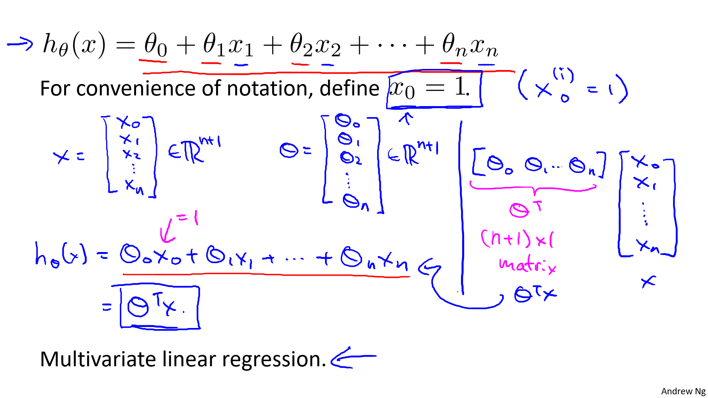
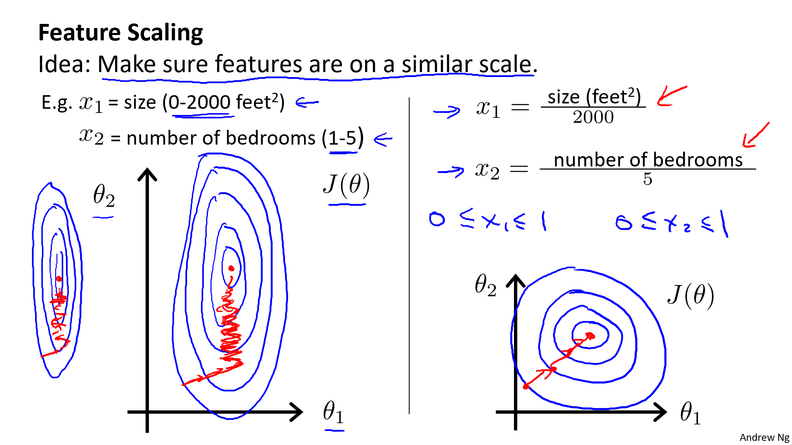
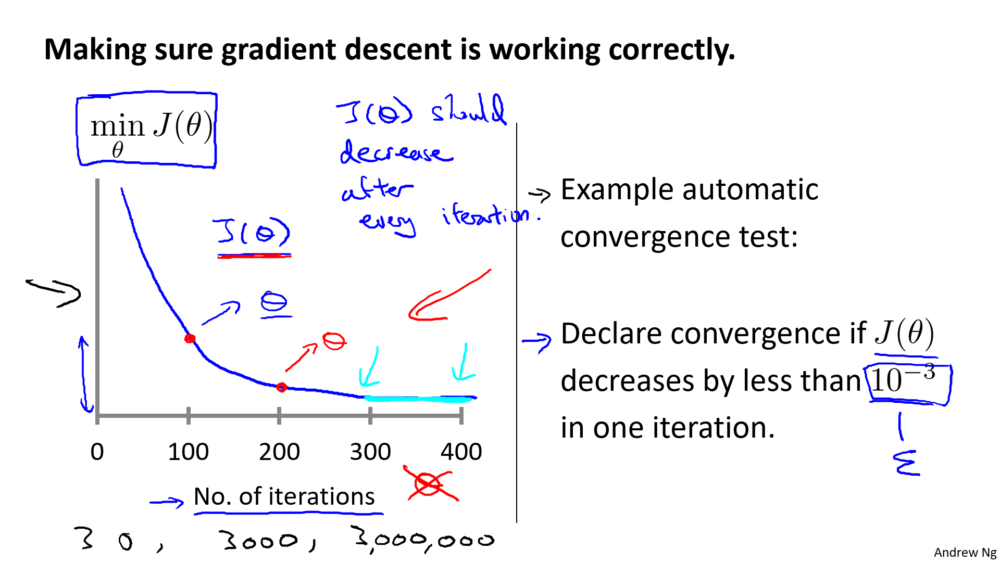
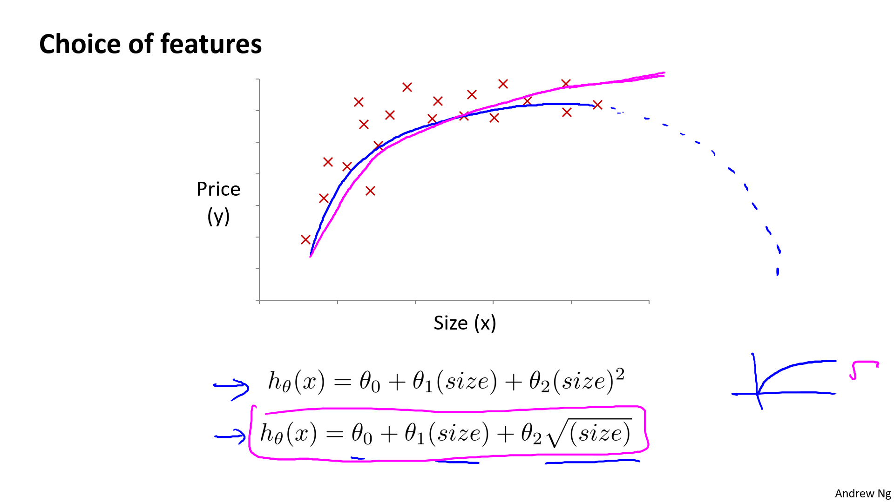
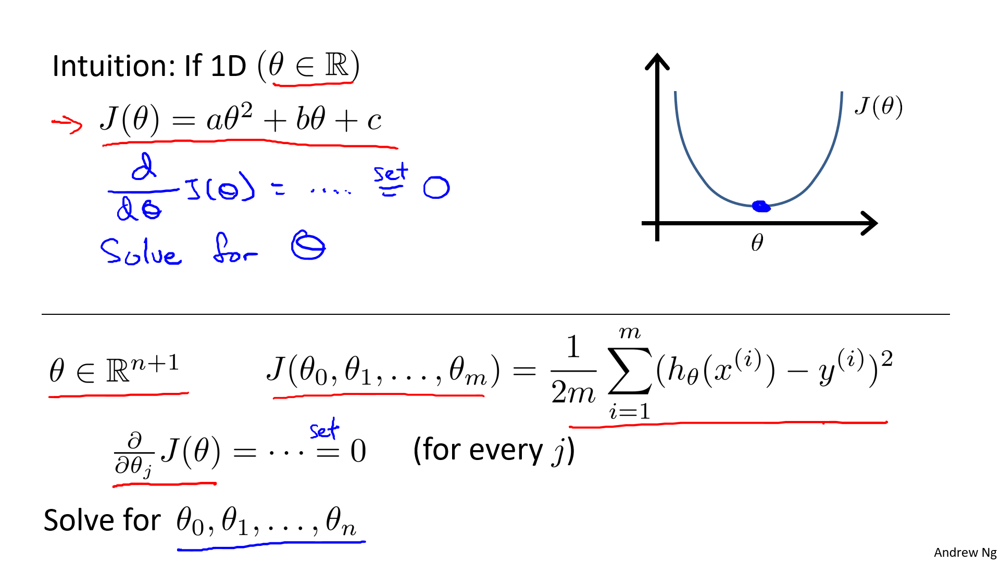
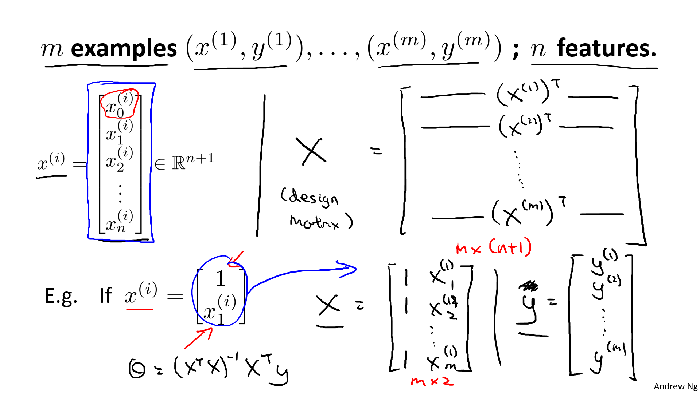

## 1. 多维特征

!!! info ""

    参考视频:
    4 - 1 - Multiple Features (8 min).mkv

目前为止，我们探讨了单变量/特征的回归模型，现在我们对房价模型增加更多的特征，例如房间数楼层等，构成一个含有多个变量的模型，模型中的特征为$\left( {x_{1}},{x_{2}},...,{x_{n}} \right)$。

| Size (feet2) | Number   of bedrooms | Number   of floors | Age of home (years) | Price   ($1000) |
| :----------: | :------------------: | :----------------: | :-----------------: | :-------------: |
|     2104     |          5           |         1          |         45          |       460       |
|     1416     |          3           |         2          |         40          |       232       |
|     1534     |          3           |         2          |         30          |       315       |
|     852      |          2           |         1          |         36          |       178       |
|      …       |          …           |         …          |          …          |        …        |

增添更多特征后，我们引入一系列新的注释：

$n$ 代表特征的数量

${x^{\left( i \right)}}$ 代表第 $i$ 个训练实例，是特征矩阵中的第$i$行，是一个**向量**（**vector**）。

比方说，上图的

${x}^{(2)}\text{=}\begin{bmatrix} 1416\\\ 3\\\ 2\\\ 40 \end{bmatrix}$，

${x}_{j}^{\left( i \right)}$代表特征矩阵中第 $i$ 行的第 $j$ 个特征，也就是第 $i$ 个训练实例的第 $j$ 个特征。

如上图的$x_{2}^{\left( 2 \right)}=3,x_{3}^{\left( 2 \right)}=2$，

支持多变量的假设 $h$ 表示为：$h_{\theta}\left( x \right)={\theta_{0}}+{\theta_{1}}{x_{1}}+{\theta_{2}}{x_{2}}+...+{\theta_{n}}{x_{n}}$，

这个公式中有$n+1$个参数和$n$个变量，为了使得公式能够简化一些，引入$x_{0}=1$，则公式转化为：$h_{\theta} \left( x \right)={\theta_{0}}{x_{0}}+{\theta_{1}}{x_{1}}+{\theta_{2}}{x_{2}}+...+{\theta_{n}}{x_{n}}$



此时模型中的参数是一个$n+1$维的向量，任何一个训练实例也都是$n+1$维的向量，特征矩阵$X$的维度是 $m*(n+1)$。 因此公式可以简化为：$h_{\theta} \left( x \right)={\theta^{T}}X$，其中上标  $T$ 代表矩阵转置。

注意：
从上图可知, $\theta$, $X$ 我们是用**列向量**来标记。计算 $h_{\theta}\left( x \right)={\theta_{0}}+{\theta_{1}}{x_{1}}+{\theta_{2}}{x_{2}}+...+{\theta_{n}}{x_{n}}$ 的时候, 可以将 $h$ 表示为 $\theta^TX.$


## 2. 多变量梯度下降

!!! info ""

    参考视频:
    4 - 2 - Gradient Descent for Multiple Variables (5 min).mkv

快速回顾我们的记号，并用向量简化。

Hypothesis: $h_\theta(x)=\theta_0+\theta_1x+\theta_2x+...+\theta_nx$

简记为： $h_\theta(x)=\theta^TX$

Parameters: $\theta_0,\theta_1,\theta_2,...\theta_n$

简记为：$\theta$, $n+1\ dimension\ vector$

Cost Function: 

$$
J(\theta_0,\theta_1,\ \theta_2,...\theta_n)=\frac {1} {2m}\sum\limits_{i=1}^{m}(h_\theta(x^{(i)})-y^{(i)})^2
$$

简记为：

$$
J(\theta)=\frac {1} {2m}\sum\limits_{i=1}^{m}(h_\theta(x^{(i)})-y^{(i)})^2
$$

Gradient descent:
**Repeat {**
            

​                ${\theta_{j}}:={\theta_{j}}-\alpha\frac{\partial}{\partial\theta_j}J(\theta_0,...\theta_n)$

​               **}** (simultaneously update for every j=0, 1, 2, ..., n)
简记为：把上面的$J(\theta_0,...\theta_n)$换成$J(\theta)$


与单变量线性回归类似，在多变量线性回归中，我们也构建一个代价函数，则这个代价函数是所有建模误差的平方和，即：$J\left( {\theta_{0}},{\theta_{1}}...{\theta_{n}} \right)=\frac{1}{2m}\sum\limits_{i=1}^{m}{{{\left( h_{\theta} \left({x}^{\left( i \right)} \right)-{y}^{\left( i \right)} \right)}^{2}}}$ ，

其中：$h_{\theta}\left( x \right)=\theta^{T}X={\theta_{0}}+{\theta_{1}}{x_{1}}+{\theta_{2}}{x_{2}}+...+{\theta_{n}}{x_{n}}$ ，

我们的目标和单变量线性回归问题中一样，是要找出使得代价函数最小的一系列参数。
多变量线性回归的批量梯度下降算法为：

当$n>=1$时，
${{\theta }_{0}}:={{\theta }_{0}}-a\frac{1}{m}\sum\limits_{i=1}^{m}{({{h}_{\theta }}({{x}^{(i)}})-{{y}^{(i)}})}x_{0}^{(i)}$

${{\theta }_{1}}:={{\theta }_{1}}-a\frac{1}{m}\sum\limits_{i=1}^{m}{({{h}_{\theta }}({{x}^{(i)}})-{{y}^{(i)}})}x_{1}^{(i)}$

${{\theta }_{2}}:={{\theta }_{2}}-a\frac{1}{m}\sum\limits_{i=1}^{m}{({{h}_{\theta }}({{x}^{(i)}})-{{y}^{(i)}})}x_{2}^{(i)}$

...

${{\theta }_{n}}:={{\theta }_{n}}-a\frac{1}{m}\sum\limits_{i=1}^{m}{({{h}_{\theta }}({{x}^{(i)}})-{{y}^{(i)}})}x_{n}^{(i)}$

我们开始随机选择一系列的参数值，计算所有的预测结果后，再给所有的参数一个新的值，如此循环直到收敛。

代码示例：

计算代价函数
$J\left( \theta  \right)=\frac{1}{2m}\sum\limits_{i=1}^{m}{{{\left( {h_{\theta}}\left( {x^{(i)}} \right)-{y^{(i)}} \right)}^{2}}}$
其中：${h_{\theta}}\left( x \right)={\theta^{T}}X={\theta_{0}}{x_{0}}+{\theta_{1}}{x_{1}}+{\theta_{2}}{x_{2}}+...+{\theta_{n}}{x_{n}}$

**Python** 代码：

```python
def computeCost(X, y, theta):
    inner = np.power(((X * theta.T) - y), 2)
    return np.sum(inner) / (2 * len(X))
```

<hr>

下面，我们开始推导$\frac{\partial}{\partial\theta}J(\theta)$。这里为了普遍性，还原了 $\theta$ 的普遍情况，也即有n个 $\theta$ 的情况。

Hypothesis:         $h_\theta(x)=\theta^Tx=\theta_0x_0+\theta_1x_1+\theta_2x_2+...+\theta_nx_n$

Parameters:         $\theta_0,\theta_1,...,\theta_n$

Cost function: 

$$
J(\theta_0,\theta_1,...,\theta_n)=\frac {1} {2m}\sum\limits_{i=1}^{m}(h_\theta(x^{(i)})-y^{(i)})^2
$$

Gradient descent:
Repeat{
$$
\theta_j :=\theta_j-\alpha\frac{\partial}{\partial \theta_j}J(\theta_0,\theta_1,...,\theta_n)
$$
​	     }（simultaneously update for every j=0, 1, 2, ..., n)）

推导： $\frac{\partial}{\partial \theta_j}J(\theta_0,\theta_1,...,\theta_n)=?$

Let's first work it for the case if we have only one training example $(x,y)$, so that we can neglect the sum in the definition $J$. We have:
$$
\begin{split}
\frac{\partial}{\partial \theta_j}J(\theta_0,\theta_1,...,\theta_n) & =  \frac {1} {2}\frac{\partial}{\partial \theta_j}\Big(h_\theta(x)-y\Big)^2 \\\\
 & = 2\cdot\frac{1}{2}\cdot(h_\theta(x)-y)\cdot\frac{\partial}{\partial \theta_j}(h_\theta(x)-y) \\\\
 & = (h_\theta(x)-y)\cdot\frac{\partial}{\partial \theta_j}(\theta_0x_0+\theta_1x_1+\theta_2x_2+...+\theta_nx_n) \\\\
 & = (h_\theta(x)-y)\cdot x_j
\end{split}
$$

## 3. 梯度下降法 - 特征缩放

!!! info ""

    参考视频:
    4 - 3 - Gradient Descent in Practice I - Feature Scaling (9 min).mkv

在我们面对多维特征问题的时候，我们要保证这些特征都具有相近的尺度，这将帮助梯度下降算法更快地收敛。

以房价问题为例，假设我们使用两个特征，房屋的尺寸和房间的数量，尺寸的值为 0-2000平方英尺，而房间数量的值则是0-5，以两个参数分别为横纵坐标，绘制代价函数的等高线图能，看出图像会显得很扁，梯度下降算法需要非常多次的迭代才能收敛。
解决的方法是尝试将所有特征的尺度都尽量缩放到-1到1之间。如图：



视频里吴恩达老师的方法是令：${{x}_{n}}=\frac{{{x}_{n}}-mean}{{max(x)-min(x)}}$, 其中 $mean$是平均值，$max(x)-min(x)$分别是最大值和最小值。

更通用的是令：${{x}_{n}}=\frac{{{x}_{n}}-{mean}}{\sigma}$，其中 $mean$是平均值，$\sigma$是标准差。

python里的api：

- **sklearn.preprocessing.StandardScaler()**
 
    - 处理之后每列来说**所有数据都聚集在均值0附近标准差差为1**
    - **StandardScaler.fit_transform(X)**
        - X:numpy array格式的数据[n_samples,n_features]
    - 返回值：转换后的形状相同的array

部分参考代码：
```python
from sklearn.datasets import load_boston
from sklearn.model_selection import train_test_split
from sklearn.preprocessing import StandardScaler
from sklearn.linear_model import LinearRegression
from sklearn.metrics import mean_squared_error


def linear_model1():
    # 1.获取数据
    boston = load_boston()

    # 2. 数据集划分
    x_train, x_test, y_train, y_test = train_test_split(
        boston.data, boston.target, test_size=0.2)

    # 3. 特征工程-标准化
    transfer = StandardScaler()
    x_train = transfer.fit_transform(x_train)
    x_test = transfer.fit_transform(x_test)
```

## 4. 梯度下降法 - 学习率

!!! info ""

    参考视频:
    4 - 4 - Gradient Descent in Practice II - Learning Rate (9 min).mkv

梯度下降算法收敛所需要的迭代次数根据模型的不同而不同，我们不能提前预知，我们可以绘制迭代次数和代价函数的图表来观测算法在何时趋于收敛。



也有一些自动测试是否收敛的方法，例如将代价函数的变化值与某个阀值（例如0.001）进行比较，但通常看左上方这样的图表更好。

不正确的学习率，会产生左侧上下两个图像。


梯度下降算法的每次迭代受到学习率的影响，如果学习率 $\alpha$ 过小，则达到收敛所需的迭代次数会非常高；如果学习率 $\alpha$ 过大，每次迭代可能不会减小代价函数，可能会越过局部最小值导致无法收敛。

通常可以考虑尝试些学习率：

$\alpha= 0.001, 0.003, 0.01, 0.03, 0.1, 0.3, 1, 3, 10$

## 5. 特征和多项式回归

!!! info ""

    参考视频:
    4 - 5 - Features and Polynomial Regression (8 min).mkv

如房价预测问题，


$h_{\theta}\left( x \right)={\theta_{0}}+{\theta_{1}}\times{frontage}+{\theta_{2}}\times{depth}$ 

当我们真正应用线性回归模型的时候，我们可以创造自己的特征即：
${x_{1}}=frontage$（临街宽度），${x_{2}}=depth$（纵向深度），$x=frontage*depth=area$（面积），
则：${h_{\theta}}\left( x \right)={\theta_{0}}+{\theta_{1}}x$。


线性回归并不适用于所有数据，有时我们需要其他模型来适应我们的数据，比如一个二次方模型：$h_{\theta}\left( x \right)={\theta_{0}}+{\theta_{1}}{x_{1}}+{\theta_{2}}{x_{2}^2}$
 或者三次方模型： $h_{\theta}\left( x \right)={\theta_{0}}+{\theta_{1}}{x_{1}}+{\theta_{2}}{x_{2}^2}+{\theta_{3}}{x_{3}^3}$ 

从上面图右侧，可以看出如果我们采用多项式回归模型，在运行梯度下降算法前特征缩放的重要性了。

通常我们需要先观察数据然后再决定准备尝试怎样的模型。 另外，我们可以令：

${{x}_{2}}=x_{2}^{2},{{x}_{3}}=x_{3}^{3}$，从而将模型转化为线性回归模型。

根据函数图形特性，我们还可以使：

${{{h}}_{\theta}}(x)={{\theta }_{0}}\text{+}{{\theta }_{1}}(size)+{{\theta}_{2}}{{(size)}^{2}}$

或者:

${{{h}}_{\theta}}(x)={{\theta }_{0}}\text{+}{{\theta }_{1}}(size)+{{\theta }_{2}}\sqrt{size}$



## 6. 正规方程

!!! info ""

    参考视频:
    4 - 6 - Normal Equation (16 min).mkv

到目前为止，我们都在使用梯度下降算法，但是对于某些线性回归问题，正规方程方法是更好的解决方案。如：



正规方程是通过求解下面的方程来找出使得代价函数最小的参数的：$\frac{\partial}{\partial{\theta_{j}}}J\left( {\theta_{j}} \right)=0$ 。
 假设我们的训练集特征矩阵为 $X$（包含了 ${{x}_{0}}=1$）并且我们的训练集结果为向量 $y$，则利用正规方程解出向量 $\theta ={{\left( {X^T}X \right)}^{-1}}{X^{T}}y$ 。

以下面表格数据为例 $m=4$：

| $x_0$   | Size (feet2) | Number   of bedrooms | Number   of floors | Age of home (years) | Price   ($1000) |
| ---- | ------------ | -------------------- | ------------------ | ------------------- | --------------- |
| 1    | 2104         | 5                    | 1                  | 45                  | 460             |
| 1    | 1416         | 3                    | 2                  | 40                  | 232             |
| 1    | 1534         | 3                    | 2                  | 30                  | 315             |
| 1    | 852          | 2                    | 1                  | 36                  | 178             |

$X\ \text{=}\begin{bmatrix}1 & 2104 & 5 & 1 & 45\\1 & 1416 & 3 & 2 & 40\\ 1 &1534 & 3 & 2 & 30\\ 1 & 852 & 2 & 1 & 36\end{bmatrix}$，$y\ \text{=}\begin{bmatrix} 460\\232\\315\\178\end{bmatrix}$

$X维度：(m,n+1),\ y的维度：(m,1)$

这时候求解 $\theta$ 只需一步:  $\theta ={{\left( {X^T}X \right)}^{-1}}{X^{T}}y$。

将上面的例子推广到一般情况



注：对于那些不可逆的矩阵（通常是因为特征之间不独立，如同时包含英尺为单位的尺寸和米为单位的尺寸两个特征，也有可能是特征数量大于训练集的数量），正规方程方法是不能用的。
千万要注意这里的设计矩阵X它的构成，设计完成后，假设函数可以向量化为 $h_\theta(x)=X\theta$

梯度下降与正规方程的比较：

| 梯度下降             | 正规方程                                     |
| ---------------- | ---------------------------------------- |
| 需要选择学习率$\alpha$  | 不需要                                      |
| 需要多次迭代           | 一次运算得出                                   |
| 当特征数量$n$大时也能较好适用 | 需要计算${{\left( {{X}^{T}}X \right)}^{-1}}$ 如果特征数量n较大则运算代价大，因为矩阵逆的计算时间复杂度为$O\left( {{n}^{3}} \right)$，通常来说当$n$小于10000 时还是可以接受的 |
| 适用于各种类型的模型       | 只适用于线性模型，不适合逻辑回归模型等其他模型                  |

总结一下，只要特征变量的数目并不大，标准方程是一个很好的计算参数$\theta $的替代方法。具体地说，**只要特征变量数量小于一万，我通常使用正规方程法，而不使用梯度下降法。**

随着我们要讲的学习算法越来越复杂，例如，当我们讲到分类算法，像逻辑回归算法，我们会看到，实际上对于那些算法，并不能使用标准方程法。对于那些更复杂的学习算法，我们将不得不仍然使用梯度下降法。因此，梯度下降法是一个非常有用的算法，可以用在有大量特征变量的线性回归问题。或者我们以后在课程中，会讲到的一些其他的算法，因为标准方程法不适合或者不能用在它们上。但对于这个特定的线性回归模型，标准方程法是一个比梯度下降法更快的替代算法。所以，根据具体的问题，以及你的特征变量的数量，这两种算法都是值得学习的。

正规方程的**python**实现：

```python
import numpy as np
    
 def normalEqn(X, y):
    
   theta = np.linalg.inv(X.T@X)@X.T@y #X.T@X等价于X.T.dot(X)
    
   return theta
```

<br>
<br>
<br>

!!! info ""

    **以下是正规方程英文版(有详细推导-自己加上的)，其他内容来源于2006年麻省理工cs 2009机器学习的note。**

## 7. The normal equations

<!--
下面这个css用于控制p标签的两端对齐
-->
<style type="text/css">
p {
    text-align: justify;  /*文本两端对齐*/
}
</style>

Gradient descent gives one way of minimizing $J$. Lets discuss a second way of doing so, this time performing the minimization explicitly and without resorting to an iterative algorithm. In this method, we will minimize $J$ by explicitly taking its derivatives with respect to the $θ_j's$, and setting them to zero. To enable us to do this without having to write reams of algebra and pages full of matrices of derivatives, lets introduce some notation for doing calculus with matrices. 

### 7.1 Matrix derivatives

For a function $f$ : $\mathbb{R^{m\times n}} \rightarrow \mathbb{R}$ mapping from $\text{m-by-n}$ matrices to the real numbers, we define the derivative of f with respect to A to be:

$$
\nabla _Af(A)=\begin{bmatrix} \frac{\partial f}{\partial A_{11}} & \cdots  & \frac{\partial f}{\partial A_{1n}} \\\\ 
\vdots  & \ddots & \vdots \\\\
\frac{\partial f}{\partial A_{m1}} & \cdots  & \frac{\partial f}{\partial A_{mn}}\end{bmatrix}
$$

Thus, the gradient $\nabla _Af(A)$ is itself an $\text{m-by-n}$  matrix, whose $(i,j)$-element is $\frac{\partial f}{\partial A_{ij}}$. For example, suppose $A =\bigl( \begin{smallmatrix} A_{11}  & A_{12} \\ A_{21} & A_{22} \end{smallmatrix} \bigr)$ is a 2-by-2 matrix, and the function $f$: $\mathbb{R^{2\times 2}}\rightarrow \mathbb{R}$ is given by

$$
f(A)=\frac{3}{2}A_{11}+5A_{12}^2+A_{21}A_{22}
$$

Here, $A_{ij}$ denotes the $(i,j)$ entry of the matrix $A$. We then have

$$
\nabla _Af(A)=\begin{bmatrix} 
\frac{3}{2} & 10A_{12}\\\\
A_{22} & A_{21}
\end{bmatrix}
$$

&ensp; We also introduce the **trace** opertator, written by "tr.". For an $\text{n-by-n}$ (square) matrix A, the trace of A is defined to be the sum of its diagonal entries:

$$
\operatorname{tr}A=\sum_{i=1}^nA_{ii}
$$

If $a$ is a real number (i.e., a 1-by-1 matrix), then $\operatorname{tr} a = a$. (If you haven't seen this "opertator notation" before, you should think of the trace of $A$ as $\operatorname{tr}(A)$, or as application of the "trace" function to the matrix $A$. It's more commonly written without the parentheses, however.）
&ensp; The trace opertator has the property that for two matrices $A$ and $B$ such that $AB$ is square, we have that $\operatorname{tr}(AB)=\operatorname{tr}(BA)$. <a href="../../math in ML/2. M derivation/#25">证明请查看机器学习中的数学知识中关于迹的交换律的证明。</a> As corollaries of this, we also have, e.g.,

$$ \operatorname{tr}(ABC)=\operatorname{tr}(CAB)=\operatorname{tr}(BCA)$$

$$ \operatorname{tr}(ABCD)=\operatorname{tr}(DABC)=\operatorname{tr}(CDAB)=\operatorname{tr}(BCDA)$$

The following properties of the trace operator are also easily verified. Here, $A$ and $B$ are square matrices, and $a$ is a real number:

$$ \operatorname{tr}(A) = \operatorname{tr}(A^T)$$

$$ \operatorname{tr}(A+B) = \operatorname{tr}(A)+\operatorname{tr}(B)$$

$$ \operatorname{tr}(aA) = a \operatorname{tr}(A)$$

&ensp; We now state without proof some facts of matrix derivatives (we won’t need some of these until later this quarter). Equation (4) applies only to non-singular square matrices A, where |A| denotes the determinant of A. We have:

$$ \nabla_A \operatorname{tr}(AB)=B^T\\\\ \tag{1}$$

$$ \nabla_{A^T}f(A) = \big(\nabla_Af(A)\big)^T \\\\\tag{2}$$

$$ \nabla_A \operatorname{tr}ABA^TC=CAB+C^TAB^T \\\\\tag{3} $$

$$\nabla_A|A|=|A|(A^{-1})^T\\\\\tag{4}$$

---

吴恩达老师不给你们证明，我来给你们证明:sunglasses:

请在看下面推导之前, 务必先看懂我这个知识库中**机器学习中的数学知识**&ensp;---&ensp;( **一. 矩阵求导本质 &二. 矩阵求导**)。


I. $\nabla_A \operatorname{tr}(AB)=B^T$

**证明:**

由 <a href="../../math in ML/2. M derivation/#24">二.矩阵求导中---(6)式的证明</a> 我们可以知道：

对于两个阶数都是 $m \times n$ 的矩阵 $C_{m \times n}, D_{m \times n}$ 其中**一个矩阵乘以（左乘右乘都可以）另一个矩阵的 ==转置== 的迹，本质是 $C_{m \times n}, D_{m \times n}$ 两个矩阵对应位置的元素相乘并相加**。

所以这里 $\operatorname{tr}(AB)$ 相当于就是 $A$ 和 $B^T$  每一个位置对应元素 ==相乘并相加== 。
其中, $A_{m \times n}, B_{n \times m}$。

接着, 由 <a href="../../math in ML/1. M derivation essence/#23_1">二.矩阵求导本质---(11)式</a> 我们可以知道:

这里求 $\nabla_A \operatorname{tr}(AB)$ 相当于 $\operatorname{tr}(AB)$ 按照 $A$ 矩阵分布的每个位置元素求偏导。

所以, 综上所述, $\nabla_A \operatorname{tr}(AB)=B^T$。

**证毕。**

II. $\nabla_{A^T}f(A) = \big(\nabla_Af(A)\big)^T$

**证明:**

由 <a href="../../math in ML/1. M derivation essence/#23_1">二.矩阵求导本质---(11)式</a> 可知:

$$
\begin{align}
\nabla_{A^T}f(A) &=
\begin{bmatrix} \frac{\partial f}{\partial a_{11}} & \cdots  & \frac{\partial f}{\partial a_{m1}} 
\\ \vdots & \ddots & \vdots 
\\ \frac{\partial f}{\partial x_{1n}} & \cdots & \frac{\partial f}{\partial x_{mn}} \\
\end{bmatrix}\\\\
 & = \begin{bmatrix} \frac{\partial f}{\partial a_{11}} & \cdots  & \frac{\partial f}{\partial a_{1n}} 
\\ \vdots & \ddots & \vdots 
\\ \frac{\partial f}{\partial x_{m1}} & \cdots & \frac{\partial f}{\partial x_{mn}} \\
\end{bmatrix}\\\\
 & = \big(\nabla_Af(A)\big)^T
\end{align}
$$

**证毕。**

III. $\nabla_A \operatorname{tr}ABA^TC=CAB+C^TAB^T$

**证明:**

首先, 我们要明确这里的 $ABA^TC$ 是关于 $A$ 矩阵的实值标量函数, 所以, 我们可以令 $f(A)=ABA^TC$。

!!! note ""

    **注意:** 这里的标记, 由于 $A$ 其实是矩阵变元, 应该标记为 $f(\pmb A)=\pmb A B \pmb A^TC$, 所以后面的推导过程,我们严谨一些, 将矩阵变元 $A$ 标记为 $\pmb A$。

仔细想你会发现，对于实值标量函数 $f (\pmb{A})$, $\operatorname{tr}\big( f(\pmb A) \big)=f(\pmb A)$ , $\mathbb{d}f(\pmb A)=\operatorname{tr}\big( \mathbb{d}f(\pmb A) \big)$

所以有 $\mathbb{d}f(\pmb A)=\mathbb{d}\big(\operatorname{tr}f(\pmb A)\big)=\operatorname{tr}\big( \mathbb{d}f(\pmb A) \big)$ 。

由 <a href="../../math in ML/2. M derivation/#32_1">二.矩阵求导本质---(24)式</a> 即:

$$
\mathbb{d}f(\pmb{X})= \operatorname{tr}\Big(\frac{\partial f(\pmb{X})}{\partial \pmb{X}^T}\mathbb{d}\pmb{X}\Big)
$$

我们可以把一个矩阵变元的实值标量函数的全微分写成上式，我们就找到了矩阵求导的结果, 也即: 

$$
\mathbb{d}f(\pmb{A})= \operatorname{tr}\Big(\frac{\partial f(\pmb{A})}{\partial \pmb{A}^T}\mathbb{d}\pmb{A}\Big)\\\\
\tag{II.1}
$$

由我们证明的 II. $\nabla_{A^T}f(A) = \big(\nabla_Af(A)\big)^T$得:

$$
\frac{\partial f(\pmb{A})}{\partial \pmb{A}^T} = \nabla _{\pmb A^T}f(\pmb A)=\big(\nabla _{\pmb A}f(\pmb A)\big)^T
$$

所以我们要求的:

$$
\nabla _{\pmb A}f(\pmb A)=\Big(\frac{\partial f(\pmb{A})}{\partial \pmb{A}^T}\Big)^T \\\\
\tag{II.2}
$$

最终我们的任务就是转化为求 $\mathbb{d}f(\pmb{A})$ 的全微分, 下面开始推导：

$$
\begin{aligned}
\mathbb{d}f(\pmb{A}) & = \mathbb{d}\pmb A B \pmb A^TC \\\\
 & = \mathbb{d}\operatorname{tr}(\pmb A B \pmb A^TC)\\\\
 & = \mathbb{d}\operatorname{tr}(C \pmb A B \pmb A^T)\\\\
 & = \operatorname{tr}\mathbb{d}(C \pmb A B \pmb A^T)\\\\
 & = \operatorname{tr}\Big(\mathbb{d}(C \pmb A) B \pmb A^T +  C \pmb A \mathbb{d}(B \pmb A^T)\Big)\\\\
 & = \operatorname{tr}\Big(C(\mathbb{d}\pmb A) B \pmb A^T +  C \pmb A B \mathbb{d}\pmb A^T\Big)\\\\
 & = \operatorname{tr}\Big(B \pmb A^T C\mathbb{d}\pmb A \Big) + \operatorname{tr}\Big( C \pmb A B \mathbb{d}\pmb A^T\Big)\\\\
 & = \operatorname{tr}\Big(B \pmb A^T C\mathbb{d}\pmb A \Big) + \operatorname{tr}\Big( C \pmb A B (\mathbb{d}\pmb A)^T\Big)\\\\
 & = \operatorname{tr}\Big(B \pmb A^T C\mathbb{d}\pmb A \Big) + \operatorname{tr}\Big(\mathbb{d}\pmb A (B^T \pmb A^T C^T )\Big)\\\\
 & = \operatorname{tr}\Big(B \pmb A^T C\mathbb{d}\pmb A \Big) + \operatorname{tr}\Big( B^T\pmb A^T C^T  \mathbb{d}\pmb A\Big)\\\\
 & = \operatorname{tr}\Big[(B \pmb A^T C + B^T\pmb A^T C^T) \mathbb{d}\pmb A\Big]\\\\
\end{aligned}
$$

> 数字是步骤 汉字是每一步依据 <br>
> 01 -> 02 实值标量函数的性质 <br>
> 02 -> 03 迹的交换律 <br>
> 03 -> 04 实值标量函数的性质 <br>
> 04 -> 05 矩阵微分的乘积法则 <br>
> 05 -> 06 夹层饼 <br>
> 06 -> 07 迹的线性法则, 迹的交换律 <br>
> 07 -> 08 矩阵微分的转置法则 <br>
> 08 -> 09 转置的迹等于原矩阵的迹 <br>
> 09 -> 10 迹的交换律 <br>
> 10 -> 11 迹的线性法则 <br>

结合前面的 $(II.1)$ 式可得:

$$
\frac{\partial f(\pmb{A})}{\partial \pmb{A}^T}=B \pmb A^T C + B^T\pmb A^T C^T
$$

再结合前面的 $(II.2)$ 式可得:

$$
\begin{aligned}
\nabla _{\pmb A}f(\pmb A) & = \Big(\frac{\partial f(\pmb{A})}{\partial \pmb{A}^T}\Big)^T \\\\
& = (B \pmb A^T C + B^T\pmb A^T C^T)^T\\\\
& = C^T \pmb A B^T + C \pmb A B 
\end{aligned}
$$

**证毕。**

IV. $\nabla_A|A|=|A|(A^{-1})^T\\\\$

**证明:**

由 <a href="../../math in ML/2. M derivation/#322">矩阵行列式微分 即(25.2.1)式</a>的证明可知:

$$
\mathbb{d} |\pmb A| = \operatorname{tr}(|\pmb A|\pmb A^{-1}\mathbb{d}\pmb A)
$$

再由 <a href="../../math in ML/2. M derivation/#32_1">二.矩阵求导本质---(24)式</a>可得：

$$
\frac{\partial |\pmb A|}{\partial \pmb A^T}=|\pmb A|\pmb A^{-1}
$$

因此,

$$
\begin{aligned}
\nabla _{\pmb A}|\pmb A| & = (\frac{\partial |\pmb A|}{\partial \pmb A^T})^T \\\\
&=(|\pmb A|\pmb A^{-1})^T\\\\
&=|\pmb A|(\pmb A^{-1})^T
\end{aligned}
$$

**证毕。**

至此, 吴恩达老师省略的证明, 全部证明完毕。下面继续记笔记。

---

To make our martix notation more concrete, let us now explain in detail the meaning of the first of these equations. Suppose we have some fixed matrix $B \in \mathbb{R}^{n\times m}$ . We can then define a function $f :\mathbb{R}^{m\times n}\rightarrow \mathbb{R}$ according to $f(A)=AB$. Note that this definition makes sense, because if $A \in \mathbb{R}^{m\times n}$, then $AB$ is a square matrix, and we can apply the trace operator to it; thus, $f$ does indeed map from $\mathbb{R}^{m\times n}$ to $\mathbb{R}$. We can then apply our definition of matrix derivatives to find $\nabla _Af(A)$, which will itself by an m-by-n matrix. Equation (1) above states that the $(i,j)$ entry of this matrix will given by the $(i,j)$-entry of $B^T$ , or equivalently, by $B_{j,i}$ .

&ensp; The proofs of Equation (1-3) are reasonably simply, and are left as an exercise to the reader. Equation (4) can be derived using adjoint representation of the inverse of a martix.

### 7.2 Least squares revisited

Armed with the tools of matrix derivatives, let us now proceed to find in closed-form the value of $\theta$ that minimizes $J(\theta)$. We begin by re-writing $J$ in matrix-vectorial notation.

&ensp;Giving a training set, define **the design matrix** $X$ to be the m-by-n matrix (actually m-by-n+1, if we include the intercept term) that contains the training examples' input values in its row:

$$
X = \begin{bmatrix} --- & (x^{(1)})^T & --- \\\\ --- & (x^{(2)})^T &  ---
\\\\ & \vdots &
\\\\ --- & (x^{(m)})^T & ---
\end{bmatrix}
$$

Also, let $\vec{y}$ be the m-dimensional vector containing all the target values from the training set:

$$
\vec{y}=\begin{bmatrix} 
y^{(1)}\\\\
y^{(2)}\\\\
\vdots\\\\
y^{(m)}
\end{bmatrix}
$$

Now, since $h_\theta\big(x^{(i)}\big)=(x^{(i)})^T\theta$, we can easily verify that

$$
\begin{aligned}
X\theta-\vec{y} &= 
\begin{bmatrix} (x^{(1)})^T\theta \\\\  \vdots  \\\\
(x^{(m)})^T\theta
\end{bmatrix} - \begin{bmatrix}  y^{(1)}\\\\
\vdots\\\\
y^{(m)}
\end{bmatrix}\\\\
& = \begin{bmatrix}
(x^{(1)})^T\theta- y^{(1)} \\\\
  \vdots \\\\
(x^{(m)})^T\theta- y^{(m)} 
\end{bmatrix}
\end{aligned}
$$

Thus, using the fact for a vector $z$ , we have that $z^Tz=\sum_{i}z_i^2$ .

$$
\begin{aligned}
\frac{1}{2}(X\theta-\vec{y})^T(X\theta-\vec{y})&=\frac{1}{2}\sum_{i=1}^m\Big(h_\theta(x^{(i)})- y^{(i)} \Big)^2\\\\
&=J(\theta)
\end{aligned}
$$

Finally , to minimize $J$ , lets find its derivatives with respect to $\theta$ . Combining Equations (2) and (3) , we find that

$$
\nabla _{A^T}\operatorname{tr}(ABA^TC)=B^TA^TC^T+BA^TC \\\\
\tag{5}
$$

Hence,

$$
\begin{aligned}
\nabla _\theta J(\theta) & = \nabla _\theta \frac{1}{2}(X\theta-\vec{y})^T(X\theta-\vec{y}) \\\\
& = \frac{1}{2} \nabla _\theta(\theta^TX^TX\theta-\theta^TX^T \vec{y}-\vec{y}^TX \theta+\vec{y}^T \vec{y})\\\\
& = \frac{1}{2} \nabla _\theta \operatorname{tr}(\theta^TX^TX\theta-\theta^TX^T \vec{y}-\vec{y}^TX \theta+\vec{y}^T \vec{y})\\\\
& = \frac{1}{2} \nabla _\theta\Big(\operatorname{tr}(\theta^TX^TX\theta)-2\operatorname{tr}(\vec{y}^TX \theta)\Big)\\\\
& = \frac{1}{2}(X^TX \theta+X^TX \theta-2X^T \vec{y})\\\\
& = X^TX \theta-X^T \vec{y}
\end{aligned}
$$

In the third step, we used the fact that the trace if a real number is just the real number; the fourth step used the fact that $\operatorname{tr}(A)=\operatorname{tr}(A^T)$ , and the fifth step used Equation (5) with $A^T=\theta$, $B=B^T=X^TX$ , and $C=I$, and Equation (1). To minimize $J$ , we set its derivatives to zero, and obtain the normal equations:

$$
X^TX \theta=X^T \vec{y}
$$

Thus, the value of $\theta$ that minimize $J(\theta)$ is given in closed form by the equation

$$
\theta = (X^TX)^{-1}X^T \vec{y}
$$

## 8. 正规方程及不可逆性

!!! note ""

    参考视频: 4 - 7 - Normal Equation Noninvertibility (Optional) (6 min).mkv

在这段视频中谈谈正规方程 ( **normal equation** )，以及它们的不可逆性。

我们要讲的问题如下：$\theta ={{\left( {X^{T}}X \right)}^{-1}}{X^{T}}y$ 当计算 $\theta$=`inv(X'X ) X'y` ，那对于矩阵 $X'X$ 的结果是不可逆的情况咋办呢?

我们都知道，有些矩阵可逆(**invertible**)，而有些矩阵不可逆(**non-invertible**)。我们称那些不可逆矩阵为奇异(**singular**)或退化(**dgenerate**)矩阵。

首先, 说一下  **$\pmb X'\pmb X$ 不可逆的原因**。

- 1. **特征值线性相关**

    例如，在预测住房价格时，如果${x_{1}}$是以英尺为尺寸规格计算的房子，${x_{2}}$是以平方米为尺寸规格计算的房子，同时，你也知道1米等于3.28英尺 ( 四舍五入到两位小数 )，这样，你的这两个特征值将始终满足约束：${x_{1}}={x_{2}}*{{\left( 3.28 \right)}^{2}}$。 实际上，如果你用这样的一个线性方程，来展示那两个相关联的特征值，矩阵$X'X$将是不可逆的。

- 2. **特征值的数量小于训练集的数量**

    具体地说，在$m$小于或等于n的时候，例如，有$m$等于10个的训练样本也有$n$等于100的特征数量。要找到适合的$(n +1)$ 维参数矢量$\theta$，这将会变成一个101维的矢量，尝试从10个训练样本中找到满足101个参数的值，这工作可能会让你花上一阵子时间，但这并不总是一个好主意。因为，正如我们所看到你只有10个样本，以适应这100或101个参数，数据还是有些少。**这相当于说是多元方程组中未知数的个数远大于方程的个数。**

稍后我们将看到，**如何使用小数据样本以得到这100或101个参数**，**通常，我们会使用**一种叫做**正则化**的线性代数方法，**通过删除某些特征或者是使用某些技术，来解决当$m$比$n$小的时候的问题**。即使你有一个相对较小的训练集，也可使用很多的特征来找到很多合适的参数。

总之当你发现的矩阵$X'X$的结果是奇异矩阵，或者找到的其它矩阵是不可逆的，我会建议你这么做。

首先，**看特征值里是否有一些多余的特征**，像这些${x_{1}}$和${x_{2}}$是**线性相关**的，互为线性函数。同时，当有一些多余的特征时，可以**删除**这两个重复特征里的**其中一个**，无须两个特征同时保留，将解决不可逆性的问题。因此，首先应该通过观察所有特征检查是否有多余的特征，如果有多余的就删除掉，直到他们不再是多余的为止，如果**特征数量**实在**太多**，我会**用较少的特征**来**反映尽可能多内容**，**否则**我会考虑**使用正规化方法**。

如果矩阵$X'X$是不可逆的，（通常来说，不会出现这种情况），如果在**Octave**里，可以用伪逆函数`pinv()` 来实现。这种使用不同的线性代数库的方法被称为伪逆。即使$X'X$的结果是不可逆的，但算法执行的流程是正确的。总之，出现不可逆矩阵的情况极少发生，所以在大多数实现线性回归中，出现不可逆的问题不应该过多的关注${X^{T}}X$是不可逆的。

## 习题 && 参考答案
### 第一题

假设m=4个学生上了一节课, 有期中考试和期末考试。你已经收集了他们在两次考试中的分数数据集，如下所示：

| 期中得分 | (期中得分)^2 | 期末得分 |
| -------- | ------------ | -------- |
| 89       | 7921         | 96       |
| 72       | 5184         | 74       |
| 94       | 8836         | 87       |
| 69       | 4761         | 78       |

你想用多项式回归来预测一个学生的期中考试成绩。具体地
说, 假设你想拟合一个 $h_ \theta (x) = \theta _0+\theta _1x_1++\theta _2x_1$ 的模型, 其中x1是期中得分, x2是（期中得分）^2。此外, 你计划同时使用特征缩放（除以特征的“最大值-最小值”或范围）和均值归一化。

那么标准化后的 $x_2^{(4)}$ 特征值是多少？（提示：期中=89，期末=96是训练示例1）

### 第二题

用 $\alpha=0.3$ 进行15次梯度下降迭代, 每次迭代 $j(\theta)$ 后计算。你会发现 $j(\theta)$ 的值下降缓慢, 并且在15次迭代后仍在下降。基于此, 以下哪个结论似乎最可信？

A.  $\alpha=0.3$ 是学习率的有效选择。

B. 与其使用  $\alpha$ 当前值, 不如尝试更小的  $\alpha$ 值（比如  $\alpha=0.1$ ）

C. 与其使用  $\alpha$ 当前值, 不如尝试更大的  $\alpha$ 值（比如  $\alpha=1.0$ ）

### 第三题

假设您有m=14个训练示例, 有n=3个特性（不包括需要另外添加的恒为1的截距项）, 正规方程是 $\theta=(X^TX)^{-1}X^Ty$。对于给定m和n的值, 这个方程中 $\theta, X, y$ 的维数分别是多少？

A. $X \  14 \times 3, y \  14\times 1, \  \theta 3 \times 3$

B. $X \  14 \times 4, y \  14\times 1, \  \theta 4 \times 1$

C. $X \  14 \times 3, y \  14\times 1, \  \theta 3 \times 1$

D. $X \  14 \times 4, y \  14\times 4, \  \theta 4 \times 4$

### 第 四 题

假设您有一个数据集，每个示例有m=1000000个示例和n=200000个特性。你想用多元线性回归来拟合参数 $\theta$ 到我们的数据。你更应该用梯度下降还是正规方程？

A. 梯度下降，因为正规方程中 $\theta=(X^TX)^{-1}$ 中计算非常慢

B. 正规方程，因为它提供了一种直接求解的有效方法

C. 梯度下降，因为它总是收敛到最优 $\theta$

D. 正规方程，因为梯度下降可能无法找到最优 $\theta$

### 第 五 题

以下哪些是使用特征缩放的原因？

A. 它可以防止梯度下降陷入局部最优

B. 它通过降低梯度下降的每次迭代的计算成本来加速梯度下降

C. 它通过减少迭代次数来获得一个好的解，从而加快了梯度下降的速度

D. 它防止矩阵 $X^TX$（用于正规方程）不可逆（奇异/退化）

<br/>
<br/>
<br/>
<br/>
<br/>
<br/>
### 参考答案

第一题：-0.47

<br/>
第二题：C

<br/>

第三题：B

<br/>

第四题：A

<br/>

第五题：C


## 上机练习

In this part, you will implement linear regression with multiple variables to predict the prices of houses. Suppose you are selling your house and you want to know what a good market price would be. One way to do this is to first collect information on recent houses sold and make a model of housing prices.

&ensp; The file ex1data2.txt contains a training set of housing prices in Portland, Oregon. The first column is the size of the house (in square feet), the second column is the number of bedrooms, and the third column is the price of the house.

### 1、Feature Normalization

``` py linenums="1" title="做之前看一下数据的大概样子"
import pandas as pd
# path : 数据存放的路径
path = "ex1data2.txt"
# names : 指定列名; head=None : 原数据没有列名
data = pd.read_csv(path,header=None,names=["Size", "Bedrooms","Price"])
# 展示数据的后五行
data.tail()
```

By looking at the values, note that house sizes are about 1000 times the number of bedrooms. When feature differ by orders of magnitude, first performing feature scaling can make gradient descent converge much more quickly.

- Substract the value of each feature from the dataset.
- After substracting the mean, additionally scale (divide) the feature values by their repective "standar deviations".

&ensp; The standard deviation is a way of measuring how much variation there is in the range of values of a particular feature (most data points will lie within $\pm 2$ standard deviation of the mean); this is an alternative to taking the range of values(max-min). 

&ensp; You will do this for all the features and your code should work with datasets of all sizes (any number of features / examples). Note that each column of the matrix X corresponds to one feature.

``` py linenums="1" title="对数据标准化并插入x0"
# 对数据进行特征-标准化
# 注意pandas按列名取列是两个中括号
data2[["Size","Bedrooms"]] = (data2[["Size","Bedrooms"]]-data2[["Size","Bedrooms"]].mean())/data2[["Size","Bedrooms"]].std()
# 感觉把房价稍微缩放一下，不然对梯度影响太大
data2[["Price"]]=data2[["Price"]]/100000

# 插入x0
data2.insert(0, 'Ones',1)
data2.tail()
```

### 2、Gradient Descent

Previously, you implemented gradient descent on a univariate regression problem. The only difference now is that there is one more feature in matrix X. The hypothesis function and the batch gradient descent update rule remain unchanged.

!!! note "Implement Note:"

    In the multivariate case, the cost function can also be written in the following vectorized form: $J(\theta)=\frac{1}{2m}(X\theta-y)^T(X\theta-y)$ 
    where $X=\bigl( \begin{bmatrix} --- & (x^{(1)})^T & --- \\\\ --- & (x^{(2)})^T & ---\\\\ & \vdots & \\\\
    --- & (x^{(m)})^T & --- \end{bmatrix} \bigr)$ $y= \begin{bmatrix} y^{(1)} \\\\  y^{(2)} \\\\  \vdots \\\\ y^{(m)} \end{bmatrix}$.
    
    The vectorized version is efficient when you are working with numerical cumputing tools like numpy. If you are an expert with matrix operations, you can prove to yourself that the two forms are equivalent.


``` py linenums="1" title="运行多变量梯度下降"
import numpy as np
# 获取数据的总列数
cols = data2.shape[1]

# 将数据拆分并转为ndarry分别放到X,y中
X = np.array(data2.iloc[:, 0:cols-1].values)
y = np.array(data2.iloc[:, cols-1].values)

# 中间看一下X，y以及X，y的维度是否正确
# X.shape,y.shape
# X, y

# 初始化theta, 学习率alpha，迭代次数iters
theta = np.zeros([3,])
alpha = 0.01
iters = 1000

# X.shape,y.shape,theta.shape

# 定义代价函数并计算
def computeCost(X, y, theta):
    m = X.shape[0]
    # print((np.dot(X,theta)-y).shape)
    inner = np.dot((np.dot(X, theta)-y).T, (np.dot(X, theta)-y))
    return np.sum(inner)/(2*m)

# 定义梯度下降算法
def gradientDescent(X, y, theta, alpha, iterations):
    m = X.shape[0]  # m: 样本的总个数
    n = len(theta)  # n: theta的总个数
    # 用一个向量来记录迭代过程中所有的cost值
    costs = np.zeros(iterations)
    for i in range(iterations):
        costs[i] = computeCost(X, y, theta)
        # theta是几个就要更新几个
        for j in range(n):
            theta[j] = theta[j]-alpha * \
                (1/m)*np.sum((np.dot(X, theta)-y)*X[:, j])

    return theta, costs


# 运行梯度下降，分别接收更新后的theta值和每一步迭代的cost值
theta_hat, costs = gradientDescent(X, y, theta, alpha, iters)

# get the cost (error) of the model
costs[iters-1], theta_hat
```

输出
``` py
(0.20435384903675252, array([ 3.40397964,  1.09859063, -0.05879178]))
``` 

#### 2.1 Selecting learning rates

In this part of the exercise, you will get to try out different learning rates for the dataset and find a learning rate that converages quickly.

&ensp; We recommend trying values of the **learning rate** $\alpha$ on a log-scale, at multiplicative steps of about 3 times the previous value (i.e., **0.3, 0.1, 0.03, 0.01** and so on). You may also want to adjust the number of iterations you are running if that will help you see the overall trend in the curve.

&ensp; Notice the changes in the convergence curves as the learning rate changes. With a small learning rate, you should find that gradient descent takes a very long time to converge to the optimal value. Conversely, with a large learning rate, gradient descent might not converge or might even diverge!


### 3、Noramal Equation

In the lecture videos, you learned that the closed-form solution to linear regression is

$$
\theta = (X^TX)^{-1}X^Ty
$$

&ensp; Using this formula does not require any feature scaling, and you will get an exact solution in one calculation: there is no “loop until convergence” like in gradient descent.

**再次提醒：**
**梯度下降**：需要选择学习率 $\alpha$，需要多次迭代，当特征数量n大时也能较好适用，适用于各种类型的模型

**正规方程**：不需要选择学习率 $\alpha$，一次计算得出，需要计算 $X^TX$，如果特征数量n较大则运算代价大，因为矩阵逆的计算时间复杂度为𝑂(𝑛3)，**通常来说当𝑛小于10000 时**还是可以接受的，只适用于**线性模型**，不适合逻辑回归模型等其他模型。

``` py linenums="1" title="正规方程计算theta"
# 利用公式一步计算出参数theta
theta_ne = np.linalg.inv(X.T@X)@X.T@y #X.T@X等价于X.T.dot(X)
theta_ne
```

**输出**

``` py
array([ 3.4041266 ,  1.1063105 , -0.06649474])
```

我们用梯度下降算法计算的theta为：
[ 3.40397964,  1.09859063, -0.05879178]

两者相差不是特别大，说明我们梯度下降模型还是比较准确的，哈哈哈。至此，我已经掌握了两个算法，梯度下降模型和正规方程求解线性回归模型。我真棒，明天开始学习新的逻辑回归模型，加油！！！

