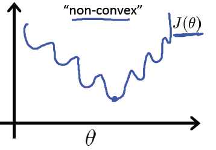
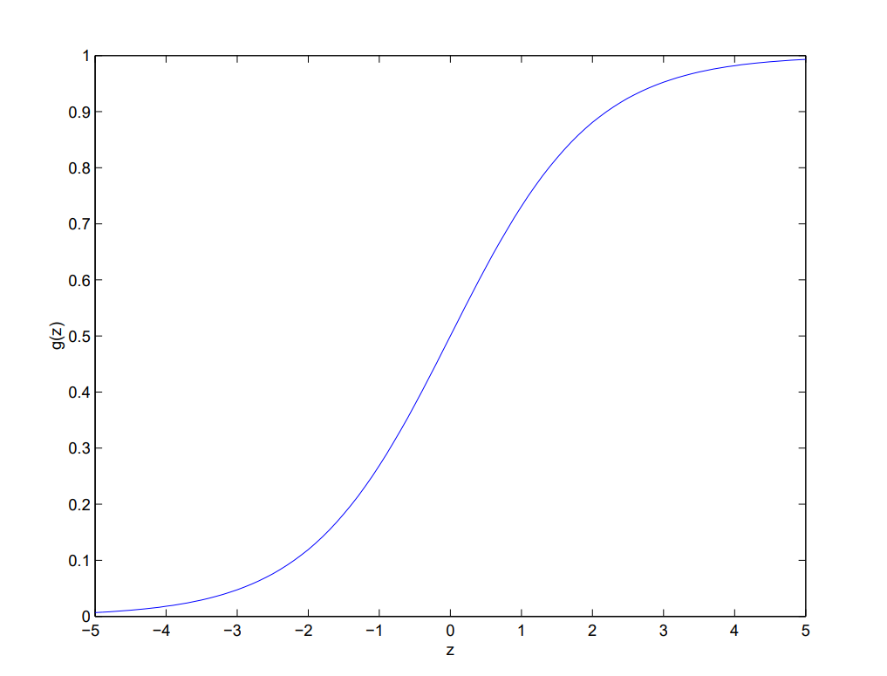
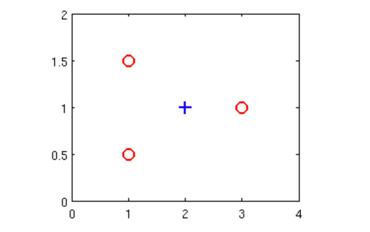
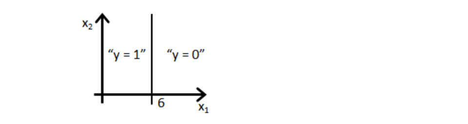
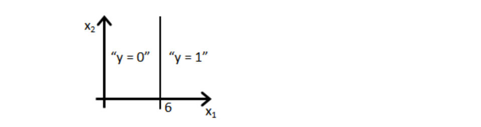
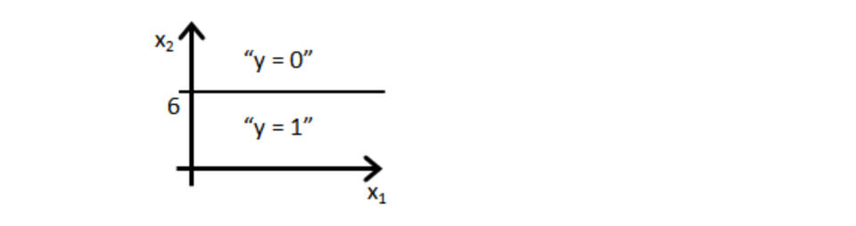
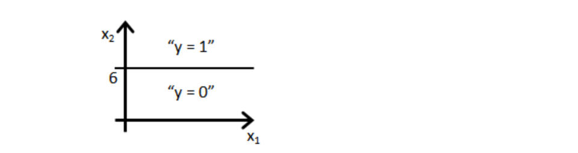
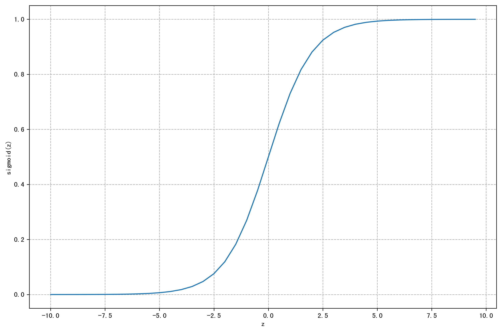

!!! info ""

    参考链接:
    https://scruel.gitee.io/ml-andrewng-notes/week3.html


## 1、分类问题

!!! info ""

    参考视频:
    6 - 1 - Classification (8 min).mkv

<!--
下面这个css用于控制p标签的两端对齐
-->
<style type="text/css">
p {
    text-align: justify;  /*文本两端对齐*/
}
center img{
    border-radius: 0.3125em;
    box-shadow: 0 2px 4px 0 rgba(34,36,38,.12),0 2px 10px 0 rgba(34,36,38,.08);
}
center div{
    color:orange; 
    border-bottom: 1px solid #d9d9d9;
    display: inline-block;
    color: #999;
    padding: 2px;
}
</style>

下面我们开始讨论分类问题。在分类问题中, 你要预测的变量 $y$ 是离散的值, 我们将学习一种叫做逻辑回归 (Logistic Regression) 的算法, 这是目前最流行使用最广泛的一种学习算法。所以说**逻辑回归是解决分类问题**。

在分类问题中, 我们尝试预测的是结果是否属于某一个类（例如正确或错误）。分类问题的例子有: 判断一封电子邮件是否是垃圾邮件; 判断一次金融交易是否是欺诈; 之前我们也谈到了肿瘤分类问题的例子, 区别一个肿瘤是恶性的还是良性的。

  

我们现在要从只包含两类0和1的二分类开始, 后面我们将讨论多分类问题, 例如变量y可以取 0, 1, 2, 3 这几个值。我们将因变量 (dependent variable) 可能属于的两个类分别称为负向类 (negative class) 和正向类 (positive class) ,则因变量, 其中 0 表示负向类, 1 表示正向类。

我们如何开发一个分类算法?

这个例子中的训练集是对肿瘤进行恶性和良性分类得到的数据, 注意到恶性与否只有两个值, 0 (No) 以及 1 (Yes)。所以对于这个训练集, 我们可以做的是把我们已经学会的线性回归算法应用到这个数据集: 用直线对数据进行拟合。

 

如果我们想做出预测，我们可以设置分类器的阈值为0.5, 即纵坐标为0.5。

- 如果假设函数输出一个值 >= 0.5, 则可以预测 y=1
- 如果假设函数输出一个值 < 0.5, 则可以预测 y=0

我们观察结果发现, 纵坐标0.5对应的横坐标右边我们将预测为正, 左边我们将预测为负。

在这个特定的例子中, 线性回归做得很好也很正确。我们尝试改变一下这个问题, 我们将横轴延长一点。假设我们有一个训练样本位于右边远处。

 

如果我们使用原来绿色的线, 仍然能做完成很好的分类(把右侧最远的点算进去)。但是随着右侧最远处的点加入, 我们运行我们的线性回归算法我们会得到另一条数据的拟合直线(假设变为图中蓝色的线)。我们继续将阈值设为0.5, 我们会发现左右两边的预测结果有问题了。

**总结一下就是, 加了最远处的训练集后, 使得线性回归对数据的拟合直线从绿色的线变到了蓝色的线, 从而生成了一个更坏的假设。所以把线性回归模型应用到分类问题，并不是一个好主意。**

对于分类问题, $y$ 取值为 0 或者1，但如果你使用的是线性回归，那么假设函数的输出值可能远大于 1，或者远小于0，即使所有训练样本的标签 $y$ 都等于 0 或 1。尽管我们知道标签应该取值0 或者1，但是如果算法得到的值远大于1或者远小于0的话，就会感觉很奇怪。所以我们在接下来的要研究的算法就叫做逻辑回归算法，这个算法的性质是：它的输出值永远在0到 1 之间。

顺便说一下，逻辑回归算法是分类算法，我们将它作为分类算法使用。有时候可能因为这个算法的名字中出现了“回归”使你感到困惑，但**逻辑回归算法实际上是**一种**分类算法**，它适用于标签取值离散的情况，如：0, 1。

接下来，我们将开始学习逻辑回归算法的细节。

## 2、假设函数描述

!!! info ""

    参考视频:
    6 - 2 - Hypothesis Representation (7 min).mkv


为了使 $h_{\theta}(x) \in (0,1)$, 引入逻辑回归模型, 定义假设函数

$$
h_{\theta}(x) = g(z)=g(\theta^Tx)
$$

对比线性回归函数 $h_\theta(x)=\theta^Tx$,  $g$ 表示逻辑函数 (logistic function), 复合起来, 则成为逻辑回归函数。

逻辑函数是 S 型函数, 会将所有实数映射到(0, 1)范围。

sigmoid 函数 (如下图) 是逻辑函数的特殊情况, 其公式为 $g(z)=\frac{1}{1+e^{-z}}$

 

应用sigmoid 函数, 则逻辑回归模型: $h_\theta(x)=g(\theta^Tx)=\frac{1}{1+e^{-\theta^Tx}}$

逻辑回归模型中, $h_\theta(x)$ 的作用是, 根据输入 $x$ 以及参数 $\theta$ , 计算得出 "输出 $y=1$ " 的可能性(estimated probability), 概率学中表示为: 

$$
h_\theta(x) = P(y=1|x;\theta) = 1-P(y=0|x;\theta)
$$

$$
P(y=1|x;\theta)+ P(y=0|x;\theta) = 1
$$

!!! note "注意"

    上面第二个式子是针对我们现在研究的二分类问题而说的, y 的取值只能是0 或 1。所以两者相加的概率为 100% 。

==$P(y=1|x;\theta)$ 的含义: probability that y=1, given x, parameterized by $\theta$ 。==

以肿瘤诊断为例, $h_\theta(x)=0.7$ 表示病人有 $70%$ 的概率得了恶性肿瘤。

## 3、决策边界

!!! info ""

    参考视频: 6 - 3 - Decision Boundary (15 min).mkv

决策边界的概念, 可帮助我们更好地理解逻辑回归模型的拟合原理。

在逻辑回归中, 有假设函数 $h_{\theta}(x) = g(z)=g(\theta^Tx)$。

为了得出分类的结果, 这里和前面一样, 规定以 $0.5$ 为阈值:

$$
h_\theta(x) \geq 0.5 \rightarrow y=1
$$

$$
h_\theta(x) < 0.5 \rightarrow y=0
$$

回忆一下sigmoid凸函数的图像 :

 

观察可得当 $g(z) \geq 0.5$ 时, 有 $z \geq 0$, 即 $\theta^T x \geq 0$。

sigmoid 函数的公式为 $g(z)=\frac{1}{1+e^{-z}}$

同线性回归模型的不同在于：

$$
z \rightarrow +\infty, e^{-\infty} \rightarrow 0 \Rightarrow g(z)=1
$$

$$
z \rightarrow -\infty, e^{+\infty} \rightarrow +\infty \Rightarrow g(z)=0
$$

直观一点 举个栗子,

$h_\theta(x)=g(\theta_0+\theta_1x_1+\theta_2x_2)$ 是下图模型的假设函数:

<center>
    
    <br>
    <div>图 3.3.1 决策边界1</div>
</center>

根据上面的讨论, 要进行分类, 那么只要 $\theta_0+\theta_1x+\theta_2x \geq 0$ 时, 就预测 $y=1$, 即预测为正向类。

如果取 $\theta = [-3 \ \ 1\ \ 1]^T$ , 则有 $z=-3+x_1+x_2$, 

当 $z \geq 0$, 即 $x_1+x_2 \geq 3$时, 易绘制出图中的品红色直线, 即**决策边界**, 为正向类 (以红叉标注的数据) 给出 $y=1$ 的分类预测结果。

上面讨论了逻辑回归模型中线性拟合的例子, 下面则是一个多项式拟合的例子, 和线性回归中的情况也是类似的。

为了拟合下图数据, 建模多项式假设函数: 

$$
h_\theta(x) = g(\theta_0+\theta_1x_1+\theta_2x_2+\theta_3x_1^2+\theta_4x_2^2)
$$

这里取 $\theta = [-1\ \ 0\ \ 0\ \ 1\ \ 1]^T$, 决策边界对应了一个在原点处的单位元 ($x_1^2+x_2^2=1$), 如此便可给出分类结果, 如图中品红色曲线:

<center>
    
    <br>
    <div>图 3.3.2 决策边界2</div>
</center>

当然, 通过一些更为复杂的多项式, 还能拟合那些图像显得非常怪异的数据, 使得决策边界形状似碗装、爱心状等等。

简单来说, 决策的边界就是**分类的分界线**, 分类现在实际就由 $z$ (中的 $\theta$ ) 决定啦。


## 4、代价函数

!!! info ""

    参考视频: 6 - 4 - Cost Function (11 min).mkv

那我们怎么知道决策边界时啥样? $\theta$ 多少时能很好的拟合数据? 当然, 见招拆招, 总要来个 $J(\theta)$。

如果直接套用线性回归的代价函数: 

$$
J(\theta)=\frac{1}{2m} \sum_{i=1}^m{\big(h_\theta(x^{(i)})-y^{(i)}\big)^2}
$$

其中, $h_\theta(x)=g(\theta^Tx)$, 可绘制关于 $J(\theta)$ 的图像, 如下图

<center>
    
    <br>
    <div>图 3.4.1 逻辑回归代价函数直接用线性回归中的代价函数</div>
</center>

回忆线性回归中的平方损失函数, 其实是一个二次凸函数 (碗状) , 二次凸函数的重要性质是只有一个局部最小点即全局最小点。上图中有许多局部最小点, 这样使得梯度下降算法无法确定哪个收敛点是全局最优。

<center>
    
    <br>
    <div>图 3.4.2 逻辑回归中理想的代价函数</div>
</center>

如果此处的代价函数也是一个凸函数, 是否也有同样的性质, 从而最优化? 这类讨论凸函数最优值得问题, 被称为**凸优化问题 (Convex optimization)**。

当然, 损失函数不止平方损失函数一种。

对于逻辑回归, 更换平方损失函数为对数损失函数, 可由统计学中的**最大似然估计方法推导出代价函数** $J(\theta)$ **(下一节英文版中给出具体的推导过程)**:

$$
J(\theta)=\frac{1}{m} \sum_{i=1}^m{Cost\big( h_\theta(x^{(i)}, y^{(i)}\big)}\\\\
Cost\big( h_\theta(x^{(i)}, y^{(i)}\big)=-\log \big(h_\theta(x)\big) \ \ \ \ \   if\ y=1 \\\\
Cost\big( h_\theta(x^{(i)}, y^{(i)}\big)=-\log \big(1-h_\theta(x)\big) \ \ \ \ if\ y=0 
$$

则关于 $J(\theta)$ 的图像如下:

<center>
    
    <br>
    <div>图 3.4.3 对数代价函数y=1&y=0两种情况</div>
</center>

如左上图, 当训练集的结果为 $y=1$ (正样本) 时, 随着假设函数趋向于1, 代价函数的值会趋向于0, 即意味着拟合程度很好。如果假设函数此时趋于0, 则会给出一个**很高的代价**, 拟合程度**差**, 算法会根据其迅速纠正 $\theta$ 值, 右图 $y=0$ 同理。

区别于平方损失函数, 对数损失函数也是一个凸函数, 他没有局部最优值, 只有全局最优值。

## 5、Logistic regression

里面包含: 代价函数和梯度的推导。(u1s1, 英文版真的写得很好)

Let's now talk about the classification problem. This is just like the regression problem, except that the values $y$ we now want to predict take on only a small number of discrete values. For now, we will focus on the **binary classification** problem in which $y$ can take on only two values, 0 and 1. (Most of what we say here will also generalize to the multiple-class case.) For instance, if we are trying to build a spam classifier for email, then $x^{(i)}$ may be some features of a piece of emial, and $y$ may be 1 if it is a piece of spam mail, and 0 otherwise. O is also called the **negative class**, and 1 the **positive class**, and they are sometimes also denoted by the symbols "-" and "+". Given $x^{(i)}$, the corresponding $y^{(i)}$ is also called the **label** for the training example.

We could approach the classification problem ignoring the fact that $y$ is discrete-valued, and use our linear regression algorithm to try to predict $y$ given $x$. However, it is easy to construct examples where this method performs very poorly. Intuitively, it also doesn't make sense for $h_\theta(x)$ to take values larger than 1 or smaller than 0 when we know that $y \in \{0, 1\}$. 

&ensp; To fix this, let's change the form for our hypotheses $h_\theta(x)$. We will choose

$$
h_\theta(x)=g(\theta^Tx)=\frac{1}{1+e^{-\theta^Tx}}
$$

where

$$
g(z)= \frac{1}{1+e^{-z}}
$$

is called the **logistic function** or the **sigmoid function**. Here is a plot showing $g(z)$ :

<center>
    
    <br>
    <div>图 3.5.1 sigmoid function</div>
</center>

Notice that $g(z)$ tends towards 1 as $z \rightarrow + \infty$, and $g(z)$ tends towards 0 as $z \rightarrow - \infty$. Moreover, $g(z)$, and hence also $h(x)$, is always bounded between 0 and 1. As before, we are keeping the convention of letting $x_0=1$, so that $\theta^Tx=\theta_0+\sum_{j=1}^n \theta_jx_j$.

&ensp; For now, let's take the choice of $g$ as given. Other function that smoothly increase from 0 to 1 can also be used, but for a couple of reasons that we'll see later, the choice of the logistic function is a fairly natural one. Before moving on, here's a useful property of the derivative of the sigmoid function, which we write a $g'$:

$$
\begin{aligned}
g'(z) &= \frac{d}{dz}\frac{1}{1+e^{-z}} \\\\
&= \frac{1}{(1+e^{-z})^2}(e^{-z})\\\\
&= \frac{1}{1+e^{-z}} \cdot \Big(1-\frac{1}{1+e^{-z}}\Big)\\\\
&= g(z)\big(1-g(z)\big)
\end{aligned}
$$

&ensp; So, given the logistic regression model, how do we fit $\theta$ for it? Following how we saw least squares regression could be derived as the maximum likelihood estimator under a set of assumptions, let's endow our classification model with a set of probabilistic assumptions, and then fit the parameters via maximum likehood.

&ensp; Let us assume that

$$
P(y=1|x;\theta) = h_\theta(x)
$$

$$
P(y=0|x;\theta) = 1-h_\theta(x)
$$

Notice that this can written more compactly as

$$
p(y|x;\theta)=\big(h_\theta(x)\big)^y \big(1-h_\theta(x)\big)^{1-y}
$$

Assuming that the $m$ training examples were generated independently, we can then write down the likelihood of the parameters as 

$$
\begin{aligned}
L(\theta) &= p(\vec y|X;\theta)\\\\
 &= \prod_{i=1}^{m} p(y^{(i)}|x^{(i)};\theta)\\\\
 &= \prod_{i=1}^{m} \big(h_\theta(x^{(i)}\big)^{y^{(i)}}\big(1-h_\theta(x^{(i)}\big)^{1-y^{(i)}}
\end{aligned}
$$

As before, it will be easier to maximize the log likelihood:

$$
\begin{aligned}
l(\theta) &= \log L(\theta) \\\\
&= \sum_{i=1}^m{y^{(i)}\log h \big(x^{(i)}\big)}+(1-y^{(i)})\log \big(1-h(x^{(i)}\big)
\end{aligned}
$$

到了这里, 因为最大似然估计是求使 $l(\theta)$ 取最大值时的 $\theta$, 而原文到了这里是是用了梯度上升法求解, 求得的 $\theta$ 就是我们要求的最佳参数。

但是为了跟前一节的中文课程统一, 我们还是用梯度下降来做, 这里我们做一个转换。因为 $l(\theta)$ 要求最大等价于 $-\frac{1}{m}l(\theta)$ 取最小。所以, 我们可以令：

$$
\begin{aligned}
J(\theta) &= -\frac{1}{m}l(\theta) \\\\
&= -\frac{1}{m}\sum\limits_{i=1}^{m}{\Big[{{y}^{(i)}}\log ( {h_\theta}( {{x}^{(i)}} ) )+( 1-{{y}^{(i)}} )\log \big( 1-{h_\theta}( {{x}^{(i)}}) \big)\Big]}
\end{aligned}
$$

因为求梯度要求 $\frac{\partial }{\partial \theta_j}J(\theta)$, 所以这里顺便推导一下。老套路, 为了简化, 先假设训练集只有一个。

Let's start by working with just one training example $(x, y)$。

$$
\begin{aligned}
\frac{\partial }{\partial \theta_j}l(\theta) &= \Big(y \frac{1}{g(\theta^Tx)}-(1-y) \frac{1}{1-g(\theta^Tx)}\Big) \frac{\partial }{\partial \theta_j}g(\theta^Tx)\\\\
&=\Big(y \frac{1}{g(\theta^Tx)}-(1-y) \frac{1}{1-g(\theta^Tx)}\Big)g(\theta^Tx)\big(1-g(\theta^Tx)\big) \frac{\partial }{\partial \theta_j}\theta^Tx\\\\
&=\Big(y\big(1-g(\theta^Tx)\big)-\big(1-y\big)g(\theta^Tx)\Big)x_j\\\\
&=\big(y-h_\theta(x)\big)x_j
\end{aligned}
$$

所以

$$
\begin{aligned}
\frac{\partial }{\partial \theta_j}J(\theta)&=-\frac{1}{m}l(\theta) \\\\
&=\big(h_\theta(x)-y\big)x_j
\end{aligned}
$$

其中, $m=1$。

这个是不是很熟悉, 这个梯度其实跟线性回归模型中的梯度完全一样。

## 6、代价函数简化和梯度下降

!!! info ""

    参考视频: 6 - 5 - Simplified Cost Function and Gradient Descent (10 min).mkv

为了简化分类讨论, 对于二分类问题, 我们可以把代价函数简化为一个函数:

$$
Cost\big(h_\theta(x),y\big)=-y\log \big(h_\theta(x)\big)-(1-y)\log \big(1-h_\theta(x)\big)
$$

当 $y=0$, 左边式子整体为0, 当 $y=1$, 则 $1-y=0$, 右边式子整体为0, 也就和上面的分段函数一样, 而一个式子计算器来也更加方便。

$$
J(\theta) = -\frac{1}{m}\sum\limits_{i=1}^{m}{\Big[{{y}^{(i)}}\log ( {h_\theta}( {{x}^{(i)}} ) )+( 1-{{y}^{(i)}} )\log \big( 1-{h_\theta}( {{x}^{(i)}}) \big)\Big]}
$$

向量化实现:

$$
h=g(X\theta)
$$

$$
J(\theta)=\frac{1}{m}\big(-y^T\log (h)-(1-y)^T\log (1-h)\big)
$$

为了最优化 $\theta$ , 仍使用梯度下降法, 算法同线性回归中一致:

Repeat until convergence:{

$$
\theta_j:=\theta_j-\alpha \frac{\partial }{\partial \theta_j}J(\theta)
$$

}

解出偏导得:

Repeat until convergence:{

$$
\theta_j:=\theta_j-\alpha \frac{1}{m}\sum_{i=1}^m{\big(h_\theta(x^{(i)})-y^{(i)}\big)\cdot x_j^{(i)}}
$$

for j = 0,1,2,..., n

}

注意, 虽然形式上梯度下降算法同线性回归一样, 但其中的假设函数不同, 即 $h_\theta(x)=g(\theta^Tx)$, 不过求导后的结果也相同。

## 7、进阶优化
!!! info ""

    参考视频: 6 - 6 - Advanced Optimization (14 min).mkv

运行梯度下降算法，其能最小化代价函数 $J(\theta)$ 并得出 $\theta$ 的最优值，在使用梯度下降算法时，如果不需要观察代价函数的收敛情况，则直接计算  $J(\theta)$  的导数项即可，而不需要计算  $J(\theta)$  值。

我们编写代码给代价函数及其偏导数然后传入梯度下降算法中, 接下来算法则会为我们最小化代价函数给出参数的最优解。这类算法被称为最优化算法**(Optimization Algorithm)**, 梯度下降算法不是唯一的最小化算法。

一些最优化算法:

- 梯度下降法(Gradient Descent)
  
- 共轭梯度算法(Conjugate gradient)
  
- 牛顿法和拟牛顿法(Newton's method & Quasi-Newton Methods)

    - DFP算法
  
    - 局部优化法(BFGS)

    - 有限内存局部优化法(L-BFGS)

- 拉格朗日数乘法(Lagrange multiplier)

比较梯度下降算法：一些最优化算法虽然会更为复杂，难以调试，自行实现又困难重重，开源库又效率也不一，哎，做个调包侠还得碰运气。不过这些算法通常效率更高，并无需选择学习速率 $\alpha$（少一个参数少一份痛苦啊！）。

## 8、多类别分类: 一对多 

!!! info ""

    参考视频: 6 - 7 - Multiclass Classification_ One-vs-all (6 min).mkv

最后讨论一下多类别分类问题(比如天气预报)。

<center>
    
    <br>
    <div>图 3.8.1 处理多元分类问题的原理</div>
</center>

原理是, **转化多**类别分类问题**为多个二**元分类问题, 这种方法被称为One-vs-all。

定义: $h_\theta^{(i)}(x)=p(y=i|x;\theta)$ , $i=(1,2,3,k)$

> $h_\theta^{(i)}(x)$ : 输出 $y=i$ (属于第 $i$ 个分类) 的可能性

> k: 类别总数, 如上图 $k=3$。

注意多类别分类问题中 $h_\theta(x)$ 的结果不再是一个实数而是一个向量, 如果类别总数为 $k$ , 则 $h_\theta(x)$ 就是一个 $k$ 维向量。

对于某个样本实例, 需计算所有的 $k$ 种分类情况得到 $h_\theta(x)$, 然后看分到哪个类别时预测输出的值最大, 就说它输出属于哪个类别, 即 $y=\max \limits_i{h_\theta^{(i)}(x)}$ 。

## 习题 && 参考答案
### 第一题

假设您已经训练了一个逻辑分类器，它在一个新示例 $x$ 上输出一个预测 $h_\theta(x)=0,4$ 。这意味着（选出所有正确项）：

A. 我们对 $P(y=0|x;\theta)$ 的估计是0.4


B. 我们对 $P(y=1|x;\theta)$ 的估计是0.6


C. 我们对 $P(y=0|x;\theta)$ 的估计是0.6


D. 我们对 $P(y=1|x;\theta)$ 的估计是0.4

### 第二题

假设您有以下训练集，并拟合logistic回归分类器 

$h_\theta(x)=g(\theta_0+\theta_1x_1+\theta_2x_2)$

| $x_1$ | $x_2$ | $y$  |
| ----- | ----- | ---- |
| 1     | 0.5   | 0    |
| 1     | 1.5   | 0    |
| 2     | 1     | 1    |
| 3     | 1     | 0    |

<center>
    
    <br>
    <div></div>
</center>

以下哪项是正确的？选出所有正确项

A. 添加多项式特征（例如, 使用 $h_\theta(x)=g(\theta_0+\theta_1x_1+\theta_2x_2+\theta_3x_1^2+\theta_4x_1x_2+\theta_5x_2^2)$ 可以增加我们拟合训练的程度

B. 在 $\theta$ 的最佳值（例如，由fminunc找到）处, $J(\theta)\geq 0$

C. 添加多项式特征, , 使用 $h_\theta(x)=g(\theta_0+\theta_1x_1+\theta_2x_2+\theta_3x_1^2+\theta_4x_1x_2+\theta_5x_2^2)$ 将增加 $J(\theta)$, 因为我们现在正在对多项式求和。

D. 如果我们训练梯度下降迭代足够多次，对于训练集中的一些例子 $x^{(i)}$, 可能得到 $h_\theta(x^{(i)})>1$


### 第三题

对于逻辑回归, 梯度由 $\frac{\partial }{\partial \theta_j}=\frac{1}{m}\sum_{i=1}^m\big(h_\theta(x^{(i)})-y^{(i)}\big)x_j^{(i)}$ 给出。以下哪项是学习率为 $\alpha$ 的逻辑回归的正确梯度下降更新? 选出所有正确项

A. $\theta:=\theta-\alpha\frac{1}{m}\sum_{i=1}^m(\theta^Tx-y^{(i)})x^{(i)}$

B. $\theta_j:=\theta_j-\alpha\frac{1}{m}\sum_{i=1}^m(\frac{1}{1+e^{-\theta^Tx^{(i)}}}-y^{(i)})x_j^{(i)}$ 同时更新所有 $j$

C. $\theta_j:=\theta_j-\alpha\frac{1}{m}\sum_{i=1}^m(h_\theta(x^{(i)})-y^{(i)})x^{(i)}$ 同时更新所有 $j$

D. $\theta_j:=\theta_j-\alpha\frac{1}{m}\sum_{i=1}^m(h_\theta(x^{(i)})-y^{(i)})x_j^{(i)}$ 同时更新所有 $j$


### 第四题

以下哪项陈述是正确的？选出所有正确项

A. 对于逻辑回归，梯度下降有时会收敛到一个局部最小值（并且无法找到全局最小值）。这就是为什么我们更喜欢更先进的优化算法，如fminunc（共轭梯度/BFGS/L-BFGS/等等）

B. sigmoid函数 $g(z)=\frac{1}{1+e^{-z}}$ 数值永远不会大于1

C. 用 $m \geq 1$ 个例子训练的逻辑回归的代价函数 $J(\theta)$ 总是大于或等于零

D. 使用线性回归+阈值的方法做分类预测，总是很有效的

### 第五题

假设训练一个逻辑回归分类器 $h_\theta(x)=g(\theta_0+\theta_1x_1+\theta_2x_2$ 。假设 $\theta_0=6, \theta_1=-1, \theta_2=0$, 下列哪个图表示分类器找到的决策边界？

A. 

<center>
    
    <br>
    <div></div>
</center>

B. 

<center>
    
    <br>
    <div></div>
</center>

C. 

<center>
    
    <br>
    <div></div>
</center>

D. 

<center>
    
    <br>
    <div></div>
</center>

<br/>
<br/>
<br/>
<br/>
<br/>
<br/>

### 参考答案

第一题: CD

第二题: AB

第三题: BC

第四题: BC

第五题: A

## 上机练习

In this part of the excise, you will build a logistic regression model to predict whether a student gets admitted into a university.

&ensp; Suppose that you are administrator of a university department and you want to determine each applicant's chance of admission based on their results on two exams. You have historical data from previous applicant's scores on two exams and the admissions decision.

&ensp; Your task is to build a classification model that estimates an applicant's probability of admission based the scores from those two exams. 

### 1、Visualizing the data

Before starting to implement any learning algorithm, it is always good to visualize the data if possible. 

&ensp; You will now complete the code so that it displays a figure like Figure 3.10.1, where the axes are the two exam scores, and the positive and negative examples are shown with different markers. 

开始之前, 先瞅一眼数据, 再用pandas提供的 read_csv 读取文本文件, 并输出前五行看看, python 代码如下:

``` py linenums="1" title="导入必要的库, 读取数据"
# 导入必要的库
import numpy as np
import matplotlib.pyplot as plt
import pandas as pd

# 导入数据
# path: 导入数据的路径
path = "ex2data1.txt"
# pandas.read_csv : pandas读入文本文件txt
# path: 导入数据的路径 header=None : 源数据没有标题, names : 指定标题
data = pd.read_csv(path, header=None, names=["Exam1", "Exam2", "Admitted"])
# 显示数据的前五行
data.head()
```

输出:

```
	Exam1 	    Exam2 	    Admitted
0 	34.623660 	78.024693 	0
1 	30.286711 	43.894998 	0
2 	35.847409 	72.902198 	0
3 	60.182599 	86.308552 	1
4 	79.032736 	75.344376 	1
```

``` py linenums="1" title="画出图像"
# 为了画图, 将数据分为Admitted = 0 和Admitted = 1 两部分
data1 = data[data["Admitted"]==1]
data0= data[data["Admitted"]==0]

# 用matplotlib画图
# 1. 创建画布
plt.figure(figsize=(12, 8), dpi=100)

# 2. 绘制图像
# 绘制训练集数据
# 前两个参数 横纵坐标 s：标记大小 marker: 标记类型 color : 标记颜色
plt.scatter(data1["Exam1"],data1["Exam2"],s=50, marker='+', color='k',label="Admitted")
plt.scatter(data0["Exam1"],data0["Exam2"],s=50, marker='o', color='y',label="Not admitted")

# 2.1 添加描述信息
plt.xlabel("Exam1 scores")
plt.ylabel("Exam2 scores")

# 2.2 添加网格显示
plt.grid(True, linestyle="--", alpha=1)

# 2.3 添加图例
plt.legend(loc=0)

# 2.4 显示图像
plt.show()
```

显示图像

<center>
    
    <br>
    <div>Figure 3.10.1: Scatter plot of training data</div>
</center>

### 2、Implementation

#### 2.1 Warmup exercise

Before you start with the actual cost function, recall that the logistic regression hypothesis is defined as:

$$
h_\theta(x) = g(\theta^Tx),
$$

where function $g$ is the sigmoid function. The sigmoid function is defined as :

$$
g(z)=\frac{1}{1+e^{-z}}
$$

&ensp; Your first step is to implement this function so it can be called by the rest of your program. When you are finished, try testing a few values by calling it. For large positive values of $x$, the sigmoid should be close to 1, while for large negative values, the sigmoid should be close to 0. Evaluating sigmoid(0) should give you exactly 0.5. Your code should also work with vectors and matrices. **For a matrix, your function should perform the sigmoid function on every element.**

``` py linenums="1" title="定义并测试sigmoid函数"
# 定义sigmoid函数
def sigmoid(z):
    return 1 / (1 + np.exp(-z))


# 打印一下sigmoid(0)是否等于0.5
print(sigmoid(0))

# 画出图像 并找点 试验一下我们写得sigmoid函数没问题
# 新建一个-10 到10 间隔为0.5 的数组
nums = np.arange(-10, 10, 0.5)


plt.figure(figsize=(12, 8), dpi=300)
plt.plot(nums, sigmoid(nums))
plt.xlabel("z")
plt.ylabel("sigmoid(z)")
plt.grid(True, linestyle="--", alpha=1)
plt.show()
```

输出

```
0.5
```

显示图像

<center>
    
    <br>
    <div>Fig 3.10.2: Plot of Sigmoid function</div>
</center>


#### 2.2 Cost function and gradient

Now you will implement the cost function and gradient for logistic regression. 

&ensp; Recall that the cost function in logistic regression is 

$$
J(\theta) = \frac{1}{m}\sum\limits_{i=1}^{m}{\Big[-{{y}^{(i)}}\log ( {h_\theta}( {{x}^{(i)}} ) )-( 1-{{y}^{(i)}} )\log \big( 1-{h_\theta}( {{x}^{(i)}}) \big)\Big]}
$$

and the gradient of the cost is a vector of the same length as $\theta$ where $j^{th}$ element (for $j=0,1,2,\cdots , n$ ) is defined as follows:

$$
\frac{\partial J(\theta)}{\partial \theta_j}=\frac{1}{m}\sum_{i=1}^m{\big(h_\theta(x^{(i)})-y^{(i)}\big)x_j^{(i)}}
$$

&ensp; Note that while this gradient looks identical to linear regression gradient, the formula is actually different because linear and logistic regression have different definitions of $h_\theta(x)$.

&ensp; Once you are done, you should see that the cost is about 0.693.

``` py linenums="1" title="定义代价函数并计算初始代价"
def cost(theta, X, y):
    # 取得训练集个数
    m = X.shape[0]
    # 下面的A@B 相当于np.dot(A,B)
    first = -np.log(sigmoid(X@theta))@y.T
    second = -np.log(1-sigmoid(X@theta))@(1-y).T
    return np.sum(first+second)/m

# 对源数据处理
# 1. 插入x0
data.insert(0, "Ones", 1)

# 获取data所有列数
cols = data.shape[1]

# 分别取出X, y
X = data.iloc[:, 0:cols-1]
y = data.iloc[:, cols-1]

# 将dataframe的values转成矩阵赋给X, y
X = np.array(X.values)
y = np.array(y.values)

# 初始化theta
theta = np.zeros(X.shape[1])

# 运行前, 最好检查一下维度
# X.shape, y.shape, theta.shape

# 运行代价函数, 计算初始cost
cost(theta,X,y)
```

输出

```
0.6931471805599453
```

输出的0.6931471805599453与笔记中的0.693吻合, 说明我们的算法没问题。

然后是定义一下求梯度的函数。

``` py linenums="1" title="定义梯度函数并尝试第一次计算"
def gradient(theta,X,y):
    m = X.shape[0]
    return X.T@(sigmoid(X@theta)-y)/m

# 输出第一次的梯度计算结果
gradient(theta,X,y)
```

```
array([ -0.1, -12.00921659, -11.26284221])
```

#### 2.3 Learning parameters using minimize

吴恩达老师的课后练习中, 优化theta使用了matlab里面的fminunc函数, 不知道Python里面如何实现。搜索之后，发现stackflow上有人提到用 `scipy` 库里面的 `minimize` 函数来替代。

首先使用 `np.info(op.minimize)` 查看函数的介绍, 传入的参数有:

``` py linenums="1" title="scipy里的minimize函数参数介绍"
minimize(fun, x0, args=(), method=None, jac=None, hess=None, hessp=None,
          bounds=None, constraints=(), tol=None, callback=None, options=None)

Minimization of scalar function of one or more variables.

Parameters
----------
fun : callable
    The objective function to be minimized.

        ``fun(x, *args) -> float``

    where ``x`` is an 1-D array with shape (n,) and ``args``
    is a tuple of the fixed parameters needed to completely
    specify the function.
x0 : ndarray, shape (n,)
    Initial guess. Array of real elements of size (n,),
    where 'n' is the number of independent variables.
args : tuple, optional
    Extra arguments passed to the objective function and its
    derivatives (`fun`, `jac` and `hess` functions).
method : str or callable, optional
    Type of solver.  Should be one of

        - 'Nelder-Mead' :ref:`(see here) <optimize.minimize-neldermead>`
        - 'Powell'      :ref:`(see here) <optimize.minimize-powell>`
        - 'CG'          :ref:`(see here) <optimize.minimize-cg>`
        - 'BFGS'        :ref:`(see here) <optimize.minimize-bfgs>`
        - 'Newton-CG'   :ref:`(see here) <optimize.minimize-newtoncg>`
        - 'L-BFGS-B'    :ref:`(see here) <optimize.minimize-lbfgsb>`
        - 'TNC'         :ref:`(see here) <optimize.minimize-tnc>`
        - 'COBYLA'      :ref:`(see here) <optimize.minimize-cobyla>`
        - 'SLSQP'       :ref:`(see here) <optimize.minimize-slsqp>`
        - 'trust-constr':ref:`(see here) <optimize.minimize-trustconstr>`
        - 'dogleg'      :ref:`(see here) <optimize.minimize-dogleg>`
        - 'trust-ncg'   :ref:`(see here) <optimize.minimize-trustncg>`
        - 'trust-exact' :ref:`(see here) <optimize.minimize-trustexact>`
        - 'trust-krylov' :ref:`(see here) <optimize.minimize-trustkrylov>`
        - custom - a callable object (added in version 0.14.0),
          see below for description.

    If not given, chosen to be one of ``BFGS``, ``L-BFGS-B``, ``SLSQP``,
    depending if the problem has constraints or bounds.
jac : {callable,  '2-point', '3-point', 'cs', bool}, optional
    Method for computing the gradient vector. Only for CG, BFGS,
    Newton-CG, L-BFGS-B, TNC, SLSQP, dogleg, trust-ncg, trust-krylov,
    trust-exact and trust-constr.
    If it is a callable, it should be a function that returns the gradient
    vector:

        ``jac(x, *args) -> array_like, shape (n,)``

    where ``x`` is an array with shape (n,) and ``args`` is a tuple with
    the fixed parameters. If `jac` is a Boolean and is True, `fun` is
    assumed to return and objective and gradient as and ``(f, g)`` tuple.
    Methods 'Newton-CG', 'trust-ncg', 'dogleg', 'trust-exact', and
    'trust-krylov' require that either a callable be supplied, or that
    `fun` return the objective and gradient.
    If None or False, the gradient will be estimated using 2-point finite
    difference estimation with an absolute step size.
    Alternatively, the keywords  {'2-point', '3-point', 'cs'} can be used
    to select a finite difference scheme for numerical estimation of the
    gradient with a relative step size. These finite difference schemes
    obey any specified `bounds`.
```

需要注意的是fun关键词参数里面的函数, 需要把优化的**theta放在第一个位置**, **$X, y$ 放到后面**。并且, **theta** 在传入的时候一定**要**是一个**一维** shape(n, ) 的数组,  不然会出错。

然后**jac是梯度,** 这里的有两个地方要注意, 第一个是**传入的theta依然要**是一个**一维** shape(n, ) , 第二个是**返回的梯度**也要**是**一个**一维** shape(n, ) 的数组。

总之，关键在于传入的theta一定要是一个1D  shape(n, ) 的，不然就不行。

``` py linenums="1" title="使用minimize函数来找到最优的theta"
import scipy.optimize as op

result = op.minimize(fun=cost, x0=theta, args=(X, y), method='TNC', jac=gradient)

result
```

输出

```
fun: 0.20349770158947394
     jac: array([9.04290379e-09, 9.02615302e-08, 4.84927098e-07])
 message: 'Local minimum reached (|pg| ~= 0)'
    nfev: 36
     nit: 17
  status: 0
 success: True
       x: array([-25.16131878,   0.20623159,   0.20147149])
```

由输出结果可知: 最优的theta为[-25.16131878,   0.20623159,   0.20147149], 最终的cost为0.20349770158947394。这符合吴恩达老师课后练习给的最红cost 0.203。看来找对包会调包还是有用的嘛 :joy: 。

The final $\theta$ value will then be used to plot the decision boundary on the training data, resulting in a Figure 2.

通过前面的学习我们知道，要画决策边界就需要令:

$$
X\theta=0
$$

即

$$
x_0\theta_0 + x_1\theta_1+x_2\theta_2=0
$$

其中, $x_0=1$, $x_1$ 在这里是Exam1 scores, $x_2$ 是 Exam2 scores。

为了画图, 我们将上式进行转换:

$$
x_2=\frac{-\theta_0-\theta_1x_1}{\theta_2}
$$

最后完成我们的绘图:

``` py linenums="1" title="画出决策边界" hl_lines="2 5 7 24"
# 拿到最终的theta
final_theta=result["x"]

# 生成一些(0,100)的Exam1 scores 
exam_1_scores=np.arange(0,105,5)
# 根据公式计算出exam2 scores
exam_2_scores=(-final_theta[0]-final_theta[1]*exam_1_scores)/final_theta[2]

# 为了画图, 将数据分为Admitted = 0 和Admitted = 1 两部分
data1 = data[data["Admitted"]==1]
data0= data[data["Admitted"]==0]

# 用matplotlib画图
# 1. 创建画布
plt.figure(figsize=(12, 8), dpi=300)

# 2. 绘制图像
# 绘制训练集数据
# 前两个参数 横纵坐标 s：标记大小 marker: 标记类型 color : 标记颜色
plt.scatter(data1["Exam1"],data1["Exam2"],s=50, marker='+', color='k',label="Admitted")
plt.scatter(data0["Exam1"],data0["Exam2"],s=50, marker='o', color='y',label="Not admitted")

# 画出决策边界
plt.plot(exam_1_scores,exam_2_scores)

# 2.1 添加描述信息
plt.xlabel("Exam1 scores")
plt.ylabel("Exam2 scores")

# 2.2 添加网格显示
plt.grid(True, linestyle="--", alpha=1)

# 2.3 添加图例
plt.legend(loc=0)

# 2.4 显示图像
plt.show()
```

输出图像

<center>
    
    <br>
    <div>Figure 3.10.3: Training data with decision boundary
</div>
</center>

其中, 上图标黄的部分是画决策边界加入的代码。

可以看到输出的图像和吴恩达老师练习给的参考图像一摸一样, 完美!!!

