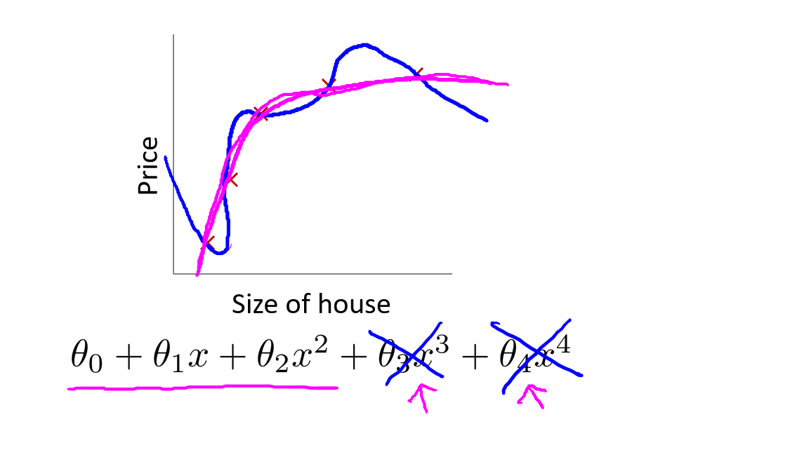
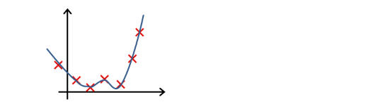
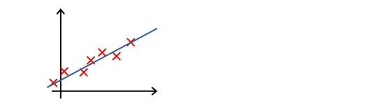
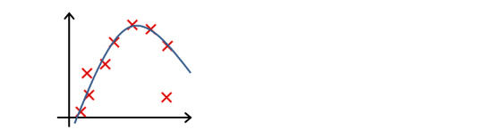
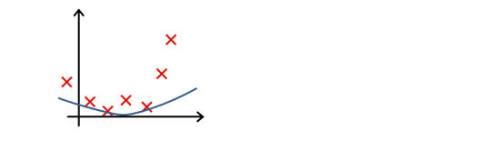
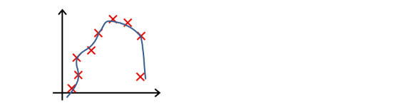
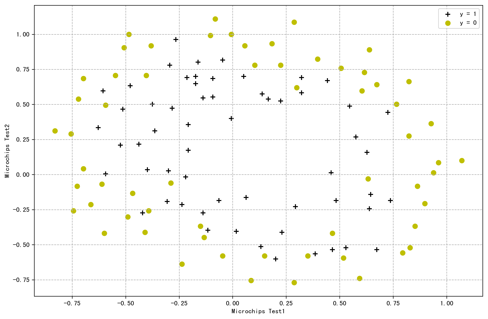
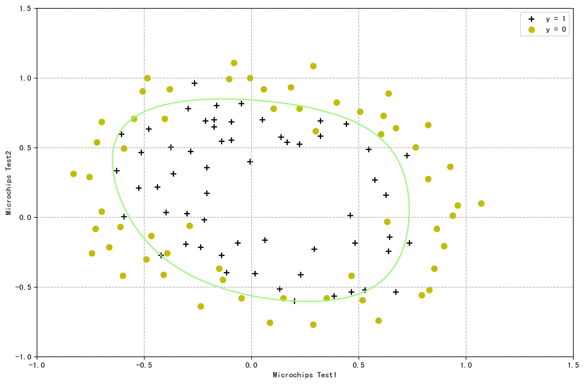
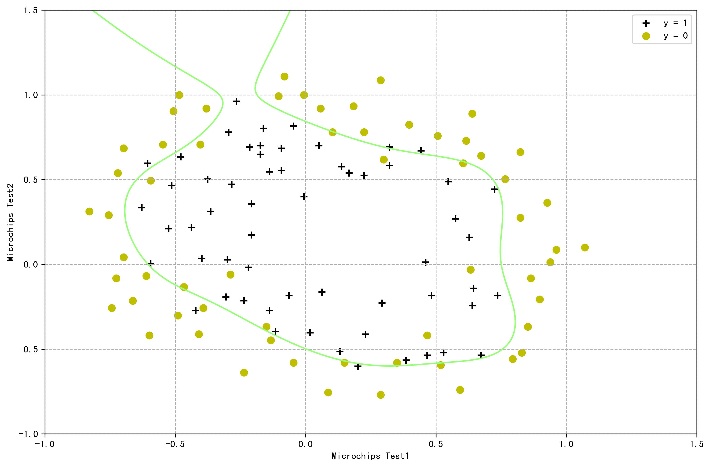
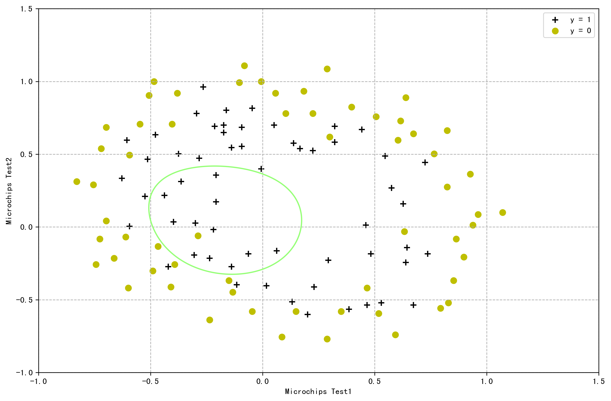

!!! info ""

    参考链接:
    https://scruel.gitee.io/ml-andrewng-notes/week3.html

<!--
下面这个css用于控制p标签的两端对齐
-->
<style type="text/css">
p {
    text-align: justify;  /*文本两端对齐*/
}
center img{
    border-radius: 0.3125em;
    box-shadow: 0 2px 4px 0 rgba(34,36,38,.12),0 2px 10px 0 rgba(34,36,38,.08);
}
center div{
    color:orange; 
    border-bottom: 1px solid #d9d9d9;
    display: inline-block;
    color: #999;
    padding: 2px;
}
</style>


## 1、过拟合问题

!!! info ""

    参考视频:
    7 - 1 - The Problem of Overfitting (10 min).mkv

对于拟合的表现，可以分为三类情况：

- 欠拟合(Underfitting)

    无法很好的拟合训练集中的数据，预测值和实际值的误差很大，这类情况被称为欠拟合。拟合模型比较简单（特征选少了）时易出现这类情况。类似于，你上课不好好听，啥都不会，下课也差不多啥都不会。

- 优良的拟合(Just right)

    不论是训练集数据还是不在训练集中的预测数据，都能给出较为正确的结果。类似于，学霸学神！

- 过拟合(Overfitting)

    能很好甚至完美拟合训练集中的数据，即 $J(\theta)$
    ，但是对于不在训练集中的**新数据**，预测值和实际值的误差会很大，**泛化能力弱**，这类情况被称为过拟合。拟合模型过于复杂（特征选多了）时易出现这类情况。类似于，你上课跟着老师做题都会都听懂了，下课遇到新题就懵了不会拓展。

线性模型中的拟合情况(左图欠拟合，右图过拟合):

<center>
    
    <br>
    <div>图4.1.1 线性回归中的拟合情况</div>
</center>

逻辑回归模型中的拟合情况:

<center>
    
    <br>
    <div>图4.1.2 逻辑回归中的拟合情况</div>
</center>

为了度量拟合表现，引入：

- 偏差(bias)

    指模型的预测值与真实值的**偏离程度**。偏差越大，预测值偏离真实值越厉害。偏差低意味着能较好地反应训练集中的数据情况。

- 方差(Variance)

    指模型预测值的**离散程度或者变化范围**。方差越大，数据的分布越分散，函数波动越大，泛化能力越差。方差低意味着拟合曲线的稳定性高，波动小。


高偏差意味着欠拟合，高方差意味着过拟合。

我们应尽量使得拟合模型处于低方差（较好地拟合数据）状态且同时处于低偏差（较好地预测新值）的状态。

避免过拟合的方法有：

- 减少特征的数量
  
    - 手动选取需保留的特征
    
    - 使用模型选择算法来选取合适的特征(如 PCA 算法)
    
    - 减少特征的方式易丢失有用的特征信息

- 正则化(Regularization)
  
    - 可保留所有参数（许多有用的特征都能轻微影响结果）
  
    - 减少/惩罚各参数大小(magnitude)，以减轻各参数对模型的影响程度

    - 当有很多参数对于模型只有轻微影响时，正则化方法的表现很好


## 2、代价函数

!!! info ""

    参考视频:
    7 - 2 - Cost Function (10 min).mkv

很多时候由于特征数量过多, 过拟合时我们很难选出要保留的特征, 这时候应用正则化方法则是很好的选择。

上文中, $\theta_0+\theta_1x+\theta_2x^2+\theta_3x^3+\theta_4x^4$ 这样一个复杂的多项式比较容易过拟合, 在不减少特征的情况下, **如果能消除类似于** $\theta_3x^3, \theta_4x^4$ **等复杂部分, 那复杂函数就变得简单了。**

为了保留各个参数的信息, 不修改假设函数, 改而修改代价函数:

$$
\min_{\theta}\frac{1}{2m}\sum_{i=1}^m{\big( h_\theta(x^{(i)})-y^{(i)} \big)^2+1000\cdot \theta_3^2+1000\cdot \theta_4^2}
$$

上式中, 我们在代价函数中增加了 $\theta_3, \theta_4$ 的惩罚项(penalty term) $1000\cdot \theta_3^2+1000\cdot \theta_4^2$ , 如果要最小化代价函数, 那么势必需要极大地减小 $\theta_3, \theta_4$ , 从而使得假设函数中的 $\theta_3x^3, \theta_4x^4$ 这两项的参数非常小, 就相当于没有了, 假设函数也就"变得"简单了, 从而在保留各参数的情况下避免了过拟合问题。

<center>
    
    <br>
    <div>图4.2.1 正则化后的拟合情况</div>
</center>

根据上面的讨论，有时也无法决定要减少哪个参数，故统一惩罚除了 $\theta_0$ 外的所有参数。(不惩罚 $\theta_0$ 是约定俗成的, 实际上惩罚和不惩罚的结果差不多)

代价函数：

$$
J(\theta)=\frac{1}{2m}\bigg[\sum_{i=1}^m{\big( h_\theta(x^{(i)})-y^{(i)} \big)^2+\lambda \sum_{j=1}^n \theta_j^2}\bigg]
$$

> $\lambda$  正则化参数(Regularization Parameter), $\lambda>0$

> $\sum_{j=1}^n$ : 不惩罚基础参数 $\theta_0$

> $\lambda \sum_{j=1}^n \theta_j^2$ : 正则化项

$\lambda$ 正则化参数类似于学习速率，也需要我们自行对其选择一个合适的值。

- 过大

    - 导致模型欠拟合(假设可能会变成近乎 $x=\theta_0$ 的直线 )

    - 无法正常去过拟问题
    - 梯度下降可能无法收敛
    
- 过小

    - 无法避免过拟合（等于没有）

## 3、线性回归正则化

!!! info ""

    参考视频:
    7 - 3 - Regularized Linear Regression (11 min).mkv

Regularized linear regression

$$
J(\theta)=\frac{1}{2m}\bigg[\sum_{i=1}^m{\big( h_\theta(x^{(i)})-y^{(i)} \big)^2+\lambda \sum_{j=1}^n \theta_j^2}\bigg]
$$

Goal:

$$\min_{\theta}J(\theta)$$

首先是使用梯度下降法完成这个目标:

Repeat  {

$$
\theta_0:=\theta_0-\alpha \frac{1}{m} \sum_{i=1}^m \big(h_\theta(x^{(i)})-y^{(i)} \big) x_0^{(i)}
$$

$$
\theta_j:=\theta_j-\alpha \bigg [\frac{1}{m} \sum_{i=1}^m \big(h_\theta(x^{(i)})-y^{(i)} \big) x_j^{(i)}+ \frac{\lambda}{m} \theta_j \bigg ]
$$

其中, $j\in \{1,2,\cdots ,n\}$

}

> 这里更新 $\theta_j$ 相比于没正则化只多了一项 $\frac{\lambda}{m}\theta_j$, 大家仔细研究会发现就是 $J(\theta)$ 中一个平方项求导产生, 因为比较简单, 所以这里就不做推导了。

上式的第二项也可以移项得到更新表达式的另一种形式

$$
\theta_j:=\theta_j(1- \alpha \frac{\lambda}{m})- \alpha \frac{1}{m} \sum_{i=1}^m \big(h_\theta(x^{(i)})-y^{(i)} \big) x_j^{(i)} 
$$

> $\frac{\lambda}{m} \theta_j$ :正则化项

应用正则化的正规方程法:

$$
\theta = (X^TX+ \lambda \cdot L )^{-1}X^Ty
$$

其中, $L=
\begin{bmatrix}
0 &   &  &  &   \\
  & 1 &   &  & \\
  &   & 1 &   &   \\
  &   &   & \ddots &  \\
  &   & & & 1 \\
\end{bmatrix}$

> $\lambda \cdot L$: 正则化项

> $L$ : 第一行第一列为 0 的 $n+1$ 维单位矩阵

前文提到正则化可以解决正规方程中不可逆问题, 即加入了 $\lambda \cdot L$ 正则化项后, 可以保证 $X^TX+\lambda \cdot L$ 可逆(invertible), 即便 $X^TX$ 不可逆(non-invertible)。

---

下面对应用正则化的正规方程法结论进行推导

Cost Function

$$
J(\theta)=\frac{1}{2m}\bigg[\sum_{i=1}^m{\big( h_\theta(x^{(i)})-y^{(i)} \big)^2+\lambda \sum_{j=1}^n \theta_j^2}\bigg]
$$

我们先假设连 $\theta_0$ 一起惩罚 并将上式向量化

$$
J(\theta)=\frac{1}{2m}\bigg[(X\theta-\vec{y})^T(X\theta-\vec{y})+\lambda \theta^T \theta \bigg]
$$

然后开始求 $J(\theta)$ 关于 $\theta$ 的梯度, 即

$$
\nabla _\theta J(\theta)=\nabla _\theta \frac{1}{2m}\bigg[(X\theta-\vec{y})^T(X\theta-\vec{y})+\lambda \theta^T \theta \bigg]
$$

由之前的结论

$$
\nabla _\theta \frac{1}{2}(X\theta-\vec{y})^T(X\theta-\vec{y})= X^TX \theta-X^T \vec{y}
$$

所以我们现在只要关注后一项, 即

$$
\nabla _\theta \frac{1}{2m} \cdot \lambda \theta^T \theta
$$

利用之前的结论

$$ \nabla_A \operatorname{tr}(AB)=B^T\\\\ $$

$$ \nabla_{A^T}f(A) = \big(\nabla_Af(A)\big)^T \\\\$$

$$ \nabla_A \operatorname{tr}ABA^TC=CAB+C^TAB^T \\\\ $$

我们撇开系数, 先推导 $\nabla_\theta \theta^T \theta$ 

$$
\begin{aligned}
\nabla_\theta \theta^T \theta &= (\nabla_{\theta^T}  \theta^T \theta)^T\\\\
&= \big(\nabla_{\theta^T} \operatorname{tr}(\theta^T \theta) \big)^T\\\\
\end{aligned}
$$

然后, 可以令 $\theta^T=A, B=C=I$ 即

$$
\begin{aligned}
\nabla_\theta \theta^T \theta &=  \big(\nabla_{\theta^T} \operatorname{tr}(\theta^T \theta) \big)^T\\\\
&= \big(\nabla_A \operatorname{tr}(ABA^TC)\big)^T\\\\
&= \big(CAB+C^TAB^T\big)^T\\\\
&= 2 A ^T \\\\
&= 2 \theta
\end{aligned}
$$

所以

$$
\nabla_\theta J(\theta)=\frac{1}{m}(X^TX \theta-X^T \vec{y}+\lambda \cdot \theta)
$$

为求 $J(\theta)$ 最小, 就是要令 $\nabla_\theta J=0$, 所以

$$
X^TX \theta-X^T \vec{y}+\lambda \cdot \theta=0
$$

解出 $\theta$ 为

$$
\theta=(X^TX+\lambda \cdot E)^{-1}X^T \vec{y}
$$

其中, $E$ 为单位阵。

因为 $\theta_0$ 不参与正则, 我们仔细观察我们推导的结果与原来正规方程推导的结果, 就是多了一个 $\lambda \cdot E$ 这一项, 要让 $\theta_0$ 维持原来的结果, 我们只要让 $E$ 的第一行第一列为0, 这样和 $\lambda$ 相乘为0, 那么 $\theta_0$ 就会保持不变。

综上, 不惩罚 $\theta_0$ 的正规方程结论就是:

$$
\theta = (X^TX+ \lambda \cdot L )^{-1}X^Ty
$$

其中, $L=
\begin{bmatrix}
0 &   &  &  &   \\
  & 1 &   &  & \\
  &   & 1 &   &   \\
  &   &   & \ddots &  \\
  &   & & & 1 \\
\end{bmatrix}$

## 4、逻辑回归正则化

!!! info ""

    参考视频:
    7 - 4 - Regularized Logistic Regression (9 min).mkv


为逻辑回归的代价函数添加正则化项：

$$
J(\theta)=-\frac{1}{m} \sum_{i=1}^m\Big[y^{(i)}\log \big(h_\theta(x^{(i)})\big)+ (1-y^{(i)})\log \big(1-h_\theta(x^{(i)})\big) \Big]+ \frac{\lambda}{2m}\sum_{j=1}^n \theta_j^2
$$

前文已经证明过逻辑回归和线性回归的代价函数的求导结果是一样的, 此处通过给正则化项添加常数 1/2, 则其求导结果也就一样了。

从而应用正则化的逻辑回归梯度下降算法:

Repeat {

$$
\theta_0:=\theta_0-\alpha \frac{1}{m} \sum_{i=1}^m{(h_\theta(x^{(i)})-y^{(i)})x_0^{(i)}}
$$

$$
\theta_j:=\theta_j-\alpha \bigg [\frac{1}{m} \sum_{i=1}^m \big(h_\theta(x^{(i)})-y^{(i)} \big) x_j^{(i)}+ \frac{\lambda}{m} \theta_j \bigg ]
$$

其中, $j\in \{1,2,\cdots ,n\}$

}

## 习题 && 参考答案


**第 1 题**

你正在训练一个分类逻辑回归模型。以下哪项陈述是正确的？选出所有正确项

A. 将正则化引入到模型中，总是能在训练集上获得相同或更好的性能

B. 在模型中添加许多新特性有助于防止训练集过度拟合

C. 将正则化引入到模型中，对于训练集中没有的例子，总是可以获得相同或更好的性能

D. 向模型中添加新特征总是会在训练集上获得相同或更好的性能


**第 2 题**

假设您进行了两次逻辑回归, 一次是 $\lambda=0$, 一次是 $\lambda=1$。其中一次, 得到参数 $\theta=\begin{bmatrix} 81.47 \\  12.69  \\\end{bmatrix}$ ,另一次, 得到 $\theta=\begin{bmatrix} 13.01 \\  0.91  \\\end{bmatrix}$ 。
但是，您忘记了哪个 $\lambda$ 值对应于哪个 $\theta$ 值。你认为哪个对应于 $\lambda=1$ ？

A. $\theta=\begin{bmatrix} 13.01 \\  0.91  \\\end{bmatrix}$

B. $\theta=\begin{bmatrix} 81.47 \\  12.69  \\\end{bmatrix}$


**第 3 题**

以下关于正则化的陈述哪一个是正确的？选出所有正确项

A. 使用太大的 $\lambda$ 值可能会导致您的假设与数据过拟合; 这可以通过减小 $\lambda$ 来避免

B. 使用非常大的 $\lambda$ 值不会影响假设的性能；我们不将 $\lambda$ 设置为太大的唯一原因是避免数值问题

C. 考虑一个分类问题。添加正则化可能会导致分类器错误地分类某些训练示例（当不使用正则化时, 即当 $\lambda=0$ 时，它正确地分类了这些示例）

D. 由于逻辑回归的输出值 $0 \leq h_\theta(x) \leq 1$ , 其输出值的范围无论如何只能通过正则化来“缩小”一点, 因此正则化通常对其没有帮助


**第 3 题**

下列哪一个图片的假设与训练集过拟合？

A.

<center>
    
    <br>
    <div></div>
</center>

B.

<center>
    
    <br>
    <div></div>
</center>

C.

<center>
    
    <br>
    <div></div>
</center>

D.

<center>
    
    <br>
    <div></div>
</center>


**第 5 题**

下列哪一个图片的假设与训练集欠拟合?

A.

<center>
    
    <br>
    <div></div>
</center>

B.

<center>
    
    <br>
    <div></div>
</center>

C.

<center>
    
    <br>
    <div></div>
</center>

D.

<center>
    
    <br>
    <div></div>
</center>


<br/>
<br/>
<br/>
<br/>
<br/>
<br/>

**参考答案**

第一题: D

第二题: A

第三题: C

第四题: A

第五题: A


## 代码练习

In this part of exercise, you will implement regularized logistic regression to predict whether microchips from a fabrication plant passes quality assurance (QA). During QA, each microchips goes through various tests to ensure it is functioning correctly.

&ensp; Suppose you are the product manager of the factory and you have the test results for some microchips on two different tests. From these two tests, you would like to determine whether the microchips should be accepted or rejected. To help you make the decision, you have a dataset of test results on past microchips, from which you can build a logistic regression model.

### 1、Visualizing the dataset

Similar to the previous parts of this exercise, we need to plot a figure like Figure 4.6.1 , where the axes are the two test scores, and positive ( $y=1$, accepted) and negative ( $y=0$, rejected) examples are shown with different markers.

画图之前先瞅一眼数据

``` py linenums="1" title="导入必要的库和数据"
# 导入必要的库
import numpy as np
import matplotlib.pyplot as plt
import pandas as pd

# 导入数据
# path: 导入数据的路径
path = "ex2data2.txt"
# pandas.read_csv : pandas读入文本文件txt
# path: 导入数据的路径 header=None : 源数据没有标题, names : 指定标题
data = pd.read_csv(path, header=None, names=["Test1", "Test2", "Accepted"])
# 显示数据的后五行
data.tail()
```

输出

```
 	Test1 	Test2 	Accepted
113 	-0.720620 	0.538740 	0
114 	-0.593890 	0.494880 	0
115 	-0.484450 	0.999270 	0
116 	-0.006336 	0.999270 	0
117 	0.632650 	-0.030612 	0
```

画出图像

``` py linenums="1" title="画图"
# 为了画图, 将数据分为Admitted = 0 和Admitted = 1 两部分
data1 = data[data["Accepted"] == 1]
data0 = data[data["Accepted"] == 0]

# 用matplotlib画图
# 1. 创建画布
plt.figure(figsize=(12, 8), dpi=300)

# 2. 绘制图像
# 绘制训练集数据
# 前两个参数 横纵坐标 s：标记大小 marker: 标记类型 color : 标记颜色
plt.scatter(data1["Test1"], data1["Test2"], s=50,
            marker='+', color='k', label="y = 1")
plt.scatter(data0["Test1"], data0["Test2"], s=50,
            marker='o', color='y', label="y = 0")

# 2.1 添加描述信息
plt.xlabel("Microchips Test1")
plt.ylabel("Microchips Test2")

# 2.2 添加网格显示
plt.grid(True, linestyle="--", alpha=1)

# 2.3 添加图例
plt.legend(loc=0)

# 2.4 显示图像
plt.show()
```

<center>
    
    <br>
    <div>Fig 4.6.1 : Plot of training data</div>
</center>


Figure 4.6.1 shows that our dataset cannot be separated into positive and negative examples by a straight-line through the plot. Therefore, a straight-foward application of logistic regression will not perform well on this dataset since logistic regression will only be able to find a linear decision boundary.

### 2、Feature mapping

One way to fit the data better is to create more features from each data point. We will map the features into all polynomial term of $x_1$ and $x_2$ up to the sixth power.

$$
mapFeature(x)=\begin{bmatrix} 
1\\
x_1\\
x_2\\
x_1^2\\
x_1x_2\\
x_2^2\\
x_1^3\\
\vdots \\
x_1x_2^5\\
x_2^6
\\\end{bmatrix}
$$

&ensp; As a result of this mapping, our vector of two features (the scores on two QA tests) has been transformed into a 28-dimensional vector. A logistic regression classifier trained on this higher-dimension feature vector will have a more complex decision boundary and will appear nonlinear when drawn in our 2-dimension plot.

&ensp; While the feature mapping allows us to build a more expressive classifier, it also more susceptible to overfitting. In the next part of the exercise, you will implement regularized logistic regression to fit the data and also see for yourself how regularization can help combat the overfitting problem.

``` py linenums="1" title="特征映射"
# 定义特征映射函数
def featureMapping(x1, x2, level):
    # 定义一个字典
    answer = {}
    # 外层循环，映射的阶数
    for i in range(1, level+1):
        # 内存循环，x1的次数
        for j in range(0, i+1):
            # 形成字典中的key-value
            answer['F{}{}'.format(i-j, j)] = np.power(x1, i-j)*np.power(x2, j)
    # 转换为一个dataframe
    answer = pd.DataFrame(answer)
    # 插入第一列全1
    answer.insert(0, "ones", np.ones((answer.shape[0], 1)))
    return answer.values

# 获取data列的数量
cols = data.shape[1]
# 按照列的序号索引得到 X, y 并转成 ndarray
X = np.array(data.iloc[:,0:cols-1].values)
y = np.array(data.iloc[:,cols-1].values)
# 瞅一眼X，y的维度是否正确
# X.shape, y.shape

# 开始特征映射 X
mappingX=featureMapping(X[:,0],X[:,1],6)
```

### 3、Cost function and gradient

Now you will implement code to compute the cost function and gradient for regularized logistic regression. Complete the code to return the cost and the gradient.

&ensp; Recall that the regularized cost function in logistic regression is

$$
J(\theta)=-\frac{1}{m} \sum_{i=1}^m\Big[y^{(i)}\log \big(h_\theta(x^{(i)})\big)+ (1-y^{(i)})\log \big(1-h_\theta(x^{(i)})\big) \Big]+ \frac{\lambda}{2m}\sum_{j=1}^n \theta_j^2
$$

&ensp; Note that you should not regularize the parameter $\theta_0$. The gradient of the cost function is a vector where the $j^{th}$ element is defined as follows:

for $j=0$ :

$$
\frac{\partial J(\theta)}{\partial \theta_0}= \frac{1}{m} \sum_{i=1}^m{(h_\theta(x^{(i)})-y^{(i)})x_0^{(i)}}
$$

for $j \geq 1$ :

$$
\frac{\partial J(\theta)}{\partial \theta_j}= \bigg (\frac{1}{m} \sum_{i=1}^m \big(h_\theta(x^{(i)})-y^{(i)} \big) x_j^{(i)}\bigg )+ \frac{\lambda}{m} \theta_j
$$

``` py linenums="1" title="定义梯度计算函数以及cost函数, 并计算初始cost"
# 定义sigmoid函数
def sigmoid(z):
    return 1/(1+np.exp(-z))

# 定义梯度
def gradientReg(theta, X, y, lambdada):
    # 生成一个和theta一样大小都是0的向量
    grad = np.zeros_like(theta)
    m, n = X.shape
    for j in range(n):
        if(j == 0):
            grad[j] = np.sum(X[:,j].T@(sigmoid(X@theta)-y))/m
        grad[j] = (np.sum(X[:,j].T@(sigmoid(X@theta)-y))/m)+lambdada*(theta[j])/m
    return grad

def costFunctionReg(theta, X, y, lambdada):
    m, n = X.shape
    # 下面的A@B 相当于np.dot(A,B)
    first = -np.log(sigmoid(X@theta))@y.T
    second = -np.log(1-sigmoid(X@theta))@(1-y).T
    # 正则化项不惩罚x0, 所以这里将theta[0]=0, 让其不参与正则化计算
    theta[0] = 0
    reg = lambdada*np.sum(theta.T@theta)/(2*m)
    return np.sum(first+second)/m+reg


# 初始化theta
n = mappingX.shape[1]
theta = np.zeros(n)
# 初始化lambda
lambdada = 1
# 计算初始cost
costFunctionReg(theta, mappingX, y, lambdada)
```

输出

```
0.6931471805599454
```

&ensp; Once you are done, you should see that the cost is about 0.693 by using the initial value of $\theta$ (initialized to all zeros).

可以看到我的输出结果为 `0.6931471805599454` 与吴恩达老师结果一致, 说明我的代价函数计算写得没问题。

#### 3.1 Learning parameter using fminunc

Similar to be previous parts, you will use fminunc to learn the optimal parameters $\theta$. If you have completed the cost and gradient for regularized logistic regression correctly, you should be able to step through the next part to learn the parameters $\theta$ using fminunc.

和上一个练习一样, 笔者是用python写的代码, 所以用不了吴恩达老师提到的 fminunc函数。依旧使用 `scipy.optimize` 中的 `minimize` 函数。

``` py linenums="1" title="用scipy库的最小化方法计算出最佳theta"
import scipy.optimize as op

# 初始化theta
n = mappingX.shape[1]
theta = np.zeros(n)
# 初始化lambda
lambdada = 1
# 利用minimize方法计算最佳theta
result = op.minimize(fun=costFunctionReg, x0=theta, args=(mappingX, y, lambdada),
                     method='Newton-CG', jac=gradientReg)
# theta_final接收函数计算出的最佳theta
theta_final = result["x"]
# 显示最小化的结果
result
```

输出

```
    fun: 0.5296125764614318
    jac: array([ 1.38401667e-04,  1.17628902e-04, -1.03817813e-04, -1.21318122e-05,
    9.21842353e-05, -2.35445665e-05,  9.81995751e-05, -6.87897740e-05,
    -4.73981188e-05,  1.66609202e-05,  3.28244899e-06, -5.54833116e-05,
    -2.63705642e-05,  1.19848738e-05, -3.12746784e-05,  7.59400526e-05,
    -5.32105636e-05, -4.18410567e-05, -2.82177412e-06, -1.94858732e-05,
    -3.41982269e-05,  6.20073502e-06, -4.65078774e-05, -1.51522252e-05,
    -3.32069805e-05, -7.24929349e-06, -2.04867140e-06, -7.28565483e-05])
message: 'Warning: Desired error not necessarily achieved due to precision loss.'
nfev: 23
nhev: 0
nit: 3
njev: 39
status: 2
success: False
    x: array([ 1.14447434,  0.60265237,  1.16497505, -1.87495425, -0.90736979,
    -1.27023904,  0.13068005, -0.37329   , -0.3522902 , -0.16801636,
    -1.42502898, -0.05543182, -0.60846608, -0.26895465, -1.16389146,
    -0.23899273, -0.21156258, -0.04877102, -0.27951764, -0.28976822,
    -0.4703471 , -1.03701361,  0.02382586, -0.29401771,  0.01330488,
    -0.32911521, -0.13880385, -0.93769115])
```

关于 `minimize` 的 `method` 参数, 应该是最小化方法, 看文档有很多种 如下：

```
- 'Nelder-Mead' :ref:`(see here) <optimize.minimize-neldermead>`
- 'Powell'      :ref:`(see here) <optimize.minimize-powell>`
- 'CG'          :ref:`(see here) <optimize.minimize-cg>`
- 'BFGS'        :ref:`(see here) <optimize.minimize-bfgs>`
- 'Newton-CG'   :ref:`(see here) <optimize.minimize-newtoncg>`
- 'L-BFGS-B'    :ref:`(see here) <optimize.minimize-lbfgsb>`
- 'TNC'         :ref:`(see here) <optimize.minimize-tnc>`
- 'COBYLA'      :ref:`(see here) <optimize.minimize-cobyla>`
- 'SLSQP'       :ref:`(see here) <optimize.minimize-slsqp>`
- 'trust-constr':ref:`(see here) <optimize.minimize-trustconstr>`
- 'dogleg'      :ref:`(see here) <optimize.minimize-dogleg>`
- 'trust-ncg'   :ref:`(see here) <optimize.minimize-trustncg>`
- 'trust-exact' :ref:`(see here) <optimize.minimize-trustexact>`
- 'trust-krylov' :ref:`(see here) <optimize.minimize-trustkrylov>`
```

提前剧透, 笔者是都试了一下, 挑了决策边界图像显示和吴恩达老师最像的那个方法, 即 `Newton-CG` 。

关于这个最小化方法更多信息, 用使用 `np.info(op.minimize)` 可以查看函数的介绍。

### 4、Plotting the decision boundary

To help you visualize the model learned by this classifier, we plot the non-linear decision boundary by computing the classifier's predictions on an evenly spaced grid and then drew a contour plot of where the predictions change from $y=0$ and $y=1$.

``` py linenums="1" title="画决策边界" hl_lines="30 32 34 36 38 40"
# 为了画图, 将数据分为Admitted = 0 和Admitted = 1 两部分
data1 = data[data["Accepted"] == 1]
data0 = data[data["Accepted"] == 0]

# 用matplotlib画图
# 1. 创建画布
plt.figure(figsize=(12, 8), dpi=300)

# 2. 绘制图像
# 绘制训练集数据
# 前两个参数 横纵坐标 s：标记大小 marker: 标记类型 color : 标记颜色
plt.scatter(data1["x1"], data1["x2"], s=50,
            marker='+', color='k', label="y = 1")
plt.scatter(data0["x1"], data0["x2"], s=50,
            marker='o', color='y', label="y = 0")

# 2.1 添加描述信息
plt.xlabel("Microchips Test1")
plt.ylabel("Microchips Test2")

# 2.2 添加网格显示
plt.grid(True, linestyle="--", alpha=1)

# 2.3 添加图例
plt.legend(loc=0)


# 通过绘制等高线图来绘制决策边界
# 创建一个从-1到1.5的等间距的数
x = np.linspace(-1, 1.5, 250)
# 形成一个250*250的网格，xx和yy分别对应x值和y值
xx, yy = np.meshgrid(x, x)
# 利用ravel()函数将xx和yy变成一个向量，也就是62500*1的向量
answerMapping = featureMapping(xx.ravel(), yy.ravel(), 6)  # 进行特征映射
# 代入映射后的数据进行计算预测值
answer = answerMapping@theta_final
# 将answer换成一样格式
answer = answer.reshape(xx.shape)
# 绘制等高线图，0代表绘制第一条等高线
plt.contour(xx, yy, answer, 0, colors='#97FF78')


# 2.4 显示图像
plt.show()
```


&ensp; After learning the parameters $\theta$, we will plot a decision boundary similar to Figure 4.6.2.

### 5、Optional exercises

In this part of the exercise, you will get to try out different regularization parameters for the dataset to understand how regularization prevents overfitting.

&ensp; Notice the changes in the decision boundary as you vary $\lambda$. With a small $\lambda$, you should find that the classifier get almost every training example correct, but draws a very complicated boundary, thus overfitting the data (Figure 4.6.3). This is not a good decision boundary: For example, it predicts that a point at $x=(-0.25,1.5)$ is accepted $(y=1)$, which seems to be an incorrect decision given the training set.

&ensp; With a larger $\lambda$, you should see a plot that shows an simple decision boundary which still separates the positives and negatives fairly well. However, if $\lambda$ is set to too high a value, you will not get a good fit and the decision boundary will not follow the data so well, thus underfitting the data (Figure 4.6.4).

<center>
    
    <br>
    <div>Figure 4.6.2 Training data with decision boundary ($\lambda=1$) </div>
</center>

<center>
    
    <br>
    <div>Figure 4.6.3 No regularization (Overfitting) ($\lambda=0$) </div>
</center>

<center>
    
    <br>
    <div>Figure 4.6.4 Too much regularization (Underfitting) ($\lambda=100$) </div>
</center>
