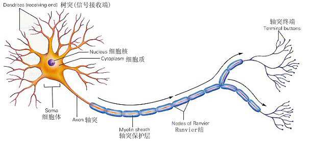
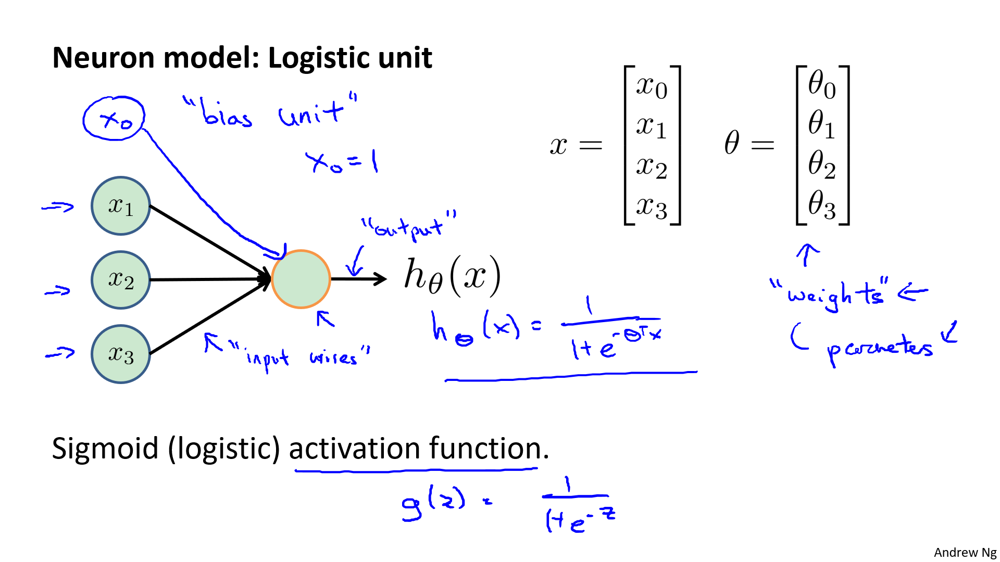
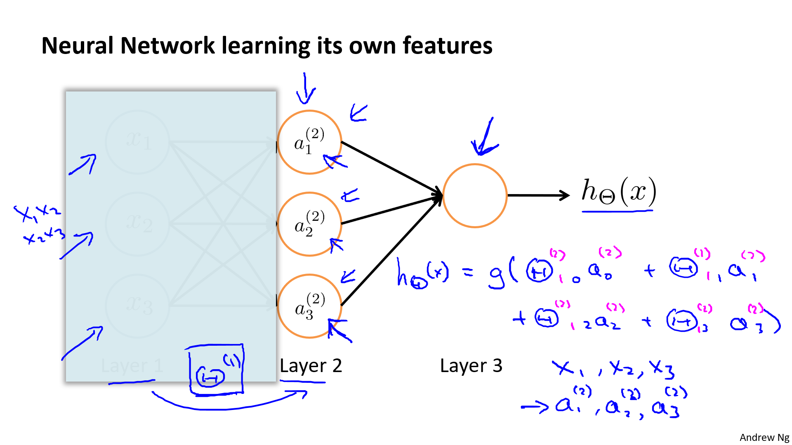
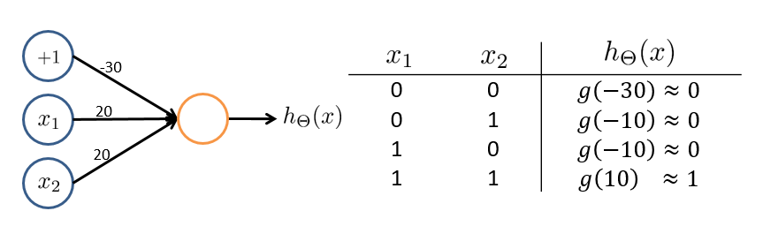
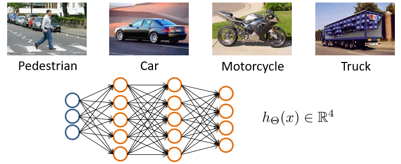
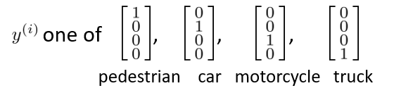
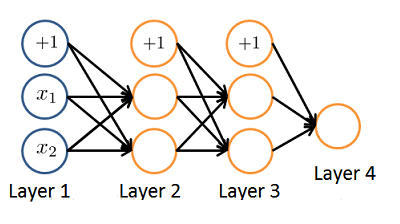
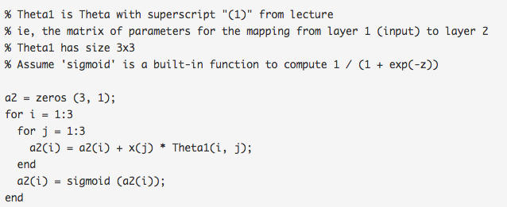

!!! info ""

    参考链接:
    https://scruel.gitee.io/ml-andrewng-notes/week3.html

<!--
下面这个css用于控制p标签的两端对齐
-->
<style type="text/css">
p {
    text-align: justify;  /*文本两端对齐*/
}
center img{
    border-radius: 0.3125em;
    box-shadow: 0 2px 4px 0 rgba(34,36,38,.12),0 2px 10px 0 rgba(34,36,38,.08);
}
center div{
    color:orange; 
    border-bottom: 1px solid #d9d9d9;
    display: inline-block;
    color: #999;
    padding: 2px;
}
</style>

## 1、非线性假设

!!! info ""

    参考视频: 8 - 1 - Non-linear Hypotheses (10 min).mkv

理论上我们可以用多项式函数去近似任意函数（泰勒极数(Taylor series)），从而可得到任意问题的拟合曲线。

在实际处理时，特征量通常会很多，如果再构造高阶多项式等，特征数量将会急剧增加，这使得回归模型的复杂度太高，可见并不合适。神经网络无需构造高阶多项式，在特征量很大时也可以处理的很好。

那特征能有多大呢？下面是一个计算机视觉中的例子：

<center>
    
    <br>
    <div></div>
</center>

如上图，如果选取一小块 $50\times 50$ 像素的灰度图片（一个像素只有亮度一个值），选择每个像素点作为特征，则特征总量 $n=2500$（换成 RGB（一个像素有三个值），则 $n=7500$ ），如果将其两两组合作为新特征，则特征数量将为 $C_{2500}^2 \approx 3\ million$ 。

## 2、神经元和大脑

!!! info ""

    参考视频: 8 - 2 - Neurons and the Brain (8 min).mkv

脑科学家通过对动物实验，发现大脑中专用于处理听觉信号的脑皮层也能处理其他诸如视觉等信号，即如果切断其与耳朵的联系，将其与眼睛相连，则这块负责听觉的脑皮层区域也能接受并处理视觉信号，从而学会“看”。脑科学家通过这类换源实验，就推论假设大脑的学习算法只有一种(“one learning algorithm” hypothesis)。那么如果能找出这种学习算法并应用于计算机中，那梦想中和人一样的人工智能就成真了。

神经网络就源于**模拟人类大脑**，但其需要的计算量很大。随着计算机硬件性能的提高，神经网络逐渐从衰落变为流行，如今已广泛地被应用在各行各业中。

下图是根据研究做的一些应用（有兴趣可回顾视频）：

<center>
    
    <br>
    <div>Seeing with your tongue
</div>
</center>

BrainPort  系统：帮助失明人士通过摄像头以及舌尖感官“看”东西

<center>
    
    <br>
    <div>Haptic belt: Direction sense
</div>
</center>

触觉皮带：在朝北时蜂鸣器会发出声响，可使人拥有方向感（声音信号转换为方向信号）。

##  3、模型表示1

!!! info ""

    参考视频: 8 - 3 - Model Representation I (12 min).mkv

既然神经网络模仿的是大脑神经元，那就先看一下大脑的神经元长什么样吧：

<center>
    
    <br>
    <div></div>
</center>

想象一下印刷厂中流水线的工人（机器人也算哦），每个工人都有特定的任务，比如装订，塑封，贴防伪标识等等，工人们看到书本并处理完自己的任务后，就回放回传送带，紧接着传送带就传给下一个环节的工人，如此不断重复从而完成一个又一个环节，直到一本书印制完成。

那么类比一下，把上图中的**细胞核(nucleus)**类比成工人，**轴突(axon)**类比传送带，**树突(dendrite)**则比类比成工人的双眼。一个又一个细胞体，从树突接收需要处理的信息，对其进行处理后，再经由轴突通过电信号把处理完的信息传递出去，直到理解信息的内容。当然啦，我们大脑的实际上还要更为复杂，而且一个人的神经元数目就比地球上所有流水线的工人之和还要多呢~

人工神经网络中，树突对应**输入(input)**，细胞核对应**激活单元(activation unit)**，轴突对应**输出(output)**。

<center>
    
    <br>
    <div></div>
</center>

In a neural network, or rather in an artificial neural network, that we implement in a computer, we are going to use a very simple model of what a neuron does. We are going to model a neuron as just a logistic unit.

上图**黄色圆圈**是类似与**神经元**细胞体的东西, 然后我们通过**输入通道** (树突) 给神经元细胞体**传递信息**, 然后神经元**做一些运算**, 并通过它的**输出通道 (轴突) 输出计算结果**。当我们画出这个图表的时候就表示 

$$
h_\theta(x)=\frac{1}{1+e^{-\theta^Tx}}
$$

其中, $x=\begin{bmatrix} x_0 \\ x_1 \\ x_2 \\ x_3 \\\end{bmatrix}$, $\theta=\begin{bmatrix} \theta_0 \\ \theta_1 \\ \theta_2 \\ \theta_3 \\\end{bmatrix}$ , 是我们的参数向量。

这是一个过于简单的模拟神经元的模型。

当我绘制一个神经网络的时候, 通常我只绘制输入节点 $x_1, x_2, x_3$, 有必要的时候我会增加一个额外的节点 $x_0$, 这个 $x_0$ 节点 有时候也被称作**偏置单元 (the bias unit)** 或**偏置神经元 (the bias neuron)** 。因为 $x_0$ 总等于1 , 所以有时候画它, 有时候不画它。这要看具体情况, 加上 $x_0$ 是否表示起来更方便。

&ensp; Finally, one last bit of terminology (术语) when we talk about neural networks, sometimes we'll say that this is an artificial neuron (人工神经元) with a sigmoid or a logistic activation function. So this activation function in the neuron network terminology is just another term for that function for that non-linearity g of z. $g(z)=\frac{1}{1+e^{-z}}$ .

!!! note ""

    模型的权重 (weights) = 模型的参数 (parameters)
    这两个是一回事, 只是叫法不一样。
 

<center>
    
    <br>
    <div></div>
</center>

&ensp; What a neural network is just a group of 
these different neurons strung (连接) together. Concretely, here we have input units $x_1, x_2, x_3$ . 再说一次, 有时候我们会画上额外的节点 $x_0$, 这里我们画上了。And here we have three neurons, which I have written, $a_1^{(2)}, a_2^{(2)},a_3^{(2)}$. 再次说明, 我们可以在 $a_1^{(2)}$ 的上方添加一个 $a_0^{(2)}$ (额外的偏置单元 它的值永远是 1 )。最终, 我们在最后一层有第三个节点, 它正是前面三个节点的输出, 假设函数 $h(x)$ 计算的结果。

&ensp; To introduce a bit more terminology in a neural network, the first layer, this is also called the input layer, because this is where we input our features, $x_1, x_2, x_3$. The final layer is also called the output layer, because that layer has the neuron that outputs the final value computed by a hypotheses. And then layer two in between, this is called the hidden layer. The term hidden layer isn't a great terminology, but the intuition is that, in supervised learning where you get to see the inputs, and you get to see the correct outputs. Whereas the hidden layer are values you don't get to observe in training set. It's not x and It's not y and so we call those hidden. Later on, we'll see neural networks with more than one hidden layer. But in this example, we have one input layer, layer 1; one hidden layer, layer 2; and one output layer, layer 3. But basically anything that isn't an input layer and isn't a output layer is called a hidden layer.

To explain the specific computations represented by a neural network, here's a little bit more notation. 

$x_0$ : 偏置单元 (bias unit), $x_0=1$

$\Theta$ : 权重(weight), 即参数。

激活函数 : $g$, 即逻辑函数等。

输入层: 对应于训练集中的特征 $x$。

输出层: 对应于训练集中的结果 $y$。

> $a_i^{(j)}$ : "activation" of unit $i$ in layer $j$ (第 $j$ 层 的第 $i$ 个激活单元)

> $\Theta^{(j)}$ : matrix of weights controlling function mapping from layer $j$ to layer $j+1$ (第 $j$ 层 映射到第 $j+1$ 层时的权重/参数矩阵)

> $\Theta_{v, u}^{(j)}$ : 第 $j$ 层 的第 $u$ 个单元映射到第 $j+1$ 层的第 $v$ 个单元的参数/权重

> $s_j$ : 第 $j$ 层的激活单元数目 (不包含偏置单元)


I'm going to use $a$ superscript $j$ subscript $i$ to denote the activation (激活项) of neuron $i$ or of unit $i$ in layer j. In addition, our neural network is parametrized by these matrices $\Theta$ superscript $j$ where $\Theta^{(j)}$ is going to be a matrix of weights controlling function mapping from layer $j$ to layer $j+1$.

!!! note ""

    激活项是指 由一个具体神经元计算并输出的值。

这图下面的算式代表了左上角的图解。

<center>
    
    <br>
    <div></div>
</center>

- **每个单元会作用于下一层的所有单元**（矩阵乘法运算）。

- 如果第 $j$ 层有 $s_j$ 个单元, 第 $j+1$ 层有 $s_{j+1}$ 个单元, $\Theta^{(j)}$ 是一个 $s_{j+1}\times (s_j+1)$ 维的权重矩阵。

- 其中, $+1$ 来自偏置单元, 这样意味着输出层不包含偏置单元, 输入层和隐藏层需要增加偏置单元。

依据本节所给模型，有：

$$
\begin{aligned}
Size(\Theta ^{(1)}) &= s_{j+1} \times (s_j+1) \\\\
&=s_2\times (s_1+1)\\\\
&=3\times 4
\end{aligned}
$$

$$
\begin{aligned}
Size(\Theta ^{(2)}) &= s_{j+1} \times (s_j+1) \\\\
&=s_3\times (s_2+1)\\\\
&=1\times 4
\end{aligned}
$$

## 4、模型表示2

!!! info ""

    参考视频: 8 - 4 - Model Representation II (12 min).mkv

<center>
    
    <br>
    <div></div>
</center>

对输入层(Layer 1)的所有激活单元应用激活函数,从而得到隐藏层(Layer 2)中激活单元的值：

$a_{1}^{(2)}=g(\Theta _{10}^{(1)}{{x}_{0}}+\Theta _{11}^{(1)}{{x}_{1}}+\Theta _{12}^{(1)}{{x}_{2}}+\Theta _{13}^{(1)}{{x}_{3}})$

$a_{2}^{(2)}=g(\Theta _{20}^{(1)}{{x}_{0}}+\Theta _{21}^{(1)}{{x}_{1}}+\Theta _{22}^{(1)}{{x}_{2}}+\Theta _{23}^{(1)}{{x}_{3}})$

$a_{3}^{(2)}=g(\Theta _{30}^{(1)}{{x}_{0}}+\Theta _{31}^{(1)}{{x}_{1}}+\Theta _{32}^{(1)}{{x}_{2}}+\Theta _{33}^{(1)}{{x}_{3}})$

对 Layer 2 中的所有激活单元应用激活函数, 从而得到输出:

${{h}_{\Theta }}(x)=g(\Theta _{10}^{(2)}a_{0}^{(2)}+\Theta _{11}^{(2)}a_{1}^{(2)}+\Theta _{12}^{(2)}a_{2}^{(2)}+\Theta _{13}^{(2)}a_{3}^{(2)})$

上面的计算过程被称为**前向传播(Forward propagation)**, 即从输入层开始, 一层一层地向下计算并传递结果。

向量化实现

定义 $a^{(1)}=x=\begin{bmatrix}  x_0 \\  x_1  \\ x_2\\x_3  \\\end{bmatrix}$, 

$\Theta^{(1)}=\begin{bmatrix} \Theta_{10}^{(1)} & \Theta_{11}^{(1)} & \Theta_{12}^{(1)} & \Theta_{13}^{(1)} \\ \Theta_{20}^{(1)} & \Theta_{21}^{(1)} & \Theta_{22}^{(1)} & \Theta_{23}^{(1)} \\ \Theta_{30}^{(1)} &  \Theta_{31}^{(1)}& \Theta_{32}^{(1)} & \Theta_{33}^{(1)} \end{bmatrix}$,

$\begin{matrix} a_1^{(2)}=g(z_1^{(2)})\\  a_2^{(2)}=g(z_2^{(2)}) \\ a_3^{(2)}=g(z_3^{(2)}) \end{matrix}$, $z^{(2)}=\begin{bmatrix}  z_1^{(2)} \\ z_2^{(2)} \\  z_3^{(2)}  \\\end{bmatrix}$

则有 $a^{(2)}=g(\Theta^{(1)}a^{(1)})=g(z^{(2)})$

添加 $a_0^{(2)}=1$

预测结果即 $h_\Theta(x)=a^{(3)}=g(\Theta^{(2)}a^{(2)})=g(z^{(3)})$

<center>
    
    <br>
    <div></div>
</center>

&ensp; This forward propagation view also helps us understand what neural networks might be doing, and why they might help us to learn interesting non-linear hypotheses. Consider the following nerual network, and let's say I cover up the left part of this picture for now. If you look at what's left in this picture, this looks a lot like logistic regression. 我们就是用最右侧黄色圈圈那个节点 (logistic regression unit)来预测 $h(x)$ 的值。如果只看最右侧黄色圈圈下面公式的蓝色部分, 这和标准的逻辑回归模型中的预测函数 $h_\theta(x)=g(\theta_0+\theta_1x_1+\theta_2x_2+\theta_3x_3)$ 除了符号, 其他完全一样。And what this is doing is just logistic regression. But where the features fed into logistic regression are these values computed by the hidden layer. Just to say that again, **what this netural network is doing is just like logistic regression**, expect that rather than using the original features $x_1, x_2, x_3$ is **using these new features** $a_1, a_2, a_3$. And the cool thing about this is that the features $a_1, a_2, a_3$, they themselves are learned as functions of the input. Concretely, the function mapping from layer 1 to layer 2, that is determined by some other set of parameters, $\Theta_1$. So that's it, the neural network, instead of being constrained to feed the features $x_1, x_2, x_3$ to logistic regression, it gets to learn its own features, $a_1, a_2, a_3$, to feed into the logistic regression. And as you can imagine, depending on what parameters it chooses for $\Theta_1$, you can learn **some pretty instresting and complex features**, and therefore you can end up with **a better hypotheses**, than if you were constrained to use the raw features $x_1, x_2, x_3$, or if you will constrain to choose the polynomial term(多项式项), $x_1x_2, x_2x_3$ and so on. But instead, this algorithm has the flexibility to try to learn whatever features at once, using these $a_1, a_2, a_3$ in order to feed into this last unit. That's essentially a logistic regression here. 

当然，神经网络可有多层，每层的激活单元数量也并不固定。Other network architectures (其他神经网络架构):

<center>
    
    <br>
    <div></div>
</center>

> 我们习惯于将输入层称为神经网络的第 0 层，如上图的神经网络被称为三层网络。


## 5、例子和直观理解1

!!! info ""

    参考视频: 8 - 5 - Examples and Intuitions I (7 min).mkv

为了更好的理解神经网络, 举例单层神经网络进行逻辑运算的例子。

下面的例子中, $x_1, x_2$为**二进制数**。

逻辑与(AND)运算（都为真值则结果才为真）神经网络: 

<center>
    
    <br>
    <div></div>
</center>


$\Theta^{(1)}=\begin{bmatrix} -30 & 20 & 20 \\\end{bmatrix}$, $h_\Theta(x)=g(-30+20x_1+20x_2)$。

回归 sigmoid 函数图像, 根据输入则有上图中右边的表格, 即 $h_\Theta(x) \approx x_1$ AND $x_2$ 。这样就实现了一个能够进行与运算的神经网络。

<center>
    
    <br>
    <div></div>
</center>

再举一例, 逻辑或(OR)运算 (有一个真值则结果就为真)神经网络:

<center>
    
    <br>
    <div></div>
</center>


## 6、例子和直观理解2

!!! info ""

    参考视频: 8 - 6 - Examples and Intuitions II (10 min).mkv

下面逐步构建复杂一点的神经网络

<center>
    
    <br>
    <div></div>
</center>

如上图, 我们分别构建了三个单层神经网络, 将这三个网络组合起来, 可得到一个新的神经网络, 其可完成逻辑运算中的异或(XNOR)操作:

<center>
    
    <br>
    <div></div>
</center>

这里的组合即为 XNOR = ($x_1$ AND $x_2$) OR ((NOT $x_1$) AND (NOT $x_2$))

$\Theta^{(1)}= \begin{bmatrix} -30 & 20 & 20 \\ 10 & -20 & -20 \\ \end{bmatrix}$, $\Theta^{(2)}=\begin{bmatrix} -10&20&20 \\\end{bmatrix}$, $\begin{matrix} a^{(2)}=g(\Theta^{(1)}\cdot x)\\ a^{(3)}=g(\Theta^{(2)}\cdot a^{(2)}) \\ h_\Theta(x)=a^{(3)} \end{matrix}$

可见, 特征值能不断升级, 并抽取出更多信息, 直到计算出结果。而如此不断组合, 我们就可以逐渐构造出越来越复杂、强大的神经网络, 比如用于手写识别的神经网络。

## 7、多类别分类

!!! info ""

    参考视频: 8 - 7 - Multiclass Classification (4 min).mkv

之前讨论的都是预测结果为单值情况下的神经网络，要实现多类别分类，其实只要修改一下输出层，让输出层包含多个输出单元即可。

举一个 4 分类问题的实例：

<center>
    
    <br>
    <div></div>
</center>

有四种分类情况，那么就让输出层包含 4 个输出单元即可，则 $h_\Theta$ 为 4 维向量。 

神经网络中的多分类算法算是对 one-vs-all 思想的扩展, 定义预测结果一共有 4 种情况：

<center>
    
    <br>
    <div></div>
</center>

如果预测结果 $h_\Theta(x)=\begin{bmatrix} 0 \\ 0 \\ 1 \\ 0 \\\end{bmatrix}$, 那么表示 $h_\Theta(x)_3$, 即分为第 3 类，对应于图中的摩托车(Motorcycle)。

总结一下

多分类问题, 要分为 $K$ 类, 就在输出层放置 $K$ 个输出单元, 对于单个样本实例, 预测向量 $h_\Theta(x)$ 为 $K$ 维向量, 我们则依据这个预测向量, 得出该实例属于哪个类 $y^{(i)}$ 。注意, 神经网络中的预测和结果都是 $K$ 维向量，而不再只是一个实数了。

## 习题 && 参考答案

**第一题**

以下哪项陈述是正确的？选择所有正确项

A. 神经网络中隐藏单元的激活值, 在应用了sigmoid函数之后, 总是在（0，1）范围内

B. 在二进制值（0或1）上的逻辑函数可以（近似）用一些神经网络来表示

C. 两层（一个输入层, 一个输出层, 没有隐藏层）神经网络可以表示异或函数

D. 假设有一个三个类的多类分类问题, 使用三层网络进行训练。设 $a_1^{(3)}=(h_\Theta(x))_1$为第一输出单元的激活, 并且类似的, 有 $a_2^{(3)}=(h_\Theta(x))_2$ 和 $a_3^{(3)}=(h_\Theta(x))_3$。那么对于任何输入 $x$, 必须 $a_1^{(3)}+a_2^{(3)}+a_3^{(3)}=1$

**第二题**

考虑以下两个二值输入 $x_1,x_2 \in \{0, \ 1 \}$ 和输出 $h_\Theta(x)$ 的神经网络。它（近似）计算了下列哪一个逻辑函数？

<center>
    
    <br>
    <div></div>
</center>

A. OR

B. AND

C. NAND (与非)

D. XOR (异或)

**第三题**

考虑下面给出的神经网络。下列哪个方程正确地计算了 $a_1^{(3)}$ 的激活？注：$g(z)$ 是sigmoid激活函数

<center>
    
    <br>
    <div></div>
</center>

A. $a_1^{(3)}=g(\Theta_{1,0}^{(2)}a_0^{(2)}+\Theta_{1,1}^{(2)}a_1^{(2)}+\Theta_{1,2}^{(2)}a_2^{(2)})$

B. $a_1^{(3)}=g(\Theta_{1,0}^{(1)}a_0^{(1)}+\Theta_{1,1}^{(1)}a_1^{(1)}+\Theta_{1,2}^{(1)}a_2^{(1)})$

C. $a_1^{(3)}=g(\Theta_{1,0}^{(1)}a_0^{(2)}+\Theta_{1,1}^{(1)}a_1^{(2)}+\Theta_{1,2}^{(1)}a_2^{(2)})$

D. 此网络中不存在激活 $a_1^{(3)}$

**第四题**

你有以下神经网络

<center>
    
    <br>
    <div></div>
</center>

你想计算隐藏层 $a^{(2)} \in \mathbb{R}^3$ 的激活, 一种方法是使用以下Octave代码:

<center>
    
    <br>
    <div></div>
</center>

您需要一个矢量化的实现（即, 一个不用循环的实现）。下列哪个实现正确计算 $a^{(2)}$ ？选出所有正确项

A. z = Theta1 * x; a2 = sigmoid (z)

B. a2 = sigmoid (x * Theta1)

C. a2 = sigmoid (Theta2 * x)

D. z = sigmoid(x); a2 = sigmoid (Theta1 * z)

**第四题**

您正在使用下图所示的神经网络，并已学习参数

$\Theta^{(1)}=\begin{bmatrix} 1 & 1 & 2.4 \\ 1 & 1.7 & 3.2 \\ \end{bmatrix}$ (用于计算 $a^{(2)}$) 和 $\Theta^{(2)}=\begin{bmatrix} 1 & 0.3 & -1.2 \\\end{bmatrix}$ (用于作用在 $a^{(2)}$ 的函数, 计算 $a^{(3)}$ 的值)。假设您交换第一个隐藏层的2个单元的参数 $\Theta^{(1)}=\begin{bmatrix} 1 & 1.7 & 3.2 \\ 1 & 1 & 2.4 \\ \end{bmatrix}$, 并且还交换输出层 $\Theta^{(2)}=\begin{bmatrix} 1 & -1.2 & 0.3 \\\end{bmatrix}$ 。这将如何改变输出 $h_\Theta(x)$ 的值?

<center>
    
    <br>
    <div></div>
</center>

A. 不变

B. 变大

C. 变小

D. 信息不全，可能变大也可能变小


<br/>
<br/>
<br/>
<br/>
<br/>
<br/>

**参考答案**

第一题: AB

第二题: A

第三题: A

第四题: A

第五题: A

提示: 假定输出是 $\begin{bmatrix} x_1 & x_2 & x_3 \\\end{bmatrix}^T$ 代入到定义中计算即可, 交换的结果都为:

$g(1+0.3g(1+x_1+2.4x_2)-1.2g(1+1.7x_1+3.2x_2))$ , 其中 $g$ 为sigmoid函数。

## 代码练习

In this exercise, you will implement one-vs-all logistic regression and neural networks to recognize hand-written digits.

### 1 Multi-class Classification

For this exeercise, you will use logistic regression and neural networks to recognize handwritten digits (from 0 to 9). Automated handwritten digits recognition is widely used today - from recognizing zip codes (postal codes) on mail envelopes to recognizing amounts written on bank checks. This exercise will show you how the methods you've learned can be used for this classification task.

&ensp; In the fist part of the exercise, you will extend your previous implemention of logistic regression and apply it to one-vs-all classification.

#### 1.1 Dataset

You are given a data set in **ex3data1.mat** that contains 5000 training examples of handwritten digits. The .mat format means that the data has been saved in a native Octave/Matlab matrix format, instead of a text (ASCII) format like csv-file. These matrices can be read directly into your program by using load command. After loading, matrices of the correct dimensions and values will appear in your program's memory. That matrix will be already be named, so you do not need to assign names to them.

``` py linenums="1" title="导入数据和必要的库"
import numpy as np
import scipy.io as scio
import matplotlib.pyplot as plt
import pandas as pd

# 加载数据文件
data = scio.loadmat('ex3data1.mat')

data
```

**输出**

```
{'__header__': b'MATLAB 5.0 MAT-file, Platform: GLNXA64, Created on: Sun Oct 16 13:09:09 2011',
 '__version__': '1.0',
 '__globals__': [],
 'X': array([[0., 0., 0., ..., 0., 0., 0.],
        [0., 0., 0., ..., 0., 0., 0.],
        [0., 0., 0., ..., 0., 0., 0.],
        ...,
        [0., 0., 0., ..., 0., 0., 0.],
        [0., 0., 0., ..., 0., 0., 0.],
        [0., 0., 0., ..., 0., 0., 0.]]),
 'y': array([[10],
        [10],
        [10],
        ...,
        [ 9],
        [ 9],
        [ 9]], dtype=uint8)}
```

&ensp; There are 5000 training examples in **ex3data1.mat**, where each training examples is a 20 pixel by 20 pixel grayscale image of the digit. Each pixel is represented by a floating point number indicating the grayscale intensity at that location. The 20 by 20 grid of pixel is "unrolled" into a 400-dimensional vector. Each of these training examples becomes a single row in our data matrix X. This gives us a 5000 by 400 matrix X where every row is training example for a handwirtten digit image.

$$
X = \begin{bmatrix} —— & (x^{(1)})^T & —— \\ —— & (x^{(2)})^T & ——  \\  & \vdots &  \\  —— & (x^{(m)})^T & ——  \end{bmatrix}
$$

&ensp; The second part of the training set is a 5000-dimensional vector $y$ that contains labels for the training set. To make things more compatible with Octave/Matlab indexing, where there is no zero index, we have mapped the digit zero to the value ten. Therefore, a "0" digit is labeled as "10", while the digits "1" to "9" are labeled as "1" to "9" in their natural order. 

#### 1.2 Visualizing the data

You will begin by visualizing a subset of the training set. In Part 1, the code randomly selects 100 rows from X and passes those rows to the **display** function. This function maps each row to a 20 pixel by 20 pixel grayscale image and displays the images together. We have provided the displayData function, and you are encouraged to examine the code to see how it works. After you run this step, you should see an image like Figure <font color="#ff0000">5.9.1</font>.

``` py linenums="1" title="定义显示100个数据生成图像的函数"
def displayData(X):
    # m : 样本数量
    m = X.shape[0]
    # n : 单个样本的大小
    n = X.shape[1]
    # m, n # (100, 400)

    # 单张图片的宽度
    example_width = int(np.round(np.sqrt(n)))
    # 单张图片的高度
    example_height = int(np.floor(n/example_width))
    # example_width,example_height # (20, 20)

    # 显示图中，一行多少张图
    display_rows = int(np.floor(np.sqrt(m)))
    # 显示图中，一列多少张图片
    display_cols = int(np.ceil(m / display_rows))
    # 图片间的间隔
    pad = 1
    # display_rows,display_cols # (10, 10)

    # 初始化图片矩阵
    # 这里用- np.ones初始化是为了和吴老师给的参考图底色相同
    display_array = - np.ones((pad + display_rows * (example_height + pad),
                               pad + display_cols * (example_width + pad)))

    curr_ex = 0  # 当前的图片计数
    # 将每张小图插入图片数组中
    for j in range(0, display_rows):
        for i in range(0, display_cols):
            if curr_ex >= m:
                break
            # 获取每行样本最大的值并取绝对值
            max_val = np.max(abs(X[curr_ex, :]))
            # 拿到起始横轴和纵轴坐标
            jstart = pad + j * (example_height + pad)
            istart = pad + i * (example_width + pad)
            # 这一步个人感觉是归一化的味，每个图像的所有点强度除以他们中的最大值
            display_array[jstart: (jstart + example_height), istart: (istart + example_width)
                          ] = np.array(X[curr_ex, :]).reshape(example_height, example_width) / max_val
            curr_ex = curr_ex + 1
        if curr_ex >= m:
            break
    display_array = display_array.T
    plt.figure(figsize=(5, 5), dpi=150)
    plt.imshow(display_array, cmap=plt.cm.gray)
    plt.axis('off')
    plt.show()
```

!!! Danger ""

    注意: displayData的参数要传入已经挑选好随机100个样本的X或者最好是能开平方的一个数


``` py linenums="1" title="显示图像"
# 取到data中的 X, y值
X = data['X']
y = data['y']
# X.shape, y.shape  # ((5000, 400), (5000, 1))

# 从 5000个样本中随机挑100个
sample_idx = np.random.choice(np.arange(X.shape[0]), 100)  # 随机选100个样本
sample_images = X[sample_idx, :]  # (100,400)

displayData(sample_images)
```

<center>
    
    <br>
    <div>Figure 5.9.1: Examples from the dataset</div>
</center>

#### 1.3 Vectorizing Logistic regression

You will be using multiple one-vs-all logistic regression models to build a muli-class classifier. Since there are 10 classes, you will need to train 10 separate logistic regression classifiers. To make this training effcient, it is imporant to ensure that your code is well vectorized. In this section, you will implement a vectorized version of logistic regression that does not employ any for any loops.

##### 1.3.1 Vectorizing the cost function

We will begin by writing a vectorized version of the cost function. Recall that in (unregularized) logistic regression, the cost function is 

$J(\theta) = \frac{1}{m}\sum\limits_{i=1}^{m}{\Big[-{{y}^{(i)}}\log ( {h_\theta}( {{x}^{(i)}} ) )-( 1-{{y}^{(i)}} )\log \big( 1-{h_\theta}( {{x}^{(i)}}) \big)\Big]}$ .

&ensp; To compute each element in the summation, we have to compute $h_\theta(x^{(i)})$ for every example $i$, where $h_\theta(x^{(i)})=g(\theta^Tx^{(i)})$ and $g(z)=\frac{1}{1+e^{-z}}$ is the sigmoid function. It turns out that we can compute this quickly for all our examples by using matrix multiplication. Let us define $X$ and $\theta$ as 

$X = \begin{bmatrix} —— & (x^{(1)})^T & —— \\ —— & (x^{(2)})^T & ——  \\  & \vdots &  \\  —— & (x^{(m)})^T & ——  \end{bmatrix}$ &ensp; and &ensp; $\theta=\begin{bmatrix} \theta_0\\ \theta_1 \\ \vdots \\ \theta_n \\\end{bmatrix}$

Then, by computing the matrix product $X \theta$, we have

$$
X\theta= \begin{bmatrix} —— & (x^{(1)})^T \theta & —— \\ —— & (x^{(2)})^T \theta & ——  \\  & \vdots &  \\  —— & (x^{(m)})^T \theta & ——  \end{bmatrix} = 
\begin{bmatrix} —— & \theta^T (x^{(1)})  & —— \\ —— & \theta^T (x^{(2)}) & ——  \\  & \vdots &  \\  —— & \theta^T (x^{(m)}) & ——  \end{bmatrix}
$$

> 补充一下, X 的每一行元素代表了每一个样本。所以 $X$ 应该是 $n+1$ 列 (其中还包含了 $x_0=1$ 恒等于1的这一列)。所以 $X$ 和 $\theta$ 才可以进行矩阵乘法。

In the last equality, we used the fact that $a^Tb=ab^T$ if a and b are vectors. This allows us to compute the products $\theta^Tx^{(i)}$ for all our examples $i$ in one line of code.

&ensp; Our job is to write the unregularized cost function. Our implementation should use the strategy we presented above to calculate $\theta^Tx^{(i)}$. We should also use a vectorized approach for the rest of the cost function. A fully vectorized version should not contain any loops.

##### 1.3.2 Vectorizing the gradient

Recall that the gradient of the (unregularized) logistic regression cost is a vector where the $j^{th}$ element is defined as 

$$
\frac{\partial J(\theta)}{\partial \theta_j}= \frac{1}{m} \sum_{i=1}^m \big(h_\theta(x^{(i)})-y^{(i)} \big) x_j^{(i)}
$$

&ensp; To vectorize this operation over the dataset, we start by writing out all the partial derivatives explicitly for all $\theta_j$.

$$
\begin{aligned}
\begin{bmatrix} \frac{\partial J}{\partial \theta_0}\\ \frac{\partial J}{\partial \theta_1} \\ \frac{\partial J}{\partial \theta_2} \\ \vdots\\ \frac{\partial J}{\partial \theta_n} \\\end{bmatrix} &= \frac{1}{m} \begin{bmatrix} \sum_{i=1}^m \Big(\big(h_\theta(x^{(i)})-y^{(i)}\big)x_0^{(i)}\Big) \\ \sum_{i=1}^m \Big(\big(h_\theta(x^{(i)})-y^{(i)}\big)x_1^{(i)}\Big) \\ \sum_{i=1}^m \Big(\big(h_\theta(x^{(i)})-y^{(i)}\big)x_2^{(i)}\Big)\\ \vdots \sum_{i=1}^m \Big(\big(h_\theta(x^{(i)})-y^{(i)}\big)x_n^{(i)}\Big) \\\end{bmatrix} \\\\
&= \frac{1}{m} \sum_{i=1}^m \Big(\big(h_\theta(x^{(i)})-y^{(i)}\big)x^{(i)}\Big) \\\\
&=\frac{1}{m}X^T\big(h_\theta(x)-y\big)
\end{aligned}   \tag{1}
$$

where 

$$
h_\theta(x)-y=\begin{bmatrix} h_\theta(x^{(1)})-y^{(1)}\\  h_\theta(x^{(2)})-y^{(2)} \\ \vdots \\  h_\theta(x^{(m)})-y^{(m)} \\\end{bmatrix}
$$

&ensp; Note that $x^{(i)}$ is a vector, while $\big(h_\theta(x^{(i)})-y^{(i)}\big)$ is a scalar (single number). To understand the last step of the derivation, let $\beta_i=\big(h_\theta(x^{(i)})-y^{(i)}\big)$ and observe that:

$$
\sum_{i}\beta_ix^{(i)}=\begin{bmatrix} | & | &  & | \\ x^{(1)} & x^{(2)} & \cdots  & x^{(m)} \\ | & | &  & | \ \\\end{bmatrix} \begin{bmatrix} \beta_1\\ \beta_2 \\ \vdots \\ \beta_m \\\end{bmatrix}=X^T \beta
$$

where the values $\beta_i=\big(h_\theta(x^{(i)})-y^{(i)}\big)$ .

&ensp; The expression above allows us to compute all the parital derivatives without any loops. If you are comfotable with linear algebra, we encourage you to work through the matrix multiplications above to convince yourself that the vectorized version does the same computations. You should now implement Equation <font color='#ff0000'>1</font> to compute the correct vectorized gradient. Once you are done, complete the function by implementing the gradient.

!!! tip "Debugging Tip"

    Vectorizing code can sometimes be tricky. One common strategy for debugging is to print out the sizes of the matirces you are working with using the size function (numpy里用 **.shape**). For example, given a data matrix $X$ of size $100\times 20$ (100 examples, 20 featrues) and $\theta$, a vector with dimensions $20\times 1$, you can observe that $X \theta$ is a valid multiplication operation, while $\theta X$ is not. Furthermore, if you have a non-vectorized version of your code, you can compare the output of your vectorized code and non-vectorized code to make sure that they produce the same outputs.


##### 1.3.3 Vectorizing regularized logistic regression

After you implement vectorization for logistic regression, you will now add regularization to the cost function. Recall that for regularized logistic regression, the cost function is defined as

$$
J(\theta)=-\frac{1}{m} \sum_{i=1}^m\Big[y^{(i)}\log \big(h_\theta(x^{(i)})\big)+ (1-y^{(i)})\log \big(1-h_\theta(x^{(i)})\big) \Big]+ \frac{\lambda}{2m}\sum_{j=1}^n \theta_j^2
$$

&ensp; Note that you should not be regularizing $\theta_0$ which is used for the bias term.

&ensp; Correspondingly, the partial derivative of regularized logistic regression cost for $\theta_j$ is defined as 

for $j=0$ :

$$
\frac{\partial J(\theta)}{\partial \theta_0}= \frac{1}{m} \sum_{i=1}^m{(h_\theta(x^{(i)})-y^{(i)})x_0^{(i)}}
$$

for $j \geq 1$ :

$$
\frac{\partial J(\theta)}{\partial \theta_j}= \bigg (\frac{1}{m} \sum_{i=1}^m \big(h_\theta(x^{(i)})-y^{(i)} \big) x_j^{(i)}\bigg )+ \frac{\lambda}{m} \theta_j
$$

&ensp; Now modify your code to account for regularization. Once again, you should not put any loops into your code.

``` py linenums="1" title="定义sigmoid函数, 代价函数计算(带正则), 梯度计算 (带正则)"
# 定义sigmoid函数
def sigmoid(z):
    return 1.0/(1.0+np.exp(-z))

# 定义代价函数计算(带正则)
def costFunctionReg(theta, X, y, lambdada):
    m, n = X.shape
    # 下面的A@B 相当于np.dot(A,B)
    h = sigmoid(X@theta)
    first = (y.T)@np.log(h)
    second = ((1-y).T)@np.log(1-h)
    # 正则化项不惩罚x0, 所以这里将theta2 跳过了theta_0
    theta2 = theta[1:]
    reg = lambdada*np.sum(theta2.T@theta2)/(2*m)
    return np.sum(-first-second)/m+reg


# 定义梯度(带正则)
def gradientReg(theta, X, y, lambdada):
    # 生成一个和theta一样大小都是0的向量
    grad = np.zeros_like(theta)
    m, n = X.shape
    for j in range(n):
        if(j == 0):
            grad[j] = np.sum(X[:, j].T@(sigmoid(X@theta)-y))/m
        grad[j] = (np.sum(X[:, j].T@(sigmoid(X@theta)-y))/m) + \
            lambdada*(theta[j])/m
    return grad
```


#### 1.4 One-vs-all Classification

In this part of the exercise, you will implement one-vs all classification by training multiple regularized regression classifiers, one for each of the $K$ classes in our dataset (Figure <font color="#ff0000">5.9.1</font> ). In the handwritten digits dataset, $K=10$, but your code should work for any value of $K$.

&ensp; You should now complete the code to train one classifier for each class. In particular, your code should return all the classifier parameters in a matrix $\Theta \in \mathbb{R}^{K\times (N+1)}$, where each row of $\Theta$ correspons to the learned logistic regression parameters for one class. You can do this with a "for" - loop from 1 to $K$, training each classifier independently.

&ensp; Note that the $y$ argument to this function is a vector of labels from 1 to 10, where we have mapped the digit "0" to the label 10 (to avoid confusions with indexing).

&ensp; When training the classifier for class $k \in \{1,\cdots ,K\}$, you will want a m-dimensional vector of label $y$, where $y_i\in 0,1$ indicates whether the $j$th training instance belongs to class $k$ ($y_j=1$), or if it belongs to a different class ($y_j=0$). You may find logical arrays helpful for this task. 

&ensp; you will be using **fmincg** for this exercise (instead of **fminunc**). **fmincg** works similarly to **fminunc**, but is more more efficient for dealing with a large number of parameters.

``` py linenums="1" title="计算能预测所有分类的 theta"
def oneVsAll(X, y, num_labels, lambdada):
    m = X.shape[0]
    n = X.shape[1]
    all_theta = np.zeros((num_labels, n+1))
    one = np.ones(m)
    X = np.insert(X, 0, values=one, axis=1)
    for c in range(num_labels):
        init_theta = np.zeros(n+1)
        # 最经典的地方 利用双等号将标签分为两类
        y_t = (y == c)
        result = op.minimize(fun=costFunctionReg, x0=init_theta, args=(
            X, y_t, lambdada), method='TNC', jac=gradient)
        all_theta[c, :] = result['x']

    return all_theta
```

##### 1.4.1  One-vs-all Prediction

After training your one-vs-all classifier, you can now use it to predict the digit contained in a given image. For each input, you should compute the "probability" that it belongs to each class using the trained logistic regression classifiers. Your one-vs-all prediction function will pick the class for which the corresponding logistic regression classifier outputs the highest probability and return the class label (1, 2,..., or $K$) as the prediction for the input example.

&ensp; You should now complete the code to use the one-vs-all classifier to make predictions.

&ensp; Once you are done, ex3.m will call your  function using the learned value of $\Theta$. You should see that the training set accuracy is about
94.9% (i.e., it classifies 94.9% of the examples in the training set correctly).

``` py linenums="1" title="计算准确率"
# 取到data中的 X, y值
X = data['X']
y = data['y']
# 因为数据集是考虑了matlab从1开始，把0的结果保存为了10，这里进行取余，将10变回0
y = y % 10

m, n = data['X'].shape


num_labels = 10

# 初始化
lambdada = 0.1


# 计算出所有分类的预测参数 all_theta 的维度 (10,401)
all_theta = oneVsAll(X, y, num_labels, lambdada)

# X 插入x_0
X = np.insert(X, 0, values=np.ones(m), axis=1)
# 计算所有的预测结果 h_hat的维度 (5000, 10)
h_hat = sigmoid(X@all_theta.T)
# h_hat计算出了5000个样本对于10个标签的可能性
# 所以按行取出最大值对应的索引即为预测的标签
y_hat = h_hat.argmax(axis=1)
# 将 y 变成向量
y = y.reshape(-1,)

# y_hat,y
# 利用均值计算出正确率，巧妙
np.mean(y_hat == y)
```

**输出**

```
0.9646
```

### 2 Neural networks

In the previous part of this exercise, you implemented multi-class logistic regression to recognize handwritten digits. However, logistic regression cannot form more complex hypotheses as it is only a linear classifier.

&ensp; In this part of the exercise, you will implement a neural network to recognize handwritten digits using the same training set as before. The neural network will be able to represent complex models that form non-linear hypotheses. For this week, you will be using parameters form a neural network that we have already trained. Your goal is to implement the feedforward propagation algorithm to use our weights for prediction. In next week's exercise, you will write the backpropagation algorithm for the learning neural network parameters.

#### 2.1 Model Representation

Our neural network is shown in Figure . It has 3 layers - an input layer, a hidden layer and an output layer. Recall that our inputs are pixel values of digits images. Since the images are of size $20\times 20$, this gives us 400 input layer units (excluding the extra bias unit which always outputs $+1$ ). As before, the training data will be loaded into the variables $X$ and $y$ . 

<center>
    
    <br>
    <div>Figure 5.9.2: Neural network model.</div>
</center>


&ensp; You have been provided with a set of network parameters ($\Theta^{(1)}$, $\Theta^{(2)}$) already trained by us. These are stored in **ex3weights.mat** and will be loaded by **ex3_nn.m** into **Theta1** and **Theta2**. The parameters have dimensions that are sized for a neural netowrk with 25 units in the second layer and 10 output units (corresponding to the 10 digit classes).

#### 2.2 Feedforward Propagation and Prediction

Now you will implement feedforward propagation for the neural network. You will need to complete teh code **predict.m** to return the neural network's prediction. 

&ensp; You should implement the feedforward computation that computes $h_\theta(x^{(i)}$ for every example $i$ and return the associated predictions. Simliar to the one-vs-all classification strategy, the prediction from the neural network will be label that has the largest output $\big(h_\theta(x)\big)_k$.

!!! Note "Implementation Note"

    The matrix $X$ contains the examples in rows. When you complete the code in predict.m, you will need to add the column 1's to the matrix. The matrices Theta1 and Theta2 contain the parameters for each unit in rows. Specifically, the first row of Theta1 corresponds to the first hidden unit in the second layer. In Octave, when you compute $z^{(2)}=\Theta^{(1)}a^{(1)}$, be sure that you index (and if necessary, transpose) $X$ correctly so that you get $a^{(1)}$ as a column vector.


Once you are done, ex3_nn.m will call your predict function using loaded set of parameters for Theta1 and Theta2. You should see that the accuracy is about $97.5\%$. After that, an interacitve sequence will launch displaying images from the training set on at a time, while the console prints out the predicted label for the display image. To stop the image sequence, press Ctrl-C.

``` py linenums="1" title="使用神经网络实现数字识别(Theta 已提供)"
import numpy as np
import scipy.io as scio
import matplotlib.pyplot as plt
import scipy.optimize as op

data = scio.loadmat('ex3data1.mat')

X = data['X']
y = data['y']

theta = scio.loadmat('ex3weights.mat')

theta1 = theta['Theta1']
theta2 = theta['Theta2']

# 插入偏置项
one = np.ones(m)
X = np.insert(X, 0, values=one, axis=1)

# X.shape,theta1.shape, theta2.shape
# ((5000, 401), (25, 401), (10, 26))

# 第二层计算
a2 = sigmoid(X@theta1.T)

# 第三层计算
a2 = np.insert(a2, 0, values=one, axis=1)
a3 = sigmoid(a2@theta2.T)

# y的值为1-10，所以此处0-9要加1
p = a3.argmax(axis=1)+1

# 利用均值计算准确率
np.mean(p == y.flatten())
```

**输出**

```
0.9752
```

