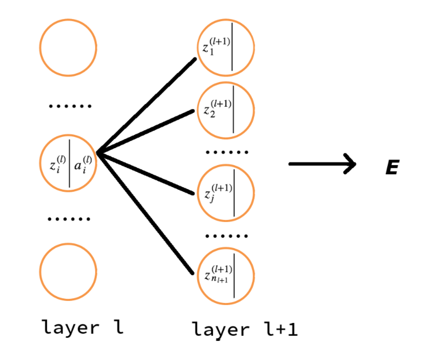

!!! info ""

    参考链接:
    
    [神经网络BP反向传播算法原理和详细推导流程](https://blog.csdn.net/qq_32865355/article/details/80260212)

<!--
下面这个css用于控制p标签的两端对齐
-->

## 1、反向传播算法和BP网络简介

误差反向传播算法简称反向传播算法（即BP算法）。使用反向传播算法的多层感知器又称为BP神经网络。BP算法是一个迭代算法, 它的基本思想为：

- 先计算每一层的状态和激活值，直到最后一层 (即信号是前向传播的);

- 计算每一层的误差, 误差的计算过程是从最后一层向前推进的 (这就是反向传播算法名字的由来);

- 更新参数 (目标是误差变小)。迭代前面两个步骤, 直到满足停止准则 (比如相邻两次迭代的误差的差别很小)。

本文的记号说明:

- $n_l$ 表示第 $l$ 层神经元的个数;

- $f(\cdot)$ 表示神经元的激活函数

- $W^{(l)} \in \mathbb{R}^{(n_l\times n_{l-1})}$ 表示 $l-1$ 层到第 $l$ 层的权重矩阵;

- $w_{ij}^{(l)}$ 是权重矩阵 $W^{(l)}$ 中的元素, 表示第 $l-1$ 层第 $j$ 个神经元到第 $l$ 层第 $i$ 个神经元的权重 (注意标号的顺序);

- $b^{(l)}=(b_1^{(l)},b_2^{(l)},\cdots ,b_{n_l}^{(l)})^T \in \mathbb{R}^{n_l}$ 表示 $l-1$ 层到第 $l$ 层的偏置;

- $z^{(l)}=(z_1^{(l)},z_2^{(l)},\cdots ,z_{n_l}^{(l)})^T \in \mathbb{R}^{n_l}$ 表示 $l$ 层神经元的状态;

- $a^{(l)}=(a_1^{(l)},a_2^{(l)},\cdots ,a_{n_l}^{(l)})^T \in \mathbb{R}^{n_l}$ 表示 $l$ 层神经元的激活值 (即输出值);

!!! Note "关于记号的特别注意"

    不同文献所采用的记号可能不同, 这将导致不同文献的公式结论可能不同。如 Andrew Ng 的教程中用 $W^{(l)}$ 表示的是第 $l$ 层到第 $l+1$ 层的权重矩阵。又如, 本文用 "下标" 来标记一个向量的不同分量, 而有一些资料却用 "上标" 来标记向量的不同分量。

下面以三层感知器 (即只含有一个隐藏层的多层感知器) 为例介绍反向传播算法 (BP) 算法。

三层感知器如图 1 所示。例子中, 输入数据 $x=(x_1,x_2,x_3)^T$ 是三维的 (对于第一层, 可以认为 $a_i^{(1)}=x_i$), 唯一的隐藏层有三个节点, 输出数据是 2 维的。

    
     
    
Figure 1: 三层感知器实例

## 2、信息向前传播

显然, 图 1 所示的神经网络的第 2 层神经元的状态及激活值可以通过下面的计算得到:

$$
\begin{aligned}
z_1^{(2)} &=w_{11}^{(2)}x_1+w_{12}^{(2)}x_2+w_{13}^{(2)}x_3+b_1^{(2)} \\\\
z_2^{(2)}&=w_{21}^{(2)}x_1+w_{22}^{(2)}x_2+w_{23}^{(2)}x_3+b_2^{(2)}\\\\
z_3^{(2)}&=w_{31}^{(2)}x_1+w_{32}^{(2)}x_2+w_{33}^{(2)}x_3+b_2^{(3)}\\\\
a_1^{(2)}&=f(z_1^{(2)})\\\\
a_2^{(2)}&=f(z_2^{(2)})\\\\
a_3^{(2)}&=f(z_3^{(2)})
\end{aligned}
$$

类似地, 第 3 层神经元地状态及激活值可以通过下面计算得到:

$$
\begin{aligned}
z_1^{(3)}&=w_{11}^{(3)}a_1^{(2)}+w_{12}^{(3)}a_2^{(2)}+w_{13}^{(3)}a_3^{(2)}+b_1^{(3)}\\\\
z_2^{(3)}&=w_{21}^{(3)}a_1^{(2)}+w_{22}^{(3)}a_2^{(2)}+w_{23}^{(3)}a_3^{(2)}+b_2^{(3)}\\\\
a_1^{(3)}&=f(z_1^{(3)})\\\\
a_2^{(3)}&=f(z_2^{(3)})
\end{aligned}
$$

可总结出, 第 $l(2\leq l \leq L)$ 层神经元的状态及激活值为 (下面式子是向量表示形式):

$$
\begin{aligned}
z^{(l)}&=W^{(l)}a^{(l-1)}+b^{(l)} \\\\
a^{(l)}&=f(z^{(l)})
\end{aligned}
$$

对于 $L$ 层感知器, 网络的最终输出为 $a^{(L)}$。前馈神经网络中信息的前向传递过程如下:

$$
x = a^{(1)} \rightarrow z^{(2)} \rightarrow \cdots a^{(L-1)} \rightarrow  z^{(L)} \rightarrow a^{(L)}=y
$$

## 3、误差反向传播

"信息前向传播"讲的是已知各个神经元的参数后, 如何得到神经网络的输出。但怎么得到各个神经元的参数呢？"误差反向传播" 算法解决的就是这个问题。

假设训练数据为 $\{(x^{(1)},y^{(1)}),(x^{(2)},y^{(2)}),\cdots ,(x^{(i)},y^{(i)}),\cdots ,(x^{(N)},y^{(N)})\}$, 即共有 $N$ 个。又假设输出数据 $n_L$ 维的, 即 $y^{(i)}=(y_1^{(i)},\cdots ,y_{n_L}^{(i)})^T$。

对于某一个训练数据 $(x^{(i)},y^{(i)})$ 来说, 其代价函数可写为 :

$$
\begin{aligned}
E_{(i)}&=\frac{1}{2}||y^{(i)}-o^{(i)}|| \\\\
&=\frac{1}{2}\sum_{k=1}^{n_L}(y^{(i)}-o^{(i)})^2
\end{aligned}
$$

- $y^{(i)}$ 为期望的输出 (是训练数据给出的已知值), $o^{(i)}$ 为神经网络对输入 $x^{(i)}$ 产生的实际输出。

- 代价函数中的系数 $\frac{1}{2}$ 不是必要的, 它的存在仅仅是为了后续计算时更方便。

- 以图 1 所示的神经网络为例, $n_L=2$, $y^{(i)}=(y_1^{(i)},y_2^{(i)})^T$, 从而有 $E_{(i)}=\frac{1}{2}(y_1^{(i)}-a_1^{(3)})^2+\frac{1}{2}(y_2^{(i)}-a_2^{(3)})^2$, 如果展开到隐藏层, 则有, $E_{(i)}=\frac{1}{2}\big(y_1^{(i)}-f(w_{11}^{(3)}a_1^{(2)}+w_{12}^{(3)}a_2^{(2)}+w_{13}^{(3)}a_3^{(2)}+b_1^{(3)})\big)^2+\frac{1}{2}\big(y_2^{(i)}-f(w_{21}^{(3)}a_1^{(2)}+w_{22}^{(3)}a_2^{(2)}+w_{23}^{(3)}a_3^{(2)}+b_2^{(3)})\big)^2$, 还可以进一步展开到输入层 (替换掉 $a_1^{(2)}$, $a_2^{(2)}$, $a_3^{(2)}$ 即可), 最后可得: **代价函数 $E_{(i)}$ 仅和权重矩阵 $W^{(i)}$ 和偏置向量 $b^{(l)}$ 相关, 调整权重和偏置可以减少或增大代价(误差)**。

显然, 所有训练数据的总体 (平均) 代价可写为:

$$
E_{total}=\frac{1}{N}\sum_{i=1}^N{E_{(i)}}
$$

如果采用梯度下降法 (文献里一般叫批量梯度下降法), 可以用下面公式更新参数 $w_{ij}^{(l)}$, $b_i{(l)}$, $2 \leq l \leq L$

$$
\begin{aligned}
W^{(l)} &= W^{(l)}- \mu \frac{\partial E_{total}}{\partial W^{(l)}} \\\\
&=W^{(l)}- \frac{\mu}{N}\sum_{i=1}^N \frac{\partial E_{(i)}}{\partial W^{(l)}}
\end{aligned}
$$

$$
\begin{aligned}
b^{(l)} &= b^{(l)}- \mu \frac{\partial E_{total}}{\partial b^{(l)}} \\\\
&=b^{(l)}- \frac{\mu}{N}\sum_{i=1}^N \frac{\partial E_{(i)}}{\partial b^{(l)}}
\end{aligned}
$$

由上面公式可知, 只需求得每一个训练数据得代价函数 $E_{(i)}$ 对参数的偏导数 $\frac{\partial E_{(i)}}{\partial W^{(l)}}$, $\frac{\partial E_(i)}{\partial b^{(l)}}$ 即可得到参数的迭代更新公式。

为简单起见, 在下文的推到中, 我们去掉 $E_{(i)}$ 的下标, 直接记为 $E$ **(假设训练数据有且只有一个数据)**

下面将介绍用"反向传播算法"求解单个训练数据误差对参数的偏导 $\frac{\partial E}{\partial W^{(l)}}$ 和 $\frac{\partial E}{\partial b^{(l)}}$ 的过程。我们求解一个简单的情况: 图 1 所示神经网络, 最后再归纳出通用公式。

### 3.1 输出层的权重参数更新

把 $E$ 展开到隐藏层, 有:

$$
\begin{aligned}
E &= \frac{1}{2}||y-o|| \\\\
&= \frac{1}{2}||y-a^{(3)}||\\\\
&=\frac{1}{2} \big((y_1-a_1^{(3)})^{2}+(y_2-a_2^{(3)})^{2}\big)\\\\
&=\frac{1}{2} \Big(\big(y_1-f(z_1^{(3)})\big)^{2}+\big(y_2-f(z_2^{(3)})\big)^{2}\Big)\\\\
&= \frac{1}{2} \Big(\big(y_1-f(w_{11}^{(3)}a_1^{(2)}+w_{12}^{(3)}a_2^{(2)}+w_{13}^{(3)}a_3^{(2)}+b_1^{(3)})\big)^{2}+\big(y_2-f(w_{21}^{(3)}a_1^{(2)}+w_{22}^{(3)}a_2^{(2)}+w_{23}^{(3)}a_3^{(2)}+b_2^{(3)})\big)^{2}\Big)\\\\
\end{aligned}
$$

由求导的链式法则, 对 "输出层神经元的权重参数"求偏导, 有:

$$
\begin{aligned}
\frac{\partial E}{\partial w_{11}^{(3)}}&= \frac{1}{2}\cdot 2 (y_1-a_1^{(3)})(-\frac{\partial a_1^{(3)}}{\partial w_{11}^{(3)}})\\\\
&=-(y_1-a_1^{(3)})f'(z_1^{(3)})\frac{\partial z_1^{(3)}}{\partial w_{11}^{(3)}}\\\\
&=-(y_1-a_1^{(3)})f'(z_1^{(3)})a_1^{(2)}
\end{aligned}
$$

如果我们把 $\frac{\partial E}{\partial z_i^{(l)}}$ 记为 $\delta_i^{(l)}$, 即做下面的定义:

$$
\frac{\partial E}{\partial z_i^{(l)}}=\delta_i^{(l)} 
$$

则 $\frac{\partial E}{\partial w_{11}^{(3)}}$ 显然可以写为:

$$
\begin{aligned}
\frac{\partial E}{\partial w_{11}^{(3)}}&= \frac{\partial E}{\partial z_1^{(3)}}\frac{\partial z_1^{(3)}}{\partial w_{11}^{(3)}}\\\\
&=\delta_1^{(3)}a_1^{(2)}
\end{aligned}
$$

其中: $\delta_1^{(3)}=\frac{\partial E}{\partial z_1^{(3)}}=\frac{\partial E}{\partial a_1^{(3)}}\frac{\partial a_1^{(3)}}{\partial z_1^{(3)}}=-(y_1-a_1^{(3)})f'(z_1^{(3)})$

对于输出层神经元的其他权重参数, 同样可求得:

$$
\begin{aligned}
\frac{\partial E}{\partial w_{12}^{(3)}}&=\delta_1^{(3)}a_2^{(2)} \\\\
\frac{\partial E}{\partial w_{13}^{(3)}}&=\delta_1^{(3)}a_3^{(2)} \\\\
\frac{\partial E}{\partial w_{21}^{(3)}}&=\delta_2^{(3)}a_1^{(2)} \\\\
\frac{\partial E}{\partial w_{22}^{(3)}}&=\delta_2^{(3)}a_2^{(2)} \\\\
\frac{\partial E}{\partial w_{23}^{(3)}}&=\delta_2^{(3)}a_3^{(2)} \\\\
\end{aligned}
$$

其中: $\delta_2^{(3)}=-\big(y_2-a_2^{(3)}f'(z_2^{(3)})\big)$

> 之所以要引入记号 $\delta_i^{(l)}$, 除了它能简化 $\frac{\partial E}{\partial w_{ij}^{(l)}}$ 和 $\frac{\partial E}{\partial b_i^{(l)}}$ 的表达形式外; 更重要的是我们可以通过 $\delta_i^{(l+1)}$ 来求解 $\delta_i^{(l)}$ (后文将说明), 这样可以充分利用之前计算过的结果来加快整个计算过程。

推广到一般情况, 假设神经网络共 $L$ 层, 则:

$$
\begin{aligned}
\delta_i^{(l)} =-(y_i-a_i^{(L)})f'(z_i^{(L)})\ \  &(1 \leq i \leq n_L) \\\\
\frac{\partial E}{\partial w_{ij}^{(L)}}=\delta_i^{(L)}a_j^{(L-1)}\ \ \ \ \ \ \ \ \  \ \  &(1 \leq i \leq n_L, 1 \leq j \leq n_{L-1})
\end{aligned}
$$

如果把上面两式表达为矩阵 (向量), 则为:

$$
\delta^{(L)} =-(y-a^{(L)})⊙f'(z^{(L)})
$$

$$
\nabla _{W^{(L)}}E=\delta^{(L)}(a^{(L-1)})^T
$$

> 符号 ⊙ 表示 Element-wise Product Operator, 又被称作 Hadamard product. 规则简单, 把对应位置的元素分别相乘即可。如:

$$
\left(
\begin{array}{cc}
a_{11} & a_{12}\\
a_{21} & a_{22}\\
a_{31} & a_{32}\\    
\end{array}
\right) ⊙ 
\left(
\begin{array}{cc}
b_{11} & b_{12}\\
b_{21} & b_{22}\\
b_{31} & b_{32}\\    
\end{array}
\right)=
\left(
\begin{array}{cc}
a_{11}b_{11} & a_{12}b_{12}\\
a_{21}b_{21} & a_{22}b_{22}\\
a_{31}b_{31} & a_{32}b_{32}\\    
\end{array}
\right)
$$

向量式子 $\delta^{(L)} =-(y-a^{(L)})⊙f'(z^{(L)})$ 在前面的例子中, 表达的就是下面这两个式子

$$
\begin{aligned}
\delta_1^{(3)}&=-\big(y_1-a_1^{(3)}f'(z_1^{(3)})\big) \\\\
\delta_2^{(3)}&=-\big(y_2-a_2^{(3)}f'(z_2^{(3)})\big) 
\end{aligned}
$$

### 3.2 隐藏层的权重参数更新

对 "隐藏层神经元的权重参数" 求偏导, 利用 $\delta_i^{(l)}$ 的定义, 有:

$$
\begin{aligned}
\frac{\partial E}{\partial w_{ij}^{(l)}}&=\frac{\partial E}{\partial z_i^{(l)}}\frac{\partial z_i^{(l)}}{\partial w_{ij}^{(l)}} \\\\
&=\delta_i^{(l)}\frac{\partial z_i^{(l)}}{\partial w_{ij}^{(l)}}\\\\
&=\delta_i^{(l)}a_j^{(l-1)}
\end{aligned}
$$

其中 $\delta_i^{(l)}$, $2 \leq l \leq L-1$ 的推导如下:

$$
\begin{aligned}
\delta_i^{(l)}&=\frac{\partial E}{\partial z_i^{(l)}} \\\\
&=\sum_{j=1}^{n_{l+1}}\frac{\partial E}{\partial z_j^{(l+1)}}\frac{\partial z_j^{(l+1)}}{\partial z_i^{(l)}}\\\\
&=\sum_{j=1}\delta_j^{(l+1)}\frac{\partial z_j^{(l+1)}}{\partial z_i^{(l)}}
\end{aligned}
$$

**全文最最关键的要来了**

上面的式子中为什么有 $\frac{\partial E}{\partial z_i^{(l)}}=\sum_{j=1}^{n_{l+1}}\frac{\partial E}{\partial z_j^{(l+1)}}\frac{\partial z_j^{(l+1)}}{\partial z_i^{(l)}}$ 呢? 其实利用的仅仅是 "函数之和的求导法则" 及 "求导的链式法则"。如果把 $E$ 从后往前展开, 当展开到 $l+1$ 层时, $E$ 可看作是 $z^{(l+1)}$ 的函数; 如果再往前展开到一层到 $l$ 层, $E$ 可看作是 $z^{(l)}$ 的函数。$E$ 对 $l$ 层的某个 $z_i^{(l)}$ 求导时, 由于 $l+1$ 层的每个神经元都和 $z_i^{(l)}$ 所在神经元有连接, 所以再函数 $E$ 中, 自变量 $z_i^{(l)}$ 出现了 $n_{l+1}$ 次, 出现的每一次对应一个 $z_j^{(l+1)}$, $1 \leq j \leq n_{l+1}$, 从而由 "函数之和的求导法则" 及 "求导的链式法则" 可得

$$
\begin{aligned}
\frac{\partial E}{\partial z_i^{(l)}} &= \frac{\partial E}{\partial z_1^{(l+1)}}\frac{\partial z_1^{(l+1)}}{\partial z_i^{(l)}}+\frac{\partial E}{\partial z_2^{(l+1)}}\frac{\partial z_2^{(l+1)}}{\partial z_i^{(l)}}+\cdots +\frac{\partial E}{\partial z_{n_{l+1}}^{(l+1)}}\frac{\partial z_{n_{l+1}}^{(l+1)}}{\partial z_i^{(l)}}\\\\
&=\sum_{j=1}^{n_{l+1}}\frac{\partial E}{\partial z_j^{(l+1)}}\frac{\partial z_j^{(l+1)}}{\partial z_i^{(l)}}
\end{aligned}
$$

上面的推导过程可以从图 2 中更清楚地展示出来。

    
     
    
Figure 2: 由delta(l+1)求delta(l)

看一个简单地特例, 如图 1 所示的神经网络中, 有 $\frac{\partial E}{\partial z_1^{2}}=\sum_{j=1}^{2}\frac{\partial E}{\partial z_j^{(3)}}\frac{\partial z_j^{(3)}}{\partial z_1^{(2)}}$

由于 $z_j^{(l+1)}=\sum_{i=1}^{n_l}w_{ji}^{(l+1)}a_i^{(l)}+b_j^{(l+1)}=\sum_{i=1}^{n_l}w_{ji}^{(l+1)}f(z_i^{(l)})+b_j^{(l+1)}$, 所以有 $\frac{\partial z_j^{(l+1)}}{\partial z_i^{(l)}}=\frac{\partial z_j^{(l+1)}}{\partial a_i^{(l)}}\frac{\partial a_i^{(l)}}{\partial z_i^{(l)}}=w_{ji}^{(l+1)}f'(z_i^{(l)})$ , 代入到前面计算的 $\delta_i^{(l)}$ 式中, 从而有:

$$
\begin{aligned}
\delta_i^{(l)}&= \sum_{j=1}^{n_{l+1}}\delta_j^{(l+1)}w_{ji}^{(l+1)}f'(z_i^{(l)}) \\\\
&=\Big(\sum_{j=1}^{n_{l+1}}\delta_j^{(l+1)}w_{ji}^{(l+1)}\Big)f'(z_i^{(l)})
\end{aligned}
$$

上式是 BP 算法最核心的公式。它利用 $l+1$ 层的 $\delta^{(l+1)}$ 来计算 $l$ 层的 $\delta^{(l)}$, 这就是 "误差反向传播算法" 名字的由来。如果把它表达为矩阵 (向量) 形式, 则为

$$
\delta^{(l)}=\big((W^{(l+1)})^T\delta^{(l+1)}\big) ⊙ f'(z^{(l)})
$$

### 3.3 输出层和隐藏层的偏置参数更新

$$
\begin{aligned}
\frac{\partial E}{\partial b_i^{(l)}} &= \frac{\partial E}{\partial z_i^{(l)}}\frac{\partial z_i^{(l)}}{\partial b_i^{(l)}} \\\\
&=\delta_i^{(l)}
\end{aligned}
$$

对应的矩阵 (向量) 形式为:

$$
\nabla _{b^{(l)}}E=\delta^{l}
$$

### 3.4 BP算法的四个核心公式

前面已经完整地介绍了误差反向传播算法, 可总结为下面四个公式:

$$
\delta_i^{(L)} = -(y_i-a_i^{(L)})f'(z_i^{(L)}) \tag{BP-1}
$$

$$
\delta_i^{(l)} =\Big(\sum_{j=1}^{n_{l+1}}\delta_j^{(l+1)}w_{ji}^{(l+1)}\Big)f'(z_i^{(l)}) \tag{BP-2} 
$$

$$
\frac{\partial E}{\partial w_{ij}^{(l)}}=\delta_i^{(l)}a_j^{(l-1)} \tag{BP-3}
$$

$$
\frac{\partial E}{\partial b_i^{(l)}}=\delta_i^{(l)} \tag{BP-4}
$$

这四个公式可以写成对应的矩阵 (向量) 形式:

$$
\begin{aligned}
\delta^{(L)} &= -(y-a^{(L)})⊙f'(z^{(L)}) \\\\
\delta^{(l)} &=\big((W^{(l+1)})^T\delta^{(l+1)}\big) ⊙ f'(z^{(l)})\\\\
\frac{\partial E}{\partial w^{(l)}}&=\delta^{(l)}(a^{(l-1)})^T\\\\
\frac{\partial E}{\partial b^{(l)}}&=\delta^{(l)}
\end{aligned}
$$

或者表示为:

$$
\begin{aligned}
\delta^{(L)} &= -(y-a^{(L)})⊙f'(z^{(L)}) \\\\
\delta^{(l)} &=\big((W^{(l+1)})^T\delta^{(l+1)}\big) ⊙ f'(z^{(l)})\\\\
\nabla _{W^{(l)}}E&=\delta^{(l)}(a^{(l-1)})^T\\\\
\nabla _{b^{(l)}}E &=\delta^{(l)}
\end{aligned}
$$

### 3.5 计算代价函数的偏导数

BP算法四个核心公式就是求某个训练数据的代价函数对参数的偏导数, 它的具体应用步骤总结如下:

- 第一步, 初始化参数 $W,\ b$

一般地, 把 $w_{ij}^{(l)}, b_i^{(l)}, 2 \leq l \leq L$ 初始化为一个很小的, 接近于0的随机值。

注意:  不要把 $w_{ij}^{(l)}, b_i^{(l)}, 2 \leq l \leq L$ 全部初始化为0或者相同的其他值, 这回导致对于所有的 $i$, $w_{ij}^{(l)}$ 都会取相同的值。

- 第二步, 利用下面的 "前向传播" 公式计算每层的状态和激活值:

$$
\begin{aligned}
z^{(l)}&=W^{(l)}a^{(l-1)}+b^{(l)} \\\\
a^{(l)}&=f(z^{(l)})
\end{aligned}
$$

- 第三步, 计算 $\delta^{(l)}$

首先利用下面公式计算输出层的 $\delta^{(L)}$

$$
\delta_i^{(L)} = -(y_i-a_i^{(L)})f'(z_i^{(L)}),\ \ (1\leq i \leq n_L)
$$

其中, $y_i$ 是期望的输出 (这是训练数据给出的已知值), $a_i^{(L)}$ 是神经网路对训练数据产生的实际输出。然后, 利用下面公式从 $L-1$ 层到第 2 层依次计算隐藏层的 $\delta^{(l)}$, $l=(L-1, L-2, L-3,\cdots , 2)$

$$
\delta_i^{(l)} =\Big(\sum_{j=1}^{n_{l+1}}\delta_j^{(l+1)}w_{ji}^{(l+1)}\Big)f'(z_i^{(l)}),\ \ (1 \leq i \leq n_l)
$$

- 第四步, 按下面公式求这个训练数据的代价函数对参数的偏导数:

$$
\begin{aligned}
\frac{\partial E}{\partial w_{ij}^{(l)}}&=\delta_i^{(l)}a_j^{(l-1)}\\\\
\frac{\partial E}{\partial b_i^{(l)}}&=\delta_i^{(l)}  \\\\
\end{aligned}
$$

工程实现中注意事项:

在前面传播的过程中, 我们已经计算出了所有的 $a_i^{(l)}$, 反向传播过程中的 $f'(z_i^{(l)})$ 可以直接用 $a_i^{(l)}$ 来计算。

假设使用的激活函数为 $f(x)=\frac{1}{1+ep^{-x}}$, 则 $f'(x)=- \frac{1}{(1+e^{-x})^2}\times e^{-x} \times (-1)=\frac{e^{-x}}{(1+e^{-x})^2}$, 容易验证 它又等于 $f(x)\big(1-f(x)\big)$, 因此: $f'(z_i^{(l)})=a_i^{(l)}(1-a_i^{(l)})$

### 3.6 BP算法总结

"批量梯度下降" 算法更新参数的总结如下:

(1) 用BP算法四个核心公式求得每一个训练数据的代价函数对参数的偏导数

(2) 按下面公式更新参数:

$$
W^{(l)} =W^{(l)}- \frac{\mu}{N}\sum_{i=1}^N \frac{\partial E_{(i)}}{\partial W^{(l)}}
$$

$$
b^{(l)} =b^{(l)}- \frac{\mu}{N}\sum_{i=1}^N \frac{\partial E_{(i)}}{\partial b^{(l)}}
$$

(3) 迭代执行第 (1), (2) 步, 直到满足停止准则。(比如相邻两次迭代误差的差别很小, 或者直接限制迭代的次数)。

> 说明: 每对参数进行一次更新都要便利整个训练集数据集, 当训练数据不大时这不是问题, 当训练数据集非常巨大时, 可以采用随机梯度下降法 (每次仅使用一个训练数据来更新参数)。