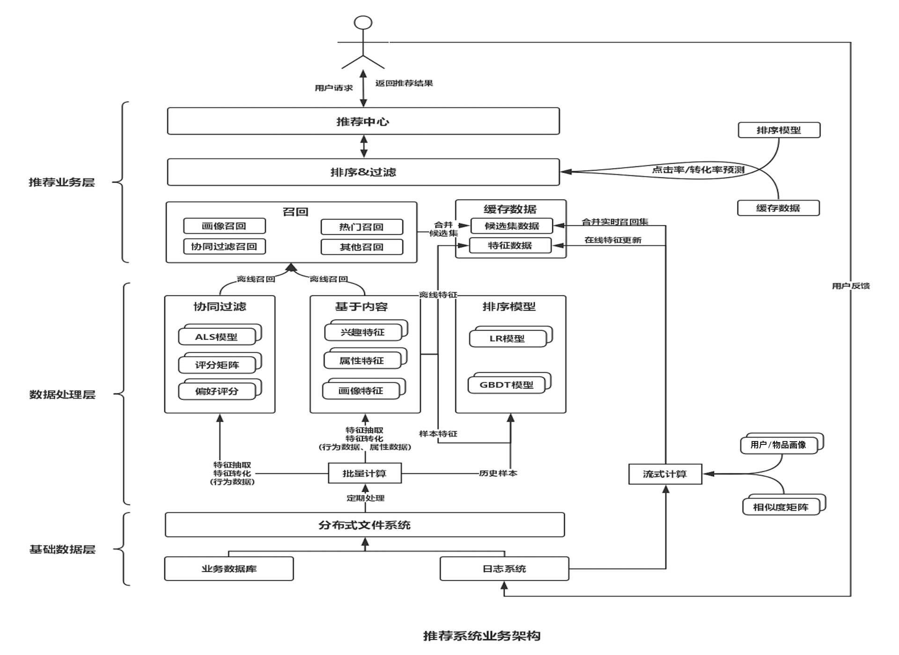
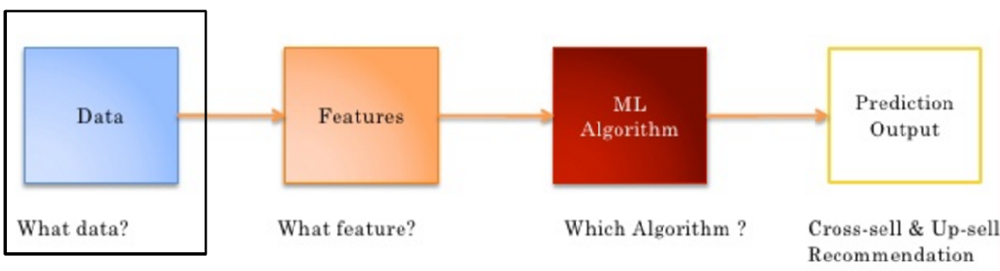
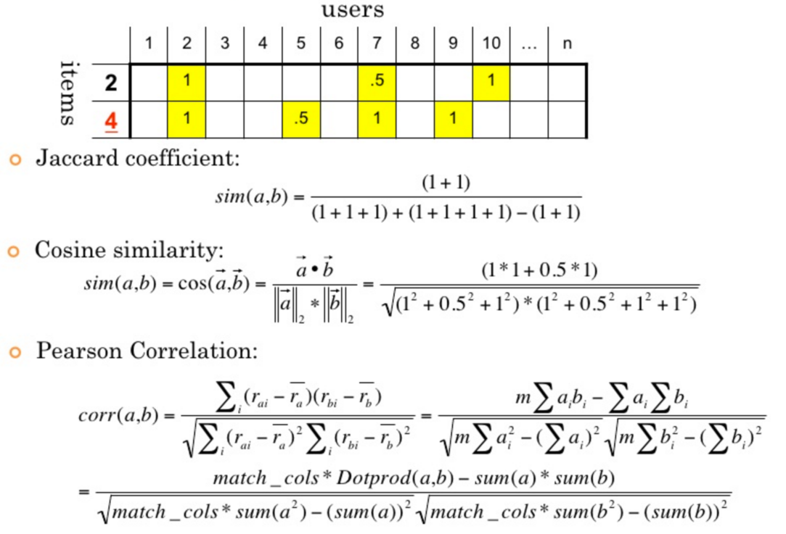
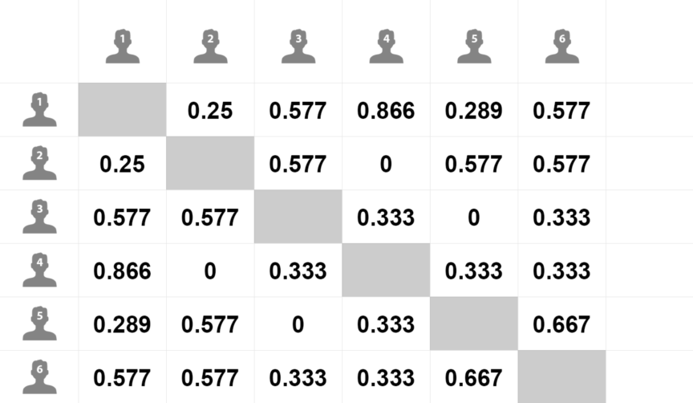
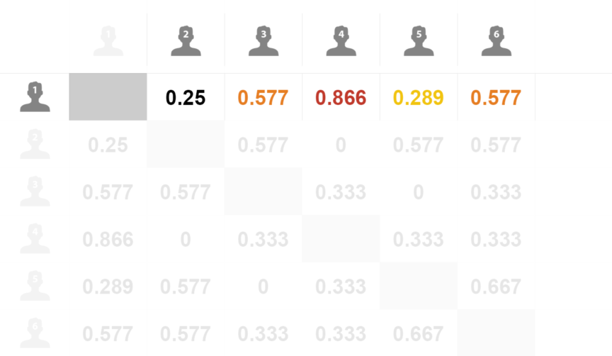
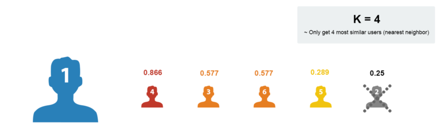
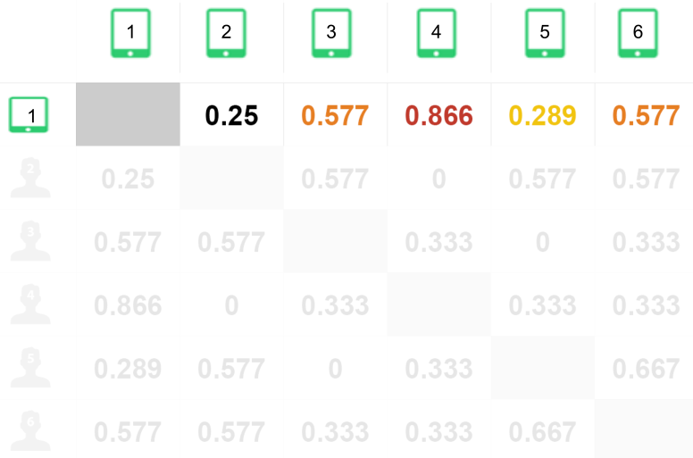
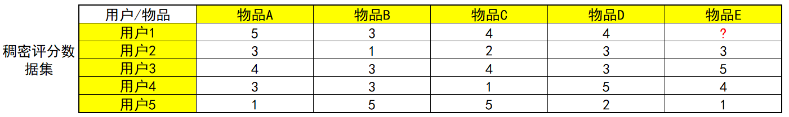
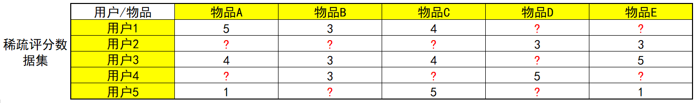

## 1、简介

​&emsp;&emsp;个性化推荐(推荐系统)经历了多年的发展，已经成为互联网产品的标配，也是AI成功落地的分支之一，在电商(淘宝/京东)、资讯(今日头条/微博)、音乐(网易云音乐/QQ音乐)、短视频(抖音/快手)等热门应用中,推荐系统都是核心组件之一。

推荐系统产生**背景**

  - 信息过载 & 用户需求不明确
    - 分类⽬录（1990s）：覆盖少量热门⽹站。Hao123 Yahoo
    - 搜索引擎（2000s）：通过搜索词明确需求。Google Baidu
    - **推荐系统**（2010s）：**不需要⽤户提供明确的需求，通过分析⽤户的历史⾏为给⽤户的兴趣进⾏建模，从⽽主动给⽤户推荐能够满⾜他们兴趣和需求的信息。**
  
**什么是**推荐系统

  - **没有明确需求的用户访问了我们的服务, 且服务的物品对用户构成了信息过载, 系统通过一定的规则对物品进行排序,并将排在前面的物品展示给用户,这样的系统就是推荐系统**

推荐系统 **V.S. 搜索引擎**

  <table>
    <tr>
      <th></th>
      <th>搜索</th>
      <th>推荐</th>
    </tr>
    <tr>
      <td> 行为方式 </td>
      <td> 主动 </td>
      <td> 被动 </td>
    </tr>
    <tr>
      <td> 意图 </td>
      <td> 明确 </td>
      <td> 模糊 </td>
    </tr>
    <tr>
      <td> 个性化 </td>
      <td> 弱 </td>
      <td> 强 </td>
    </tr>
    <tr>
      <td> 流量分布 </td>
      <td> 马太效应 </td>
      <td> 长尾效应 </td>
    </tr>
    <tr>
      <td> 目标 </td>
      <td> 快速满足  </td>
      <td> 持续服务 </td>
    </tr>
    <tr>
      <td> 评估指标 </td>
      <td> 简明 </td>
      <td> 复杂 </td>
    </tr>
  </table>

> 马太效应: 20%的网站会占据80%的流量，比如你搜一些信息技术的网站，大部分会出来少量的那几个网站，如：知乎，csdn，博客园等。

> 长尾效应: 和马太效应正好相反，会兼顾小的网站或商品。

推荐系统的**作用**

  - 高效连接用户和物品, 发现长尾商品
  - 留住用户和内容生产者, 实现商业目标

推荐系统的**工作原理**

  - **社会化推荐** 向朋友咨询, 社会化推荐, 让好友给自己推荐物品
  - **基于内容的推荐** 打开搜索引擎, 输入自己喜欢的演员的名字, 然后看看返回结果中还有什么电影是自己没看过的
  - **基于流行度的推荐** 查看票房排行榜, 
  - **基于协同过滤的推荐** 找到和自己历史兴趣相似的用户, 看看他们最近在看什么电影

推荐系统的**应用场景** feed 流 信息流 

  <center>
      
      <br>
      <div></div>
  </center>
  

推荐系统**和Web项目的区别**

  - 稳定的信息流通系统 V.S. 通过信息过滤实现目标提升 
    - web项目: 处理复杂逻辑 处理高并发 实现高可用 为用户提供稳定服务, 构建一个稳定的信息流通的服务
    - 推荐系统: 追求指标增长, 留存率/阅读时间/GMV (Gross Merchandise Volume电商网站成交金额)/视频网站VV (Video View)
  - 确定 V.S. 不确定思维
    - web项目: 对结果有确定预期
    - 推荐系统: 结果是概率问题


## 2、推荐系统设计

### 2.1 推荐系统要素

- UI 和 UE(前端界面)
- 数据 (Lambda架构)
- 业务知识
- 算法

### 2.2 推荐系统架构

推荐系统**整体架构**

  <center>
    
    <br>
    <div></div>
  </center>
  

大数据**Lambda架构**

由Twitter工程师Nathan Marz(storm项目发起人)提出

Lambda系统架构提供了一个结合实时数据和Hadoop预先计算的数据环境和混合平台, 提供一个实时的数据视图

分层架构

- 批处理层
    - 数据不可变, 可进行任何计算, 可水平扩展
    - 高延迟  几分钟~几小时(计算量和数据量不同)
    - 日志收集 Flume
    - 分布式存储 Hadoop hdfs
    - 分布式计算 Hadoop MapReduce & spark
    - 视图存储数据库
        + nosql(HBase/Cassandra)
        + Redis/memcache
        + MySQLs
- 实时处理层
    - 流式处理, 持续计算
    - 存储和分析某个窗口期内的数据
    - 最终正确性(Eventual accuracy)
    - 实时数据收集 flume & kafka
    - 实时数据分析  spark streaming/storm/flink
- 服务层
    - 支持随机读
    - 需要在非常短的时间内返回结果
    - 读取批处理层和实时处理层结果并对其归并

- Lambda架构图

  <center>
    
    <br>
    <div></div>
  </center>
    

推荐**算法架构**

- 召回阶段(海选)

    - 召回决定了最终推荐结果的天花板
    - 常用算法:
        - 协同过滤(基于用户 基于物品的)
        - 基于内容 (根据用户行为总结出自己的偏好 根据偏好 通过文本挖掘技术找到内容上相似的商品)
        - 基于隐语义

- 排序阶段
    - 召回决定了最终推荐结果的天花板, 排序逼近这个极限, 决定了最终的推荐效果
    - CTR预估 (点击率预估 使用LR算法)  估计用户是否会点击某个商品 需要用户的点击数据
  
- 策略调整

  <center>
    
    <br>
    <div></div>
  </center>
  

推荐系统的**整体架构**

  <center>
    
    <br>
    <div></div>
  </center>
  

  <center>
    
    <br>
    <div></div>
  </center>
  
## 3、推荐算法

### 3.1 推荐模型构建流程

Data(数据) -> Features(特征) -> ML Algorithm(机器学习算法) -> Prediction Output(预测输出)

<center>
  
  <br>
  <div></div>
</center>

数据收集/处理

  - 显性数据
    - Rating 打分
    - Comments 评论/评价
  - 隐形数据
    -  Order history 历史订单
    -  Cart events    加购物车
    -  Page views    页面浏览
    -  Click-thru      点击
    -  Search log     搜索记录


特征工程

- 协同过滤: 用户-物品 评分矩阵
- 基于内容: 分词 tf-idf word2Vec


训练模型

- 协同过滤
    - KNN
    - 矩阵分解


### 3.2 基于协同过滤的推荐算法

算法思想：**物以类聚，人以群分**

基本的协同过滤推荐算法基于以下假设：

- “跟你喜好**相似的人**喜欢的东西你也很有可能喜欢” ：基于用户的协同过滤推荐（User-based CF）
- “跟你喜欢的东西**相似的东西**你也很有可能喜欢 ”：基于物品的协同过滤推荐（Item-based CF）

实现协同过滤推荐有以下几个步骤：

1.  **找出最相似的人或物品：TOP-N相似的人或物品** 通过计算两两的相似度来进行排序，即可找出TOP-N相似的人或物品

2.  **根据相似的人或物品产生推荐结果** 利用TOP-N结果生成初始推荐结果，然后过滤掉用户已经有过记录的物品或明确表示不感兴趣的物品

以下是一个简单的示例，数据集相当于一个用户对物品的购买记录表：打勾表示用户对物品的有购买记录

- 关于相似度计算这里先用一个简单的思想：如有两个同学X和Y，X同学爱好[足球、篮球、乒乓球]，Y同学爱好[网球、足球、篮球、羽毛球]，可见他们的共同爱好有2个，那么他们的相似度可以用：2/3 * 2/4 = 1/3 ≈ 0.33 来表示。

  User-Based CF

  <center>
    
    <br>
    <div></div>
  </center>
  
  Item-Based CF

  <center>
    
    <br>
    <div></div>
  </center>
  
通过前面两个demo，相信大家应该已经对协同过滤推荐算法的设计与实现有了比较清晰的认识。

总结协同过滤算法思路

- CF 物以类聚 人以群分
- 首先特征工程把用户-物品的评分矩阵创建出来
- 基于用户的协同过滤
    + 给用户A找到最相似的N个用户
    + N个用户消费过哪些物品
    + N个用户消费过的物品中-A用户消费过的就是给A用户推荐的结果

- 基于物品的协同过滤
    + 给物品A找到最相似的N个物品
    + A用户消费记录 找到这些物品的相似物品
    + 从这些相似物品先去重-A用户消费过的就是推荐结果

### 3.3 相似度计算

数据分类

- 实数值 (物品评分情况)
- 布尔值 (用户的行为 是否点击 是否收藏)

根据不同的数据类型, 需要采用不同的相似度计算方法。

相似度计算方法

- **欧式距离**, 是一个欧式空间下度量距离的方法. 两个物体, 都在同一个空间下表示为两个点, 假如叫做p,q, 分别都是n个坐标, 那么欧式距离就是衡量这两个点之间的距离. 欧氏距离**不适用于布尔向量之间**。

$$
E(a,b)=\sqrt{\sum_{i=1}^n{(a_i-b_i)^2}}
$$

欧氏距离的值是一个非负数, 最大值正无穷, 通常计算相似度的结果希望是 [-1,1] 或 [0,1] 之间, 一般可以使用

​如下转化公式:

$$
\frac{1}{1+E(a,b)}
$$

- **余弦相似度**
    + 度量的是两个向量之间的夹角, 用夹角的余弦值来度量相似的情况
    + 两个向量的夹角为0是,余弦值为1, 当夹角为90度是余弦值为0,为180度是余弦值为-1
    + 余弦相似度在度量文本相似度, 用户相似度 物品相似度的时候较为常用
    + 余弦相似度的特点, 与向量长度无关,余弦相似度计算要对向量长度归一化, 两个向量只要方向一致,无论程度强弱, 都可以视为'相似'
  
- **皮尔逊相关系数Pearson**
    + 实际上也是一种余弦相似度, 不过先对向量做了中心化, 向量a b 各自减去向量的均值后, 再计算余弦相似度
    + 皮尔逊相似度计算结果在-1,1之间 -1表示负相关, 1表示正相关
    + 度量两个变量是不是同增同减
    + 皮尔逊相关系数度量的是两个变量的变化趋势是否一致, **不适合计算布尔值向量之间的相关度**

- **杰卡德相似度 Jaccard**
    + **本质**就是两者**交集除以并集**
    + 两个集合的交集元素个数在并集中所占的比例, **非常适用于布尔向量表示**
    + 分子是两个布尔向量做点积计算, 得到的就是交集元素的个数
    + 分母是两个布尔向量做或运算, 再求元素和

余弦相似度适合用户评分数据(实数值), 杰卡德相似度适用于隐式反馈数据(0, 1布尔值)(是否收藏, 是否点击, 是否加购物车)

举例说明 杰卡德 余弦 皮尔逊相关系数计算

<center>
  
  <br>
  <div></div>
</center>

皮尔逊相关系数

$$
r=\frac{\sum_{i=1}^n{(x_i-\overline{x})(y_i-\overline{y})}}{\sqrt{\sum_{i=1}^n(x_i-\overline{x})^2}\sqrt{\sum_{i=1}^n(y_i-\overline{y})^2}}
$$

基于用户的协同过滤推荐大致流程:

- 用公式计算出各用户之间的皮尔逊相关系数

<center>
  
  <br>
  <div></div>
</center>

- 以用户1举例, 列出用户1和其他用户相似度

<center>
  
  <br>
  <div></div>
</center>

- 按照相似度大小排序, K近邻, 如K取4:

<center>
  
  <br>
  <div></div>
</center>

- 取出近邻用户的购物清单

<center>
  
  <br>
  <div></div>
</center>

- 去除用户1已经购买过的商品

<center>
  
  <br>
  <div></div>
</center>

- 在剩余的物品中根据评分排序

<center>
  
  <br>
  <div></div>
</center>

> 因为余弦相似度对绝对值大小不敏感, 例如用户A对两部电影评分分别是1分和2分, 用户B对同样这两部电影进行评分是4分和5分 用余弦相似度计算, 两个用户的相似度达到0.98

> 因此, 非布尔向量计算相似度还是要用皮尔逊相似度。


基于物品的协同过滤推荐大致流程:

- 用公式计算出各物品之间的皮尔逊相关系数

<center>
  
  <br>
  <div></div>
</center>

- 以物品1举例
  
<center>
  
  <br>
  <div></div>
</center>

- 找到与物品1最近似的物品

<center>
  
  <br>
  <div></div>
</center>


### 3.4 协同过滤代码实现

``` py linenums="1" title="构建数据集"
users = ["User1", "User2", "User3", "User4", "User5"]

items = ["Item A", "Item B", "Item C", "Item D", "Item E"]

# 构建数据集
datasets = [
    ["buy", None, "buy", "buy", None],
    ["buy", None, None, "buy", "buy"],
    ["buy", None, "buy", None, None],
    [None, "buy", None, "buy", "buy"],
    ["buy", "buy", "buy", None, "buy"],
]
```

为了方便我们对数据进行运算处理(使用杰卡德相似度), 我们用True、False来表示用户是否购买过该物品，则我们的数据集转化成如下：

``` py linenums="1" title="重新构建数据集并展示"
# 用户购买记录数据集
import pandas as pd

datasets = [
    [True, False, True, True, False],
    [True, False, False, True, True],
    [True, False, True, False, False],
    [False, True, False, True, True],
    [True, True, True, False, True],
]


df = pd.DataFrame(datasets, columns=items, index=users)

pprint(df)
```

输出

```
       Item A  Item B  Item C  Item D  Item E
User1    True   False    True    True   False
User2    True   False   False    True    True
User3    True   False    True   False   False
User4   False    True   False    True    True
User5    True    True    True   False    True
```

``` py linenums="1" title="直接计算某两项的杰卡德相似系数"
from sklearn.metrics import jaccard_score


# 计算Item A 和Item B的相似度
jaccard_score(df["Item A"], df["Item B"])  # df["Item A"] 输出列向量
```

输出

```
0.2
```

``` py linenums="1" title="分别计算物品与物品 用户与用户 相似度"
from sklearn.metrics.pairwise import pairwise_distances
from pprint import pprint

# 杰卡德相似度=1-杰卡德距离
# 把矩阵每一行看成一个行向量，计算两两行向量间的杰卡德相似度
user_similar = 1-pairwise_distances(df.values, metric="jaccard")
user_similar = pd.DataFrame(user_similar,columns=users,index=users)
pprint(user_similar)

item_similar = 1-pairwise_distances(df.T.values, metric="jaccard")
item_similar = pd.DataFrame(item_similar,columns=items,index=items)
pprint(item_similar)
```

输出

```
          User1  User2     User3  User4  User5
User1  1.000000   0.50  0.666667    0.2    0.4
User2  0.500000   1.00  0.250000    0.5    0.4
User3  0.666667   0.25  1.000000    0.0    0.5
User4  0.200000   0.50  0.000000    1.0    0.4
User5  0.400000   0.40  0.500000    0.4    1.0

        Item A    Item B  Item C  Item D    Item E
Item A    1.00  0.200000    0.75    0.40  0.400000
Item B    0.20  1.000000    0.25    0.25  0.666667
Item C    0.75  0.250000    1.00    0.20  0.200000
Item D    0.40  0.250000    0.20    1.00  0.500000
Item E    0.40  0.666667    0.20    0.50  1.000000
```

有了两两的相似度，接下来就可以筛选TOP-N相似结果，并进行推荐了

- 基于用户的协同过滤

``` py linenums="1" title="User-Based CF"
import numpy as np
# 新建一个空字典用于存放每个用户的最近似的用户
topN_users = {}

# 遍历每一行数据
for i in user_similar.index:
    # 取出每一列数据，并删除自身，然后排序数据
    _df = user_similar.loc[i].drop([i])
    _df_sorted = _df.sort_values(ascending=False)
    top2 = list(_df_sorted.index[:2])
    topN_users[i] = top2

print("Top2相似用户：")
pprint(topN_users)

rs_results = {}

# 构建推荐结果
for user, sim_users in topN_users.items():
    rs_result = set()  # 存储推荐结果
    for sim_user in sim_users:
        # 构建初始的推荐结果
        rs_result = rs_result.union(
            set(df.loc[sim_user].replace(False, np.nan).dropna().index))
    # 过滤掉已经购买过的物品
    rs_result -= set(df.loc[user].replace(False, np.nan).dropna().index)
    rs_results[user] = rs_result

print("最终推荐结果：")
pprint(rs_results)
```

输出

```
Top2相似用户：
{'User1': ['User3', 'User2'],
 'User2': ['User4', 'User1'],
 'User3': ['User1', 'User5'],
 'User4': ['User2', 'User5'],
 'User5': ['User3', 'User4']}

最终推荐结果：
{'User1': {'Item E'},
 'User2': {'Item C', 'Item B'},
 'User3': {'Item B', 'Item D', 'Item E'},
 'User4': {'Item C', 'Item A'},
 'User5': {'Item D'}}
```

- 基于用户的协同过滤

``` py linenums="1" title="Item-Based CF"
import pandas as pd
import numpy as np
from pprint import pprint

users = ["User1", "User2", "User3", "User4", "User5"]
items = ["Item A", "Item B", "Item C", "Item D", "Item E"]
# 用户购买记录数据集
datasets = [
    [True, False, True, True, False],
    [True, False, False, True, True],
    [True, False, True, False, False],
    [False, True, False, True, True],
    [True, True, True, False, True],
]

df = pd.DataFrame(datasets,
                  columns=items,
                  index=users)

# 计算所有的数据两两的杰卡德相似系数
from sklearn.metrics.pairwise import pairwise_distances
# 计算物品间相似度
item_similar = 1 - pairwise_distances(df.T.values, metric="jaccard")
item_similar = pd.DataFrame(item_similar, columns=items, index=items)
print("物品之间的两两相似度：")
print(item_similar)

topN_items = {}
# 遍历每一行数据
for i in item_similar.index:
    # 取出每一列数据，并删除自身，然后排序数据
    _df = item_similar.loc[i].drop([i])
    _df_sorted = _df.sort_values(ascending=False)

    top2 = list(_df_sorted.index[:2])
    topN_items[i] = top2

print("Top2相似物品：")
pprint(topN_items)

rs_results = {}
# 构建推荐结果
for user in df.index:    # 遍历所有用户
    rs_result = set()
    for item in df.loc[user].replace(False,np.nan).dropna().index:   # 取出每个用户当前已购物品列表
        # 根据每个物品找出最相似的TOP-N物品，构建初始推荐结果
        rs_result = rs_result.union(topN_items[item])
    # 过滤掉用户已购的物品
    rs_result -= set(df.loc[user].replace(False,np.nan).dropna().index)
    # 添加到结果中
    rs_results[user] = rs_result

print("最终推荐结果：")
pprint(rs_results)
```

输出

```
物品之间的两两相似度：
        Item A    Item B  Item C  Item D    Item E
Item A    1.00  0.200000    0.75    0.40  0.400000
Item B    0.20  1.000000    0.25    0.25  0.666667
Item C    0.75  0.250000    1.00    0.20  0.200000
Item D    0.40  0.250000    0.20    1.00  0.500000
Item E    0.40  0.666667    0.20    0.50  1.000000
Top2相似物品：
{'Item A': ['Item C', 'Item E'],
 'Item B': ['Item E', 'Item D'],
 'Item C': ['Item A', 'Item B'],
 'Item D': ['Item E', 'Item A'],
 'Item E': ['Item B', 'Item D']}
最终推荐结果：
{'User1': {'Item B', 'Item E'},
 'User2': {'Item C', 'Item B'},
 'User3': {'Item B', 'Item E'},
 'User4': {'Item A'},
 'User5': {'Item D'}}
```

### 3.5 对用户进行评分预测

在前面的demo中, 我们只是使用用户对物品的一个购买记录, 类似也可以是比如浏览点击记录、收听记录等等。这样数据我们预测的结果其实相当于是在预测用户是否对某物品感兴趣, 对于喜好程度不能很好的预测。

因此在协同过滤推荐算法中其实会更多的利用用户对物品的"评分"数据来进行预测, 通过评分数据集, 我们可以预测用户对于他没有评分过的物品的评分。其实现原理和思想和都是一样的, 只是使用的数据集是用户-物品的评分数据。

**关于用户-物品评分矩阵**

用户-物品的评分矩阵，根据评分矩阵的稀疏程度会有不同的解决方案。

- 稠密评分矩阵

<center>
  
  <br>
  <div></div>
</center>

- 稀疏评分矩阵

<center>
  
  <br>
  <div></div>
</center>

这里先介绍稠密评分矩阵的处理，稀疏矩阵的处理相对会复杂一些，我们到后面再来介绍。

**开始**使用协同过滤推荐算法对用户进行评分预测

**数据集:**

<center>
  
  <br>
  <div></div>
</center>

**目的:** 预测用户1对物品E的评分

**构建数据集:**注意这里构建评分数据时, 对于缺失的部分我们**需要保留为None**, 如果设置为0那么会被当作评分值为0去对待。

```
users = ["User1", "User2", "User3", "User4", "User5"]
items = ["Item A", "Item B", "Item C", "Item D", "Item E"]
# 用户购买记录数据集
datasets = [
    [5,3,4,4,None],
    [3,1,2,3,3],
    [4,3,4,3,5],
    [3,3,1,5,4],
    [1,5,5,2,1],
]
```

计算相似度: 对于评分数据这里我们采用皮尔逊相关系数[-1,1]来计算, -1表示强负相关, +1表示强正相关, 0 表示不相关。

> pandas中corr方法可直接用于计算皮尔逊相关系数

``` py linenums="1" title="分别计算用户与用户 物品与物品间的相似度"
df = pd.DataFrame(datasets,
                  columns=items,
                  index=users)

print("用户之间的两两相似度：")
# 直接计算皮尔逊相关系数
# 默认是按列进行计算，因此如果计算用户间的相似度，当前需要进行转置
user_similar = df.T.corr()
print(user_similar.round(4))

print("物品之间的两两相似度：")
item_similar = df.corr()
print(item_similar.round(4))
```

输出

```
# 运行结果：
用户之间的两两相似度：
        User1   User2   User3   User4   User5
User1  1.0000  0.8528  0.7071  0.0000 -0.7921
User2  0.8528  1.0000  0.4677  0.4900 -0.9001
User3  0.7071  0.4677  1.0000 -0.1612 -0.4666
User4  0.0000  0.4900 -0.1612  1.0000 -0.6415
User5 -0.7921 -0.9001 -0.4666 -0.6415  1.0000
物品之间的两两相似度：
        Item A  Item B  Item C  Item D  Item E
Item A  1.0000 -0.4767 -0.1231  0.5322  0.9695
Item B -0.4767  1.0000  0.6455 -0.3101 -0.4781
Item C -0.1231  0.6455  1.0000 -0.7206 -0.4276
Item D  0.5322 -0.3101 -0.7206  1.0000  0.5817
Item E  0.9695 -0.4781 -0.4276  0.5817  1.0000
```

可以看到与用户1最相似的是用户2和用户3；与物品A最相似的物品分别是物品E和物品D。

**注意：**我们在预测评分时，往往是通过与其有正相关的用户或物品进行预测，如果不存在正相关的情况，那么将无法做出预测。这一点尤其是在稀疏评分矩阵中尤为常见，因为稀疏评分矩阵中很难得出正相关系数。

**评分预测:**

**User-Based CF 评分预测：使用用户间的相似度进行预测**

关于评分预测的方法也有比较多的方案，下面介绍一种效果比较好的方案，该方案考虑了用户本身的评分评分以及近邻用户的加权平均相似度打分来进行预测:

$$
pred(u,i)=\frac{\sum_{v \in U_{rated}}{sim(u,v)*r_{vi}}}{\sum_{v \in U_{rated}}{|sim(u,v)|}}
$$

我们要预测用户1对物品E的评分，那么可以根据与用户1最近邻的用户2和用户3进行预测，计算如下：

$$
pred(u_1,i_5)=\frac{0.85*3+0.71*5}{0.85+0.71}=3.91
$$

最终预测出用户1对物品5的评分为3.91

**Item-Based CF 评分预测：使用物品间的相似度进行预测**

这里利用物品相似度预测的计算同上，同样考虑了用户自身的平均打分因素，结合预测物品与相似物品的加权平均相似度打分进行来进行预测

$$
pred(u,i)=\frac{\sum_{j \in I_{rated}}{sim(i,j)*r_{uj}}}{\sum_{j \in I_{rated}}{|sim(i,j)|}}
$$

我们要预测用户1对物品E的评分，那么可以根据与物品E最近邻的物品A和物品D进行预测，计算如下：

$$
pred(u_1,i_5)=\frac{0.97*5+0.58*4}{0.97+0.58}=4.63
$$

对比可见，User-Based CF预测评分和Item-Based CF的评分结果也是存在差异的，因为严格意义上他们其实应当属于两种不同的推荐算法，各自在不同的领域不同场景下，都会比另一种的效果更佳，但具体哪一种更佳，必须经过合理的效果评估，因此在实现推荐系统时这两种算法往往都是需要去实现的，然后对产生的推荐效果进行评估分析选出更优方案。